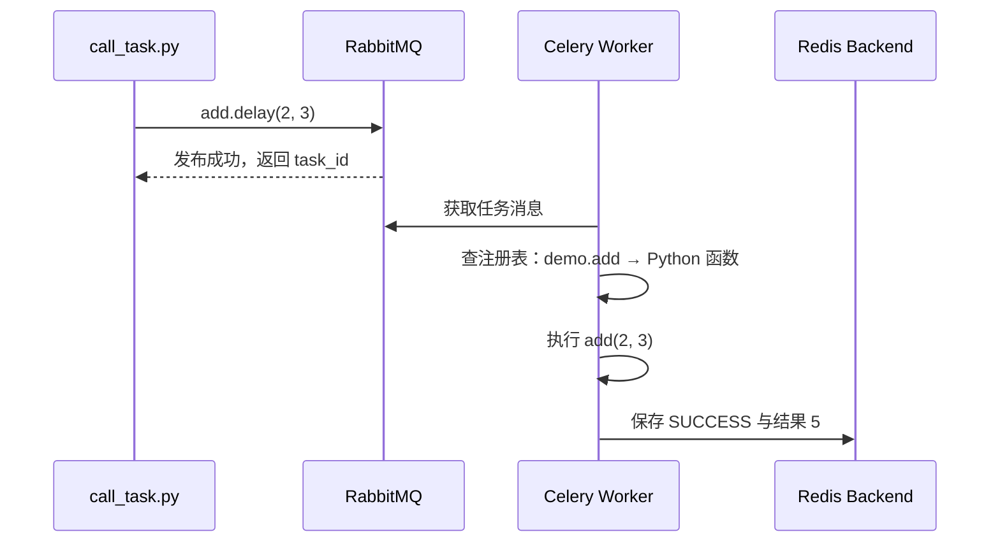

# 01 · 运行模型与第一个任务

官方文档：[First Steps with Celery](https://docs.celeryq.dev/en/stable/getting-started/first-steps-with-celery.html)

这一讲先建立最小闭环：定义 app、注册 task、启动 worker、从另一个进程投递任务。

## API 的含义先说清

| API / 对象 | 星级 | 含义 |
| --- | --- | --- |
| `Celery(name, broker=..., backend=...)` | ⭐⭐⭐ | 创建 Celery 应用；保存连接、配置与任务注册表 |
| `@app.task` | ⭐⭐⭐ | 把函数注册为 Celery Task；任务名成为跨进程调用坐标 |
| `task.delay(*args, **kwargs)` | ⭐⭐⭐ | 把任务调用发布到 broker，立即返回 `AsyncResult` |
| `celery -A module worker` | ⭐⭐⭐ | 导入应用模块并启动常驻 worker |
| `include=[...]` | ⭐⭐ | worker 初始化时要导入的任务模块列表 |

## 五个角色

| 角色 | 做什么 | 不做什么 |
| --- | --- | --- |
| Celery app | 保存配置、任务注册表、连接工厂 | 不等于 worker 进程 |
| Task | 描述可被远程执行的函数 | 调用 `.delay()` 时不在调用端执行函数体 |
| Broker | 保存并传递任务消息 | 不保存最终 Python 结果 |
| Worker | 消费消息、查找任务、执行函数 | 不负责决定周期时间 |
| Result backend | 按 task_id 保存状态和结果 | 不负责把任务送给 worker |

## 第一个任务的时序



`.delay()` 返回只说明消息已由调用流程发布，不说明 worker 已经执行成功。发布成功和执行成功是两个不同时间点。

## 代码 1：创建应用

把这一块写成 `celery_app.py`：

```python
import os
from pathlib import Path

from celery import Celery
from dotenv import load_dotenv

load_dotenv(Path(__file__).resolve().parents[2] / ".env")

app = Celery(
    "demo",
    broker=os.environ["RABBITMQ_URL"],
    backend=os.environ["REDIS_URL"],
    include=["tasks"],
)

app.conf.update(
    task_serializer="json",
    result_serializer="json",
    accept_content=["json"],
    timezone="Asia/Shanghai",
    task_default_queue="celery_demo",
)
```

`Celery("demo")` 的第一个参数是应用名，不是队列名。`broker` 决定任务消息去哪，`backend` 决定结果去哪。`include=["tasks"]` 让 worker 启动时 import `tasks`，从而执行装饰器并把任务放进注册表。

JSON 序列化意味着参数和返回值应使用字符串、数字、布尔值、列表、字典等 JSON 数据。不要直接传数据库连接、文件句柄、ORM 对象或 request 对象。

## 代码 2：注册任务

把这一块写成 `tasks.py`：

```python
from celery_app import app


@app.task(name="demo.add")
def add(left: int, right: int) -> int:
    return left + right
```

模块被 import 时，`@app.task` 把函数包装成 Task 并注册到 `app.tasks`。显式名称 `demo.add` 是消息中的任务坐标；worker 收到消息后按这个名字查函数。生产项目中任务名应稳定，随意改名会让队列中旧消息找不到任务。

装饰后的 `add` 同时支持两种完全不同的调用：

```python
local_result = add(2, 3)       # 普通本地调用：当前进程立刻执行
async_result = add.delay(2, 3) # Celery 投递：函数体由 worker 稍后执行
```

本地调用不会经过 broker、worker 和 backend，也不会获得 Celery 的重试、路由或状态记录。

## 代码 3：投递任务

把这一块写成 `call_task.py`：

```python
from tasks import add


result = add.delay(2, 3)

print(f"task_id={result.id}")
print(f"state={result.state}")
```

`result` 是 `AsyncResult`，可以理解为“指向某个 task_id 结果记录的句柄”。它不是任务的整数结果，也不会自动等待任务完成。

## 启动顺序

先进入本讲目录启动 worker：

```bash
uv run celery -A celery_app worker -l INFO --pool=solo
```

另开终端投递：

```bash
uv run python call_task.py
```

`-A celery_app` 表示 import `celery_app` 模块并寻找 app。`--pool=solo` 便于跨平台学习；Linux 生产环境通常使用默认 prefork，池模型在第 07 讲讨论。

## 本讲必须形成的判断

- 调用端、broker、worker、backend 是四条可能独立失败的链路。
- `.delay()` 成功不等于任务成功。
- worker 必须先注册任务名，才能执行消息中的任务。
- 传给任务的是可序列化数据，不是进程内对象本身。
