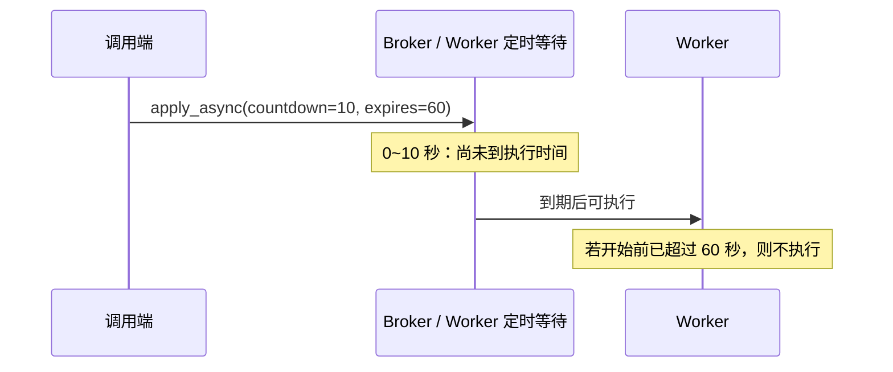
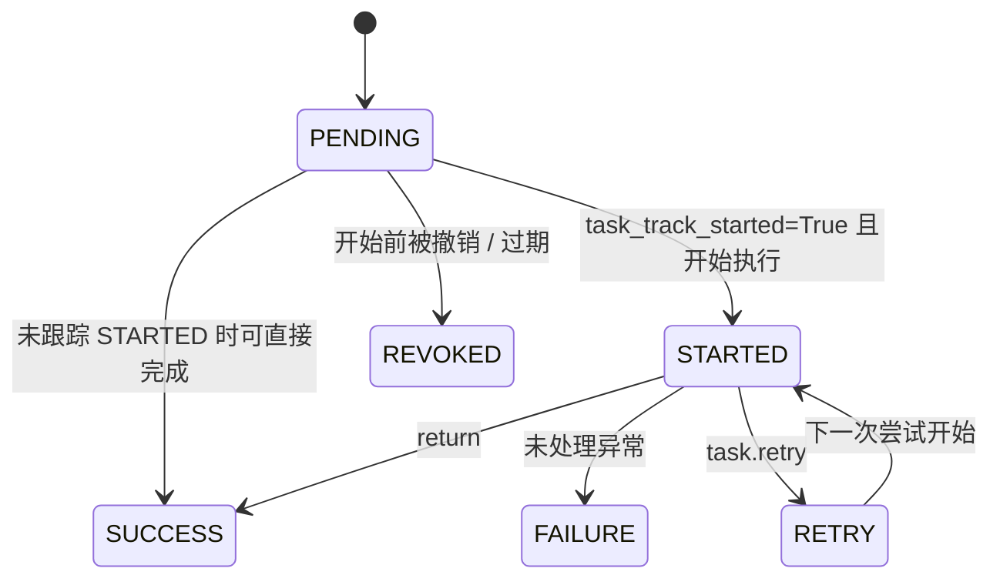

# 02 · 任务调用与结果

官方文档：[Calling Tasks](https://docs.celeryq.dev/en/stable/userguide/calling.html)

`delay` 用于普通调用，`apply_async` 用于携带调度和路由选项。两者都返回 `AsyncResult`。

## API 的含义先说清

| API | 星级 | 输入 | 返回 / 行为 |
| --- | --- | --- | --- |
| `task.delay(*args, **kwargs)` | ⭐⭐⭐ | 任务参数 | `apply_async` 的快捷写法，返回 `AsyncResult` |
| `task.apply_async(args=..., kwargs=..., **options)` | ⭐⭐⭐ | 参数和调用选项 | 发布任务并返回 `AsyncResult` |
| `result.id` / `result.state` | ⭐⭐⭐ | task_id 句柄 | 读取 ID / 从 backend 查询状态 |
| `result.get(timeout=...)` | ⭐⭐ | 等待秒数 | 阻塞当前线程，返回结果或重新抛出任务异常 |
| `result.ready()` / `successful()` / `failed()` | ⭐⭐ | 无 | 查询终态及成功/失败 |
| `result.forget()` | ⭐ | 无 | 删除 backend 中的结果记录 |

## `delay` 和 `apply_async` 的关系

下面两句在参数意义上等价：

```python
add.delay(2, 3)
add.apply_async(args=(2, 3))
```

`delay` 只接收任务函数参数；`apply_async` 额外接收 Celery 调用选项，例如 `countdown`、`eta`、`expires`、`queue`、`task_id`。

## 代码 1：延迟执行与过期

```python
from tasks import add


result = add.apply_async(
    args=(2, 3),
    countdown=10,
    expires=60,
)

print(result.id)
```

- `countdown=10`：至少等待约 10 秒后才有资格执行。
- `eta=datetime(...)`：指定绝对时间；涉及客户端、worker 时钟和时区，日常优先用 countdown。
- `expires=60`：超过有效期仍未开始执行时，worker 将其标记为撤销/过期；它不是运行中任务的超时，运行时间限制见第 07 讲。



不要用很长的 `countdown` / `eta` 代替专业调度系统。大量远期任务可能被 worker 提前保留并占用内存；周期调度使用 Beat。

## AsyncResult 状态机



`PENDING` 有歧义：任务可能仍在 broker、尚未写状态，也可能 task_id 根本不存在。Celery 的 result backend 通常把“查不到记录”也表示为 PENDING。

## 代码 2：读取结果

```python
from celery.exceptions import TimeoutError

from tasks import add


result = add.delay(2, 3)

try:
    value = result.get(timeout=5)
except TimeoutError:
    print("调用端等待超时；这不等于 worker 已取消任务")
else:
    print(value)
```

`get(timeout=5)` 的 timeout 只限制**调用端等待多久**。等待超时后，任务仍可能在队列中或继续执行。它与任务的 `time_limit`、任务撤销是不同机制。

任务函数抛出的异常会被 backend 保存；默认 `get(propagate=True)` 会在调用端重新抛出该异常。`propagate=False` 会把异常对象当返回值交给你，只有明确要统一收集失败时才使用。

## 为什么 Web 请求里通常不调用 `.get()`

```text
HTTP 请求线程 / 协程
    └─ 发布 Celery 任务
         └─ 立刻 .get() 等 worker
              └─ 又把“后台任务”变回同步等待
```

典型 API 应返回 `202 Accepted + task_id`，客户端之后查询状态；或者任务完成后通过数据库状态、事件、WebSocket 等方式通知。任务内部也不要同步 `.get()` 等另一个任务，工作流依赖使用 Canvas。

## 代码 3：用 task_id 恢复结果句柄

```python
from celery_app import app


task_id = "从接口或数据库取得的任务 ID"
result = app.AsyncResult(task_id)

print(result.state)
if result.ready():
    print(result.result)
```

AsyncResult 本身很轻，它只保存 app、task_id 和 backend 访问能力。真正状态在 backend；如果没有配置 backend，状态和返回值无法按这里的方式查询。
