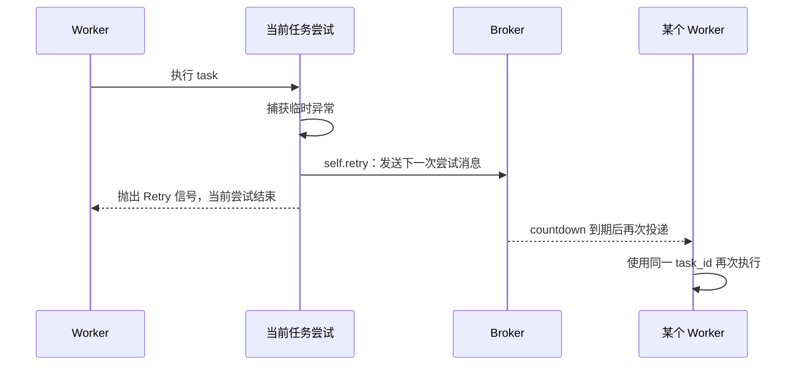
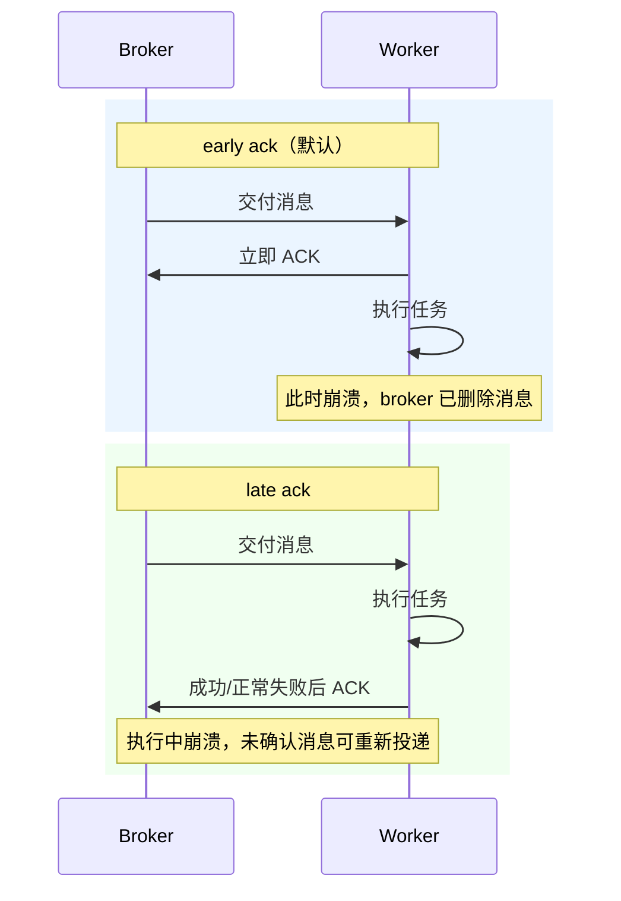

# 03 · 重试、确认与幂等

官方文档：[Tasks — Retrying](https://docs.celeryq.dev/en/stable/userguide/tasks.html#retrying)、[Optimizing — Prefetch Limits](https://docs.celeryq.dev/en/stable/userguide/optimizing.html#prefetch-limits)

这一讲要分清两类故障：任务函数捕获到的临时业务异常，用 `retry`；worker 进程崩溃或机器断电，用消息确认策略决定是否重投。

## API 与配置的含义

| API / 配置 | 星级 | 处理什么故障 |
| --- | --- | --- |
| `self.retry(exc=..., countdown=...)` | ⭐⭐⭐ | 当前任务已捕获到临时异常，主动安排下一次尝试 |
| `autoretry_for=(...)` | ⭐⭐⭐ | 指定异常自动调用 retry |
| `retry_backoff` / `retry_jitter` | ⭐⭐⭐ | 指数退避与随机抖动，避免同时重试冲击下游 |
| `max_retries` | ⭐⭐⭐ | 限制最大重试次数 |
| `acks_late=True` | ⭐⭐⭐ | 执行完成后才确认消息；崩溃时有机会重投 |
| `task_reject_on_worker_lost=True` | ⭐⭐ | worker 子进程异常丢失时拒绝/重入队消息 |
| `worker_prefetch_multiplier` | ⭐⭐⭐ | 每个并发槽预取多少消息，影响公平性和吞吐 |

## 重试不是再次调用普通函数



`self.retry()` 会发布新的任务消息，并抛出 Celery 内部的 Retry 信号终止当前尝试。通常要写 `raise self.retry(...)`，明确当前函数不会继续向下执行。

## 代码 1：手动重试

```python
from celery_app import app


class TemporaryServiceError(Exception):
    pass


def call_remote_service(document_id: int) -> dict:
    raise TemporaryServiceError("临时不可用")


@app.task(bind=True, max_retries=3, name="demo.generate_document")
def generate_document(self, document_id: int) -> dict:
    try:
        return call_remote_service(document_id)
    except TemporaryServiceError as exc:
        raise self.retry(exc=exc, countdown=5)
```

`bind=True` 让第一个参数变成当前 Task 实例，从而可访问 `self.request.id`、`self.request.retries` 和 `self.retry()`。超过 `max_retries` 后，Celery 不再安排下一次尝试，并把最后异常作为 FAILURE。

只重试你确认是临时性的异常。参数错误、权限错误、数据不满足约束通常应直接失败；对所有 `Exception` 无脑重试会制造故障循环。

## 代码 2：自动重试与指数退避

```python
from celery_app import app


class TemporaryServiceError(Exception):
    pass


def call_remote_service(record_id: int) -> dict:
    raise TemporaryServiceError(f"记录 {record_id} 暂时同步失败")


@app.task(
    autoretry_for=(TemporaryServiceError,),
    retry_backoff=True,
    retry_backoff_max=300,
    retry_jitter=True,
    max_retries=5,
    name="demo.sync_record",
)
def sync_record(record_id: int) -> dict:
    return call_remote_service(record_id)
```

指数退避使等待时间逐步增大；jitter 在此基础上加入随机性，避免一批同时失败的任务在同一秒集体重试。对可预期、处理逻辑相同的临时异常，`autoretry_for` 比重复手写 try/except 更清楚。

## early ack 与 late ack

默认 early ack：worker 在执行前确认消息。优点是任务不会因为 worker 执行后崩溃而重复；缺点是执行进程被硬杀时，该消息可能已经确认，无法重投。



late ack 不是“恰好执行一次”。worker 可能已经完成外部写入，但在发送 ACK 前崩溃，消息随后重投，任务会再次执行。因此启用 late ack 的前提是幂等。

## 幂等到底是什么意思

幂等不是“任务没有副作用”，而是同一个业务操作重复执行，最终业务状态仍然正确。

```python
@app.task(acks_late=True, name="demo.create_export")
def create_export(request_id: str) -> str:
    existing = find_export_by_request_id(request_id)
    if existing is not None:
        return existing.file_url

    file_url = build_export_file(request_id)
    save_export_with_unique_request_id(request_id, file_url)
    return file_url
```

真正的防重不能只靠“先查询再插入”，因为两个 worker 可能同时查不到。数据库应对 `request_id` 建唯一约束，并在冲突时读取已存在记录。幂等边界必须落在能原子保证唯一性的存储层。

## 重试与重投的区别

| 对比 | retry | late ack 重投 |
| --- | --- | --- |
| 谁触发 | 任务代码 / Celery autoretry | broker 发现消息未确认、worker 丢失 |
| 是否能拿到 Python 异常 | 能 | 通常不能，进程可能已消失 |
| 是否可设 backoff | 能 | 不是同一套重试策略 |
| 是否要求幂等 | 要 | 更要 |

正常 Python 异常不会因为 `acks_late=True` 自动无限重投；Celery 通常把可正常处理的失败确认掉，并把 FAILURE 写入 backend。业务重试仍应使用 `retry`。
