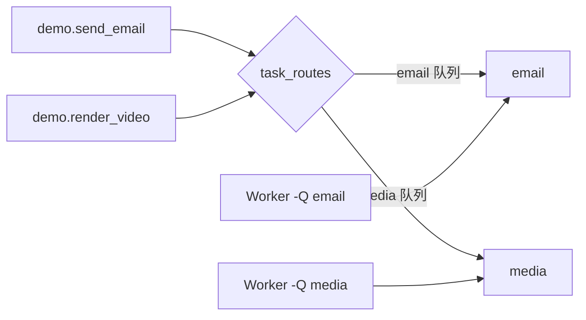

# 04 · 队列与路由

官方文档：[Routing Tasks](https://docs.celeryq.dev/en/stable/userguide/routing.html)

路由回答两个问题：某个任务发布到哪个队列；哪个 worker 消费哪些队列。把任务拆到不同队列，可以隔离资源和故障，但不会自动增加总算力。

## API 与配置的含义

| API / 配置 | 星级 | 含义 |
| --- | --- | --- |
| `task_default_queue` | ⭐⭐⭐ | 未命中任何路由的任务进入哪个队列 |
| `task_routes` | ⭐⭐⭐ | 按任务名集中声明目标队列 |
| `apply_async(queue=...)` | ⭐⭐ | 单次调用覆盖队列；只适合真正的调用级例外 |
| `task_queues` + Kombu `Queue` | ⭐⭐ | 显式定义 exchange、queue、routing key |
| worker `-Q q1,q2` | ⭐⭐⭐ | 限制该 worker 只消费指定队列 |

## 路由发生在哪里



调用端在发布消息时根据路由决定队列。worker 的 `-Q` 只决定“我消费哪些队列”，不会把已经进错队列的消息搬到正确位置。

## 代码 1：集中配置简单路由

```python
from celery_app import app


app.conf.update(
    task_default_queue="default",
    task_routes={
        "demo.send_email": {"queue": "email"},
        "demo.render_video": {"queue": "media"},
    },
)
```

```python
from celery_app import app


@app.task(name="demo.send_email")
def send_email(message_id: int) -> None:
    ...


@app.task(name="demo.render_video")
def render_video(video_id: int) -> None:
    ...
```

`task_routes` 使用任务名匹配，所以任务名是路由契约。集中路由比把 `queue=` 散落在每个调用点更容易审计和修改。

## 启动专职 worker

```bash
celery -A celery_app worker -l INFO -Q default,email -n general@%h
celery -A celery_app worker -l INFO -Q media -n media@%h
```

第一组 worker 处理普通任务和邮件；第二组只处理媒体任务。媒体任务积压时不会占住邮件 worker 的执行槽，这叫资源隔离。

worker 名称通过 `-n` 区分；同一台机器启动多个 worker 时尤其重要，否则 inspect 和日志难以识别节点。

## 代码 2：单次覆盖队列

```python
from tasks import send_email


result = send_email.apply_async(
    kwargs={"message_id": 42},
    queue="email_urgent",
)
```

这次调用绕过 `task_routes` 的默认目标，进入 `email_urgent`。只有在确实存在调用级优先通道时使用；若每个调用方都自由指定队列，路由会变得不可治理。

还必须有 worker 消费 `email_urgent`，否则消息会一直积压：

```bash
celery -A celery_app worker -l INFO -Q email_urgent
```

## 代码 3：显式声明 AMQP 队列

```python
from celery_app import app
from kombu import Exchange, Queue


app.conf.task_queues = (
    Queue("default", Exchange("default", type="direct"), routing_key="default"),
    Queue("media", Exchange("tasks", type="direct"), routing_key="media"),
)
```

简单项目只用命名队列和 `task_routes` 就够了。只有需要明确 exchange、routing key、队列参数或对接其他 AMQP 生产者时，再进入 Kombu 层。

## 路由设计原则

- 按资源特征拆队列：CPU 重任务、长 I/O、低延迟任务可以隔离。
- 队列数量不是越多越好；每条队列都增加部署、监控和容量规划成本。
- 路由不会解决任务幂等、重试或数据库锁问题。
- 查看 worker 是否监听了目标队列，比反复重发任务更重要。
