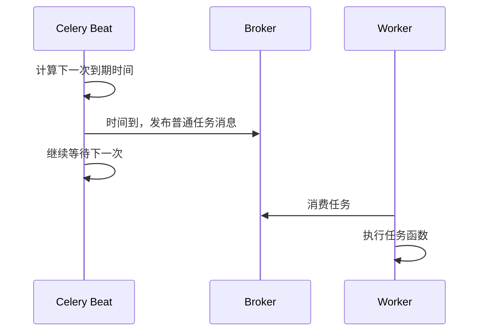
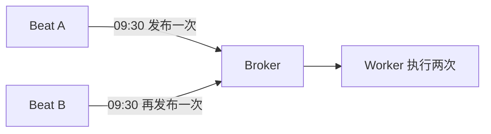

# 05 · Beat 周期任务

官方文档：[Periodic Tasks](https://docs.celeryq.dev/en/stable/userguide/periodic-tasks.html)

Celery Beat 是调度器，不是执行器。它在时间到时向 broker 发布普通任务；真正运行函数的仍是 worker。

## API 与配置的含义

| API / 配置 | 星级 | 含义 |
| --- | --- | --- |
| `beat_schedule` | ⭐⭐⭐ | 静态周期任务表 |
| `crontab(...)` | ⭐⭐⭐ | 按分钟、小时、星期等日历条件调度 |
| 浮点秒数 / `timedelta` | ⭐⭐⭐ | 按固定间隔调度 |
| `timezone` | ⭐⭐⭐ | crontab 的解释时区 |
| `add_periodic_task()` | ⭐⭐ | 通过启动信号动态注册周期任务 |
| 数据库存储的 scheduler | ⭐⭐ | 需要运行时修改计划时使用，如 django-celery-beat |

## Beat 与 worker 的关系



关闭 worker 不会阻止 Beat 继续发布，消息会在 broker 积压；关闭 Beat 也不会影响 worker 执行已经存在的消息。

## 代码 1：固定间隔与 crontab

```python
from celery.schedules import crontab

from celery_app import app


app.conf.update(
    timezone="Asia/Shanghai",
    beat_schedule={
        "cleanup-every-60-seconds": {
            "task": "demo.cleanup",
            "schedule": 60.0,
            "kwargs": {"batch_size": 100},
            "options": {"queue": "maintenance", "expires": 50},
        },
        "report-every-weekday-at-09-30": {
            "task": "demo.generate_report",
            "schedule": crontab(minute=30, hour=9, day_of_week="1-5"),
        },
    },
)
```

每条 schedule 最终只是定期调用一次 `apply_async`。`options` 中的 queue、expires 等和普通任务调用相同。示例给 cleanup 设置 `expires=50`：若 60 秒周期任务在下一周期前仍未开始，旧任务会过期，减少陈旧积压。

`crontab` 使用 Celery 配置的 timezone。服务器系统时区、容器时区和业务时区可能不同，因此不要依赖机器默认值。

## 代码 2：任务定义

```python
from celery_app import app


@app.task(name="demo.cleanup")
def cleanup(batch_size: int) -> int:
    return delete_expired_rows(limit=batch_size)


@app.task(name="demo.generate_report")
def generate_report() -> None:
    build_daily_report()
```

Beat 通过字符串任务名发布消息，因此 worker 必须注册完全相同的任务名。Beat 不需要 import 任务函数本身，但任务名称拼错时仍会按错误名称发布，worker 随后报告“未注册任务”。

## 启动

```bash
# 终端 1：执行任务
celery -A celery_app worker -l INFO -Q maintenance,default

# 终端 2：负责到点发布
celery -A celery_app beat -l INFO
```

开发时可使用 `worker -B` 把 Beat 嵌入 worker，但生产部署应将二者分开，独立重启和监控。

## 为什么同一份计划通常只能有一个 Beat



Beat 默认没有跨实例选主。两个 Beat 读取同一份 schedule，就会各自发布一次。生产环境需要确保只有一个 scheduler 实例，或者使用带分布式锁/选主能力的 scheduler。

## 周期任务还会重叠

计划每分钟发布一次，不代表上一轮一定在一分钟内完成。如果任务运行 90 秒，下一轮仍会照常发布。解决方式不是依赖 Beat 猜测任务状态，而是根据业务选择：

- 任务幂等，允许多实例并行；
- 使用数据库/Redis 分布式锁限制同一业务键；
- 调整周期、拆分任务或减少单次工作量；
- 监控队列积压和任务运行时间。
