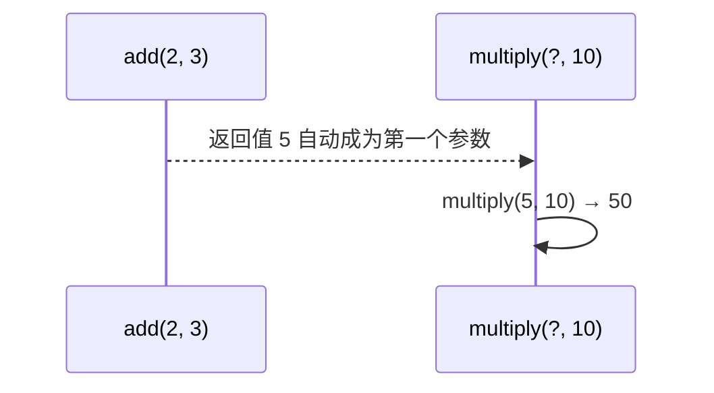
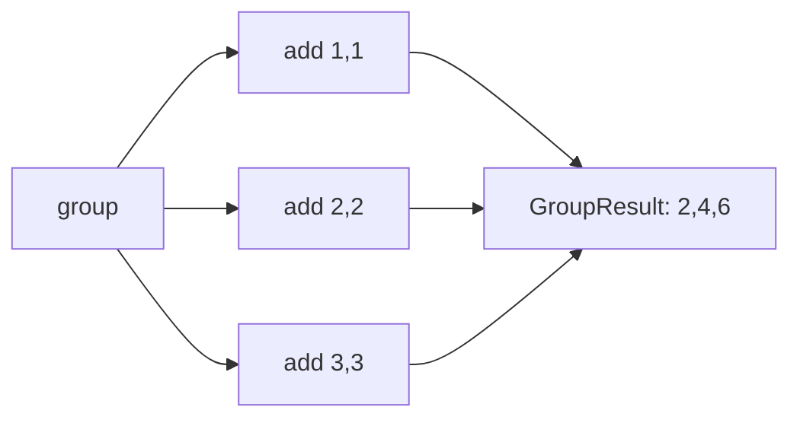
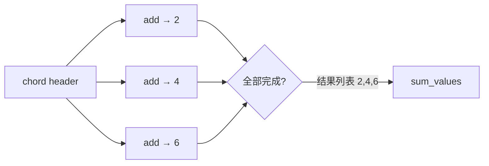

# 06 · Canvas 工作流

官方文档：[Canvas — Designing Workflows](https://docs.celeryq.dev/en/stable/userguide/canvas.html)

Canvas 把任务调用描述成可组合的 Signature，再用 chain、group、chord 表达依赖关系。它解决的是“任务之间怎样传结果”，不是任务函数内部的业务事务。

## API 的含义先说清

| API | 星级 | 含义 |
| --- | --- | --- |
| `task.s(*args, **kwargs)` | ⭐⭐⭐ | 创建可变 Signature；上游结果会作为第一个参数传入 |
| `task.si(*args, **kwargs)` | ⭐⭐ | 创建 immutable Signature；忽略上游结果 |
| `signature.set(**options)` | ⭐⭐ | 给签名增加 queue、countdown 等调用选项 |
| `chain(a, b)` / `a | b` | ⭐⭐⭐ | 串行执行，上一步结果传给下一步 |
| `group([...])` | ⭐⭐⭐ | 一批签名并行执行，得到结果列表 |
| `chord(group, callback)` | ⭐⭐ | group 全部完成后，把结果列表交给 callback |
| `map` / `starmap` / `chunks` | ⭐ | 批量参数的补充工具，用到再查 |

## Signature 是“调用说明书”

```python
from tasks import add


signature = add.s(2, 3)
signature = signature.set(queue="default", countdown=5)

result = signature.apply_async()
```

`add.s(2, 3)` 不执行任务，也不发布消息。它保存任务名、参数和调用选项；调用 `apply_async()` 或 `delay()` 后才真正发布。Signature 可被序列化，所以 Canvas 能跨进程继续编排。

## `s()` 与 `si()` 的关键区别

假设上游返回 10：

```python
add.s(5)   # 实际调用 add(10, 5)
add.si(5)  # 实际调用 add(5)，不接收上游结果
```

在 chain 中，普通 Signature 会把上游结果放在原参数之前。下一任务不需要上游结果时使用 immutable signature `.si()`，否则很容易出现参数数量错误。

## 代码 1：`chain` 串行传值

```python
from celery import chain

from tasks import add, multiply


workflow = chain(
    add.s(2, 3),       # 返回 5
    multiply.s(10),    # 实际调用 multiply(5, 10)，返回 50
)

result = workflow.apply_async()
```



chain 并不要求两个任务在同一 worker 或进程执行；结果通过 Celery 的工作流消息继续传递。链中任一步失败，后续普通步骤不会继续。

## 代码 2：`group` 并行扇出

```python
from celery import group

from tasks import add


workflow = group(
    add.s(1, 1),
    add.s(2, 2),
    add.s(3, 3),
)

result = workflow.apply_async()
```

group 同时发布多个独立任务。是否真正并行取决于可用 worker 执行槽；只有一个 solo worker 时仍会逐个执行。group 的聚合结果按签名顺序组织，不按完成顺序组织。



## 代码 3：`chord` 并行后汇总

```python
from celery import chord

from tasks import add, sum_values


workflow = chord(
    [add.s(1, 1), add.s(2, 2), add.s(3, 3)],
    sum_values.s(),
)

result = workflow.apply_async()
```

回调任务会收到 header 的结果列表：`sum_values([2, 4, 6])`。Chord 需要能支持结果同步的 backend；参与 chord 的任务不能随意忽略结果，否则回调不知道 header 是否全部完成。



## 不要在任务内部 `.get()`

```python
@app.task
def wrong() -> int:
    result = add.delay(2, 3)
    return result.get()  # 占住 worker 槽等待另一个任务，可能造成死锁/吞吐崩塌
```

需要任务依赖时，用 chain 或 chord 把依赖关系交给 Celery 调度，不要让一个 worker 子进程同步阻塞等待另一个任务。
