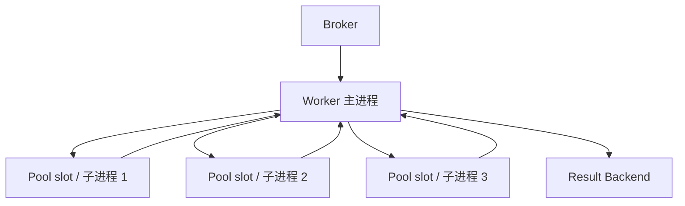
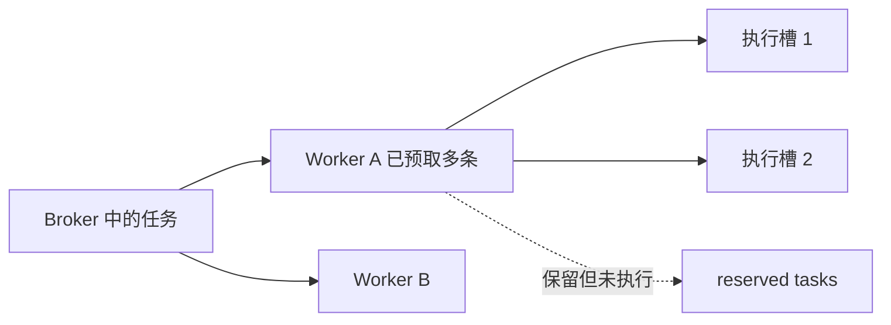

# 07 · Worker 与生产配置

官方文档：[Workers Guide](https://docs.celeryq.dev/en/stable/userguide/workers.html)、[Concurrency](https://docs.celeryq.dev/en/stable/userguide/concurrency/)

worker 是常驻进程。主进程负责连接 broker、收消息和管理执行池，真正的任务函数通常在池中的执行单元里运行。

## 选项的含义先说清

| 选项 / 配置 | 星级 | 含义 |
| --- | --- | --- |
| `--concurrency=N` / `-c N` | ⭐⭐⭐ | worker 同时可执行的任务槽数量 |
| `--pool=prefork` | ⭐⭐⭐ | Linux/Unix 默认多进程池，CPU 任务和通用生产场景首选 |
| `--pool=solo` | ⭐⭐ | 所有任务在 worker 主线程串行执行，适合学习与调试 |
| `--pool=threads` | ⭐⭐ | 线程池，适合特定阻塞 I/O；受 GIL 和库线程安全影响 |
| eventlet / gevent | ⭐ | 大量协作式 I/O 的专用池；功能限制与 monkey patch 成本较高 |
| `worker_prefetch_multiplier` | ⭐⭐⭐ | 每个并发槽额外预取多少消息 |
| soft / hard time limit | ⭐⭐ | 给任务运行时间设软提醒和硬终止 |
| `worker_max_tasks_per_child` | ⭐⭐ | 子进程执行若干任务后重建 |
| `inspect` / `status` | ⭐⭐⭐ | 查询 worker、活跃任务、保留任务和统计信息 |

## worker 的进程模型



`-c 3` 表示最多三个执行槽，不表示 broker 只向 worker 交付三条消息；预取还会让 worker 保留额外消息。

## 代码 1：按任务性质启动 worker

```bash
# Linux/Unix 通用生产 worker：四个子进程
celery -A celery_app worker -l INFO --pool=prefork --concurrency=4

# 学习、调试或不支持 prefork 的本地环境
celery -A celery_app worker -l INFO --pool=solo

# 特定阻塞 I/O 任务，且依赖库线程安全
celery -A celery_app worker -l INFO --pool=threads --concurrency=16
```

Celery 不正式支持 Windows 生产 worker；`solo` 可用于本地学习，但生产部署通常使用 Linux 容器/主机。不同 pool 支持的功能不完全相同，尤其 soft time limit、进程回收等依赖进程模型。

## 预取为什么影响公平性

假设 concurrency=2、`worker_prefetch_multiplier=4`，worker 可能保留执行中任务之外的多条消息。长任务混合时，某个 worker 会提前囤住任务，其他空闲 worker 看不到这些消息。



长任务常以 `worker_prefetch_multiplier=1` 作为起点，优先公平；大量短任务可提高 multiplier 换吞吐。它不是固定最佳值，需要结合任务耗时分布和队列监控调整。

## 时间限制不是普通业务超时

```python
from billiard.exceptions import SoftTimeLimitExceeded

from celery_app import app


@app.task(soft_time_limit=20, time_limit=30, name="demo.long_job")
def long_job(job_id: int) -> None:
    try:
        run_job(job_id)
    except SoftTimeLimitExceeded:
        release_temporary_resources(job_id)
        raise
```

- soft limit：在支持的 pool 中向任务抛 `SoftTimeLimitExceeded`，给它清理机会。
- hard limit：到期后 worker 会终止执行单元，finally 不一定有机会完成。

因此 time limit 不能替代数据库事务、幂等和外部请求自身的 timeout。对 HTTP 调用仍应在客户端设置连接/读取超时，否则进程可能长期卡死直到硬限制介入。

## 控制子进程生命周期

```python
app.conf.update(
    worker_max_tasks_per_child=500,
    worker_max_memory_per_child=512_000,
)
```

这两个配置用于缓解第三方库内存增长或长期碎片，不是修复内存泄漏的替代品。达到阈值后，当前任务结束，worker 再替换子进程；阈值过小会频繁重建进程并降低吞吐。

## 监控命令

```bash
celery -A celery_app status
celery -A celery_app inspect ping
celery -A celery_app inspect active
celery -A celery_app inspect reserved
celery -A celery_app inspect scheduled
celery -A celery_app inspect stats
celery -A celery_app inspect registered
```

`inspect` 通过广播向 worker 询问状态。没有返回可能是 worker 离线、网络不通、响应超时或远程控制不可用，不能简单解释为“没有任务”。

## revoke 的真实含义

```python
from celery_app import app


app.control.revoke(task_id)
```

revoke 会让 worker 记住该 task_id，并在任务尚未开始时跳过它。任务已经运行时，普通 revoke 不会倒转已发生的副作用。`terminate=True` 会终止执行进程，可能误伤该进程正在处理的其他状态或留下半完成写入，应只作为运维最后手段。

## 关停

生产发布应先停止接收新流量，再对 worker 发送 TERM 触发 warm shutdown，让正在执行的任务完成。KILL 无法清理；是否重投取决于消息是否已经确认和 late ack 配置。
