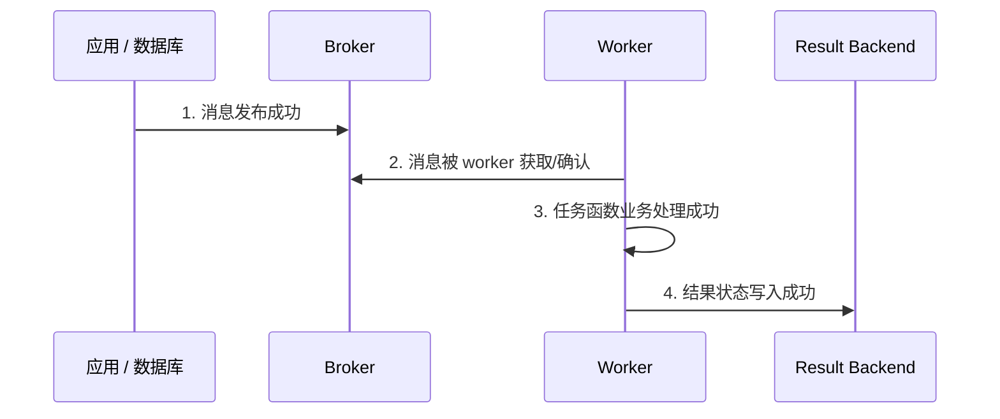
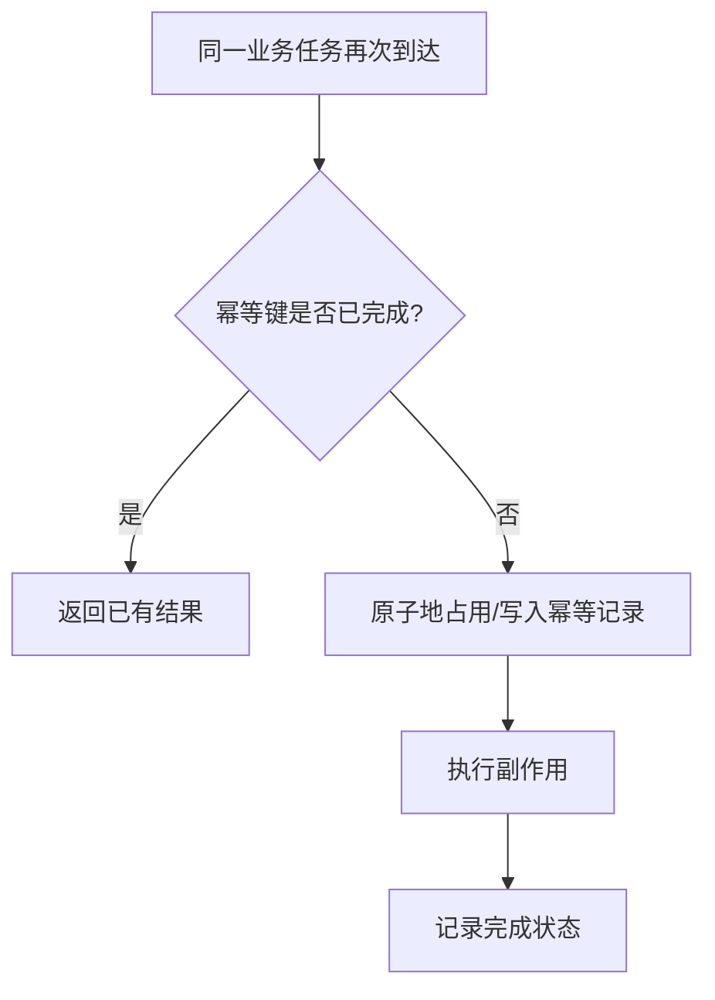
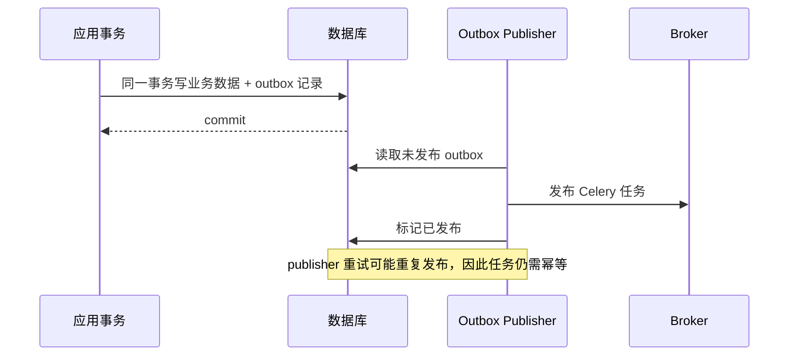

# 08 · 故障语义与上线清单

这一讲不再增加调用 API，而是把 Celery 的故障边界串起来。会写 `.delay()` 不难，难的是知道每个“成功”具体成功到哪一步。

## 四个成功不是同一件事



可能出现：业务已经成功，但 backend 写入失败，AsyncResult 查不到 SUCCESS；消息发布成功，但调用端在收到确认前断线，于是调用端不知道是否应重发；任务写完数据库后在 ACK 前崩溃，于是消息重投并再次执行。

## 你真正能设计的是“至少一次 + 幂等”

Celery 无法替业务提供端到端的 exactly-once。常见可靠模型是：允许任务在故障边界重复交付，通过幂等让重复执行不产生重复业务结果。



Celery task_id 可以帮助追踪，但不总是业务幂等键。一次用户操作如果因为 HTTP 重试而发布两次，可能产生两个不同 task_id；更稳妥的是使用业务请求 ID、订单 ID + 操作类型等稳定键，并由数据库唯一约束兜底。

## 数据库提交与任务发布之间的空隙

下面的写法有双写问题：

```python
save_order()
send_email.delay(order_id)
```

- 数据库提交成功、任务发布失败：订单存在，但永远没有邮件任务。
- 任务先发布、数据库事务随后回滚：worker 可能查不到订单。

企业常用解决方案是 transactional outbox：业务数据和 outbox 事件在同一数据库事务提交，再由独立 publisher 可靠地把未发布事件发送到 broker。



## result backend 不是业务数据库

backend 的主要用途是状态查询和 Canvas 结果同步。结果可能过期、清理、暂时不可达，也可能因任务配置 `ignore_result=True` 而不存在。关键业务状态应写入自己的数据库，不应只靠 `AsyncResult.state` 判断订单、账单或导出是否真实完成。

## 故障矩阵

| 故障点 | 可能现象 | 应对方式 |
| --- | --- | --- |
| 发布前应用崩溃 | 没有任务消息 | outbox / 调用侧可靠重试 |
| 发布成功但调用端超时 | 不知道是否发布成功，重发可能重复 | 稳定业务幂等键 |
| worker 正常抛临时异常 | FAILURE 或 RETRY | 精确异常 + backoff + 最大次数 |
| worker 执行中被杀 | early ack 可能丢；late ack 可能重投 | late ack + 幂等 + 监控 |
| backend 不可用 | 任务可能已完成但状态不可查 | 业务状态落库；backend 告警与恢复 |
| Beat 启动两个实例 | 每周期发布两次 | 单 scheduler / 选主 |
| 目标队列无 worker | 消息持续积压 | 队列深度与消费者监控 |

## 上线前检查清单

### 任务定义

- 参数与返回值可 JSON 序列化，没有传 ORM 对象、request、连接等进程内对象。
- 任务名稳定且不会和其他模块冲突。
- 外部网络调用设置了连接与读取 timeout。
- 任务重复执行时结果仍正确；幂等由存储层唯一约束或状态机保证。
- 只对临时异常重试，设置 backoff、jitter 和 max_retries。

### 消息与队列

- 每个路由目标队列都有 worker 消费。
- 长短任务是否需要拆队列已经评估。
- prefetch 与任务耗时分布匹配。
- RabbitMQ / Redis 的连接、认证、持久化和高可用由环境负责。

### worker

- pool 与任务性质、操作系统匹配。
- concurrency 不超过数据库连接池、外部 API 限额等下游容量。
- worker 支持 warm shutdown，发布流程不会直接 KILL。
- active、reserved、scheduled、失败率、重试率和队列深度可监控。

### Beat 与 Canvas

- 同一份 schedule 只有一个有效 scheduler。
- 周期任务允许重叠，或已有分布式锁/幂等保护。
- chord 使用支持的 backend，参与任务没有忽略结果。
- 任务内部没有 `.get()` 阻塞等待其他 Celery 任务。

## 最终选型

| 需求 | 工具 |
| --- | --- |
| 当前进程内短暂并发 I/O | `asyncio` |
| 跨进程/跨机器的后台任务、重试和队列削峰 | Celery |
| 固定时间或 crontab 发布任务 | Celery Beat |
| 多任务依赖与扇出收拢 | Celery Canvas |
| 业务数据与消息原子衔接 | Transactional outbox + Celery |

Celery 是执行和调度基础设施，不是业务一致性本身。真正可上线的任务必须同时考虑消息语义、幂等、数据库事务和可观测性。
