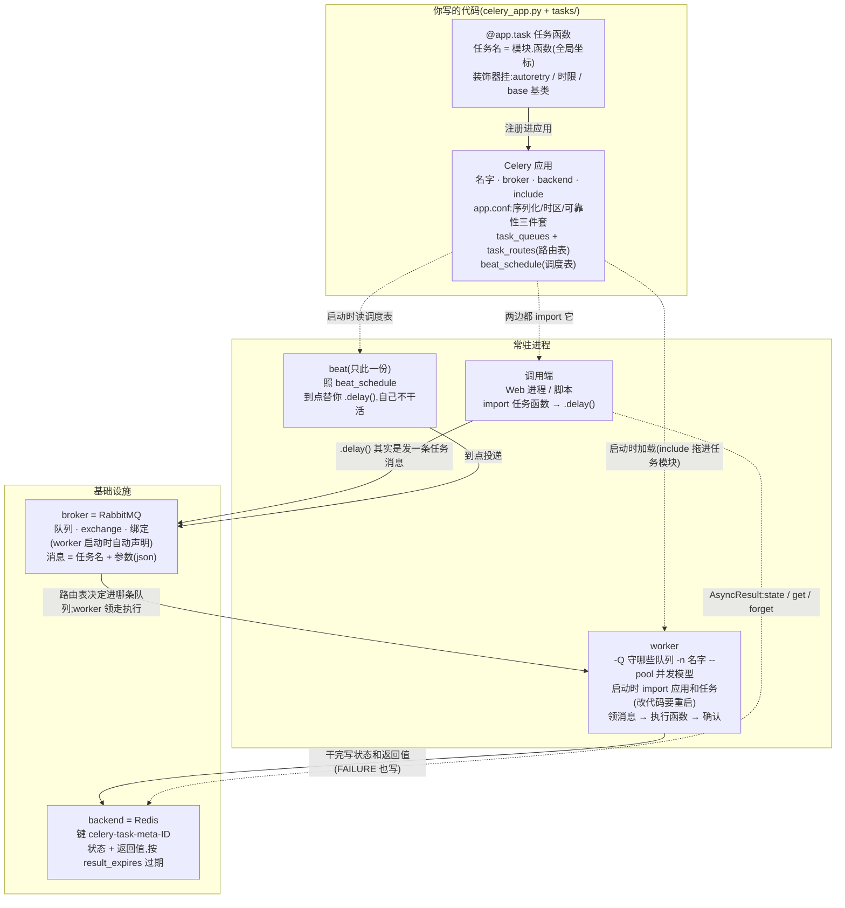
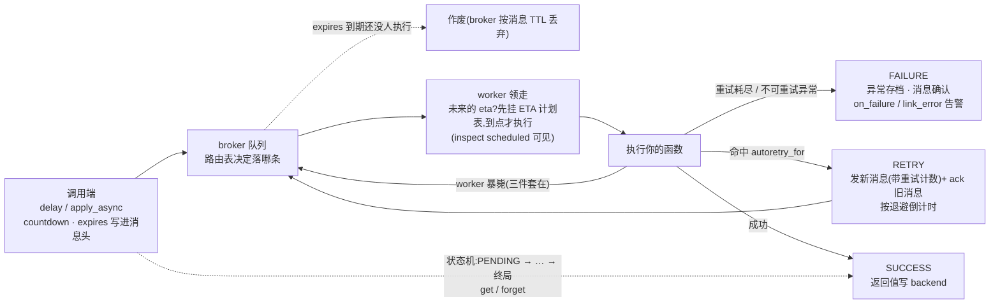
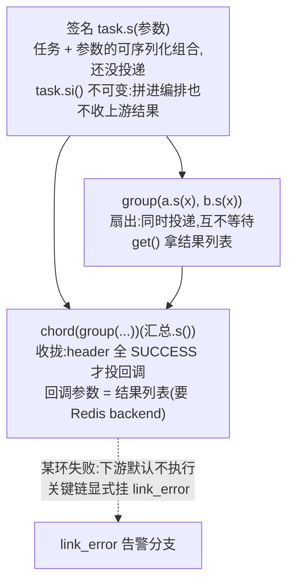
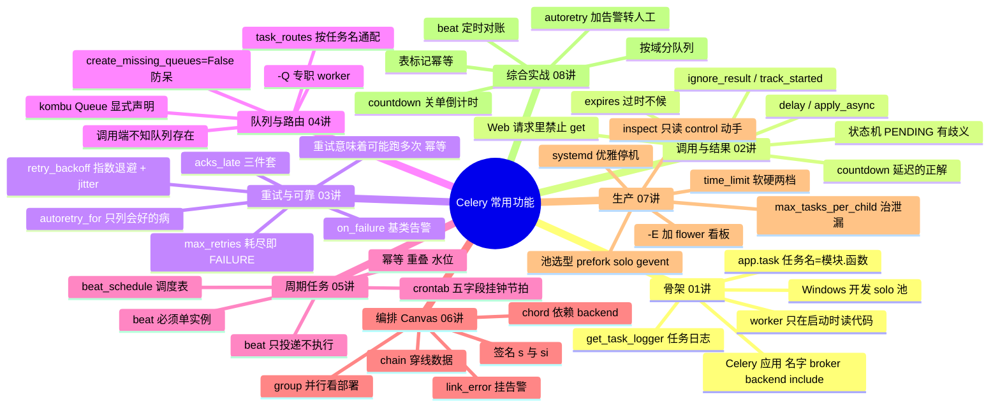

# Celery 概念地图

把八讲里的对象和配置收进几张图:**谁连谁、哪个配置挂在哪一层、一个任务怎么走完一生**。图用 Mermaid 画,GitHub / Typora / Obsidian 里直接渲染;纯终端看不了图的话,每张图后面都配了同内容的文字,信息不缺。

> 配套关系:[celery配置速查.md](celery配置速查.md) 是字典(参数级),本文件是地图(关系级)。

---

## 1 对象关系图:谁 import 谁、消息怎么流

三句口诀:

- **调用端只认任务函数,worker 只认队列**,中间靠 app.conf 里的路由表翻译——兔 MQ 的"绑定"搬进了配置文件,解耦的落点也跟着搬了家(第 4 讲)
- **任务名是全局坐标**(模块.函数):路由表按它分队列、beat 按它点名、revoke/监控按它找人。改任务名 = 作废坐标,别随手改(第 1 讲)
- **worker 和 beat 都是 app.conf 的执行者**:worker 执行"怎么干"(队列、池、可靠性),beat 执行"什么时候干"(调度表);两者互不认识,靠 broker 里的消息接头(第 5 讲)

---

## 2 配置挂在哪:一表看全

问"重试配置在哪""路由配在哪",答案全在这张表——**先找层,再找旋钮**:

| 层 | 旋钮 | 管什么 | 讲 |
|---|---|---|---|
| `Celery(...)` | `broker` / `backend` | 消息走哪 / 结果存哪 | 01 |
| `Celery(...)` | `include=[...]` | worker 启动时 import 哪些任务模块 | 01 / 04 |
| app.conf | `task_serializer` / `accept_content` | 序列化白名单(企业只开 json) | 01 |
| app.conf | `timezone` | crontab 按哪个时区解释 | 05 |
| app.conf | `task_default_queue` | 漏写路由任务的兜底队列(需在 task_queues 里声明) | 04 |
| app.conf | `task_acks_late` / `task_reject_on_worker_lost` / `worker_prefetch_multiplier` | 可靠性三件套,全局默认 | 03 |
| app.conf | `result_expires` | 结果保质期 | 02 |
| app.conf | `task_queues` / `task_routes` | 队列声明 + 路由表 | 04 |
| app.conf | `task_create_missing_queues=False` | 拼错队列名当场报错 | 04 |
| app.conf | `beat_schedule` | 周期调度表 | 05 |
| app.conf | `task_time_limit` / `worker_max_tasks_per_child` | 全局兜底:时限 / 治泄漏 | 07 |
| 装饰器 | `ignore_result` / `track_started` | 这个任务的结果行为 | 02 |
| 装饰器 | `autoretry_for` / `retry_backoff` / `retry_jitter` / `max_retries` | 这个任务的重试 | 03 |
| 装饰器 | `bind=True` / `base=告警基类` | 拿到 self / 失败自动告警 | 03 |
| 装饰器 | `soft_time_limit` / `time_limit` | 这个任务的时限 | 07 |
| apply_async | `countdown` / `expires` | 单次投递:延迟 / 作废 | 02 |
| apply_async | `queue` / `priority` | 单次改投 / 插队 | 04 |
| apply_async | `link` / `link_error` | 成功 / 失败分支 | 06 |
| beat_schedule 条目 | `schedule` / `options` | 节拍(float/crontab)/ 投递选项 | 05 |
| 命令行 | `-Q` / `-n` / `--pool` / `--concurrency` / `-E` | 部署:守哪 / 叫啥 / 怎么并发 / 发事件 | 04 / 07 |

两条规律:

- **同一旋钮三层可给**:app.conf(全局默认)→ 装饰器(任务级例外)→ apply_async(单次微调),后写者赢。企业写法是前一层管住全部、后两层只放例外(第 1 讲敲黑板);命令行是第四层,但它管的是**部署**(哪些机器守哪些队列),不改任务行为
- **worker 是住在旧代码里的常驻进程**:上面任何一层改了,worker 都要重启才生效——调用端每次运行都是新代码,worker 不是,这是两边最大的不对称(第 1 讲敲黑板)

---

## 3 一个任务的一生(八讲全景)

- RETRY 不是终态:"ack 旧的、发带计数的新消息"就是你在兔 MQ 第 8 讲手写的重试三板斧,Celery 内置了它还附赠指数退避和抖动(第 3 讲)
- worker 暴毙那条回队箭头,只在三件套齐全时存在:acks_late(干完才确认)+ reject_on_worker_lost(暴毙即 reject)+ prefetch=1(不囤消息)——缺一个,箭头断一条(第 3 讲)
- FAILURE 的兜底是"异常存档 + 告警",不是死信队列:主流圈子的选择,和兔 MQ 的 DLX 思路是两条路,想走 DLX 也能配(第 3 讲)

---

## 4 Canvas 编排图(第 6 讲的套路)

三个要点:签名是积木(可序列化,能存能传);chain 靠**穿线数据**活着(先设计每环的 return);group 给的是**并行的机会**,真并几路看部署了几个 worker(第 6 讲实验一/二的对照)。

---

## 5 思维导图:常用功能总览

八讲走完,对着这张导图从上往下自问"这是什么、解决什么、代码怎么写"——答得顺,就出师了。
