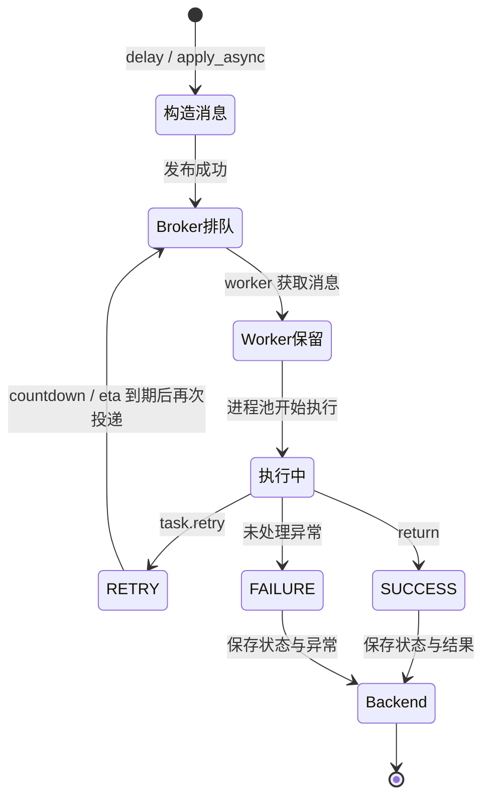
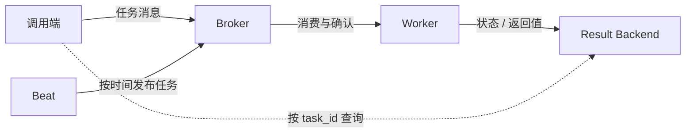

# Celery 概念地图

## 一个任务的一生



`PENDING` 并不一定表示“任务正在队列里”。结果 backend 查不到这个 task_id 时也是 PENDING；因此仅凭 PENDING 无法判断任务是否真实存在。

## 三条完全不同的链路



- Broker 不保存 Python 返回值，它保存待消费的任务消息。
- Backend 不调度任务，它按 task_id 保存状态与结果。
- Beat 不执行任务，它只在时间到时向 broker 发布任务。

## API 关系

```text
函数定义：@app.task → Task 对象

单次调用：
Task.delay(...) ──────────────┐
Task.apply_async(...) ────────┼─> AsyncResult(task_id)
signature.apply_async() ──────┘

工作流：
signature → chain / group / chord → apply_async()
```

## 可靠性分层

| 层 | 解决的问题 | 主要工具 |
| --- | --- | --- |
| 业务层 | 重复执行不能重复扣款/发货 | 幂等键、唯一约束、状态机 |
| 任务层 | 临时错误怎样重试 | `retry`、`autoretry_for`、backoff、jitter |
| 消息层 | worker 崩溃后消息是否重投 | `acks_late`、`task_reject_on_worker_lost` |
| 调度层 | 任务去哪、何时发 | `task_routes`、Beat、Canvas |
| 运行层 | 并发、超时、内存、积压 | worker pool、time limit、prefetch、监控 |

不要把“自动重试”和“崩溃重投”当成一回事：前者处理 Python 能捕获的业务异常，后者处理进程被杀、断电等无法正常抛异常的故障。
