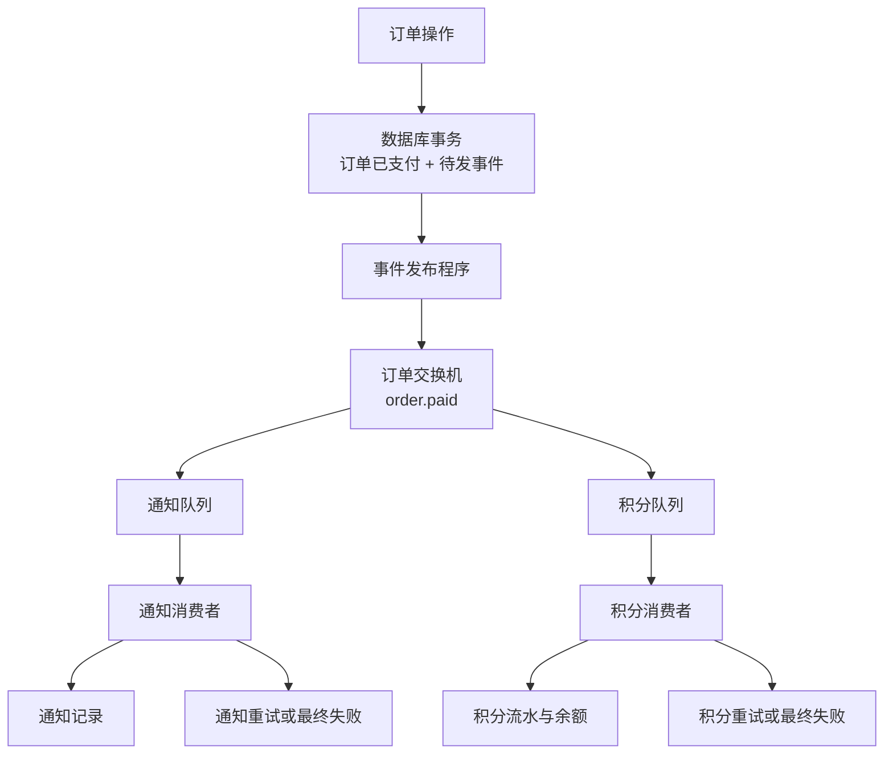

# 订单支付事件处理系统：实战需求

## 1. 项目目标

实现一个小型订单后台：订单支付成功后，通过 RabbitMQ 通知两个独立业务——生成支付通知、增加用户积分。

除正常收发外，还要处理重复消息、临时失败、消费者退出和消息发布失败。完成后，应能通过数据库记录、日志和管理页面说明一条消息的处理过程。

本项目只模拟支付和通知，不接真实支付渠道，不发送真实邮件或短信。本文件规定需求和验收结果，不提供实现代码。

### 完成后要掌握的内容

| 能力 | 本项目中的使用方式 |
| --- | --- |
| 交换机、队列和绑定 | 一条支付事件分别进入通知队列和积分队列 |
| 发布确认 | 确认 RabbitMQ 接收了发布；无可路由队列时能发现错误 |
| 手动消费确认 | 业务结果提交成功后才 ack |
| 竞争消费与预取 | 两个消费者共同处理通知队列，限制未确认消息数量 |
| 幂等 | 重复投递不会重复创建通知或增加积分 |
| 有限延迟重试 | 临时错误按间隔重试，达到上限后停止 |
| 失败归档与补偿 | 保存处理失败的消息，修复原因后可以重新处理 |
| Outbox | 将订单变更和待发事件一起保存，避免订单支付成功却没有发布事件 |
| 日志与监控 | 能发现积压、消费者离线、失败和长时间未发布的事件 |

**最终验收关注数据库中的业务结果，不只看终端是否打印“成功”。**

## 2. 范围与开发环境

### 2.1 本次需要完成

- 创建模拟订单，并执行“标记支付成功”。
- 发布订单支付事件。
- 通知、积分两个业务独立消费。
- 持久化业务结果、去重记录、待发事件和失败处理记录。
- 支持可重复的故障模拟与验收。
- 所有程序能够在 PyCharm 中直接运行，Parameters 留空。

### 2.2 本次不需要完成

- 前端页面、真实支付、真实邮件或短信。
- 库存扣减、优惠券、退款、分布式事务框架。
- RabbitMQ 集群部署和压力测试平台。
- 为每一种交换机都做一个业务场景。

先把一条订单支付链路做完整，不扩展成电商系统。

### 2.3 环境约定

| 项目 | 要求 |
| --- | --- |
| 开发语言 | Python，使用当前项目环境 |
| 消息客户端 | Pika |
| RabbitMQ | 使用已有服务器；先验证 AMQP 连接，不以管理页面登录代替连接验证 |
| 本地数据库 | SQLite 即可，无需额外部署数据库；数据库文件放本实战目录并忽略提交 |
| 运行方式 | PyCharm 直接运行，各进程有独立运行入口 |
| 启动选项 | 在有注释的配置位置修改，不要求命令行参数 |
| 连接凭据 | 从现有 .env 读取，不写入源码、消息或日志 |
| 资源名称 | 统一使用 ai_lab.practice 前缀，与已有 ai_lab.learn 教程资源分开 |

SQLite 用于本地、小规模并发验收。事务冲突或数据库暂时繁忙时不得提前确认消息；暂不要求分布式数据库或高并发部署。

## 3. 业务规则

### 3.1 创建订单

输入用户 ID 和订单金额，创建一笔状态为“待支付”的订单。

- 订单号唯一。
- 金额大于 0，以十进制字符串传递，例如 99.00。
- 测试使用虚构用户，不包含手机号、邮箱等真实个人信息。
- 创建订单本身不产生“订单已支付”事件。

### 3.2 标记支付成功

- 只有“待支付”订单可以第一次变为“已支付”。
- 保存支付时间。
- 同一个订单重复执行支付操作，返回已有支付结果，不创建第二条支付事件。
- 订单不存在时明确失败，不发布消息。
- 最终版本中，订单状态变更和对应 Outbox 事件在同一个数据库事务中提交。

**事务**：一组数据库修改一起提交或一起回滚，避免只成功一部分。

### 3.3 通知业务

消费支付事件后，为该订单创建一条“支付成功通知”记录，记录用户、订单、事件 ID、通知内容和处理时间。

- 不调用外部服务，以数据库中成功创建通知记录作为本项目的业务完成标准。
- 同一订单的支付成功通知最多一条。
- 通知业务失败不能使已经完成的订单支付回滚。

### 3.4 积分业务

每笔已支付订单为所属用户增加 **100 积分**，同时保存积分流水。

- 一笔订单最多产生一条“支付赠送积分”流水。
- 同一用户支付两笔不同订单，应累计增加 200 积分。
- 积分流水和余额变更在同一事务中提交。
- 积分处理失败不影响通知业务独立完成。

固定增加 100 积分是为了方便验收，本项目不实现复杂积分计算规则。

## 4. 系统分工与消息资源

### 4.1 独立职责

| 模块或进程 | 负责什么 |
| --- | --- |
| 订单操作入口 | 创建订单、标记支付成功、查询结果 |
| 资源初始化入口 | 声明本项目使用的交换机、队列和绑定 |
| 事件发布程序 | 读取待发事件，发布消息并记录发布结果 |
| 通知消费者 | 校验消息、完成通知业务、确认或进入失败处理 |
| 积分消费者 | 校验消息、完成积分业务、确认或进入失败处理 |
| 失败补偿入口 | 按事件 ID 查询失败原因，发起指定业务的重新处理 |
| 状态检查入口 | 汇总数据库业务状态与消息处理状态 |

这些是职责边界，不要求一个职责只能对应一个文件。消息传输逻辑与业务处理逻辑应分开，业务函数不直接调用 ack。

### 4.2 基础资源

| 类型 | 名称 | 用途 |
| --- | --- | --- |
| topic 交换机 | ai_lab.practice.order.events | 接收订单事件 |
| 队列 | ai_lab.practice.order.notification.q | 通知业务订阅 |
| 队列 | ai_lab.practice.order.points.q | 积分业务订阅 |
| direct 交换机 | ai_lab.practice.order.failure | 路由最终失败消息 |
| 队列 | ai_lab.practice.order.notification.failed.q | 通知失败消息 |
| 队列 | ai_lab.practice.order.points.failed.q | 积分失败消息 |

通知和积分工作队列都绑定 order.paid。失败交换机分别使用 notification.failed、points.failed 路由到对应失败队列。

交换机和队列定义需要持久化；业务消息需要标记为持久化。持久化与发布确认分别处理不同问题，不作为“任何故障下绝不会丢失”的承诺。

重试所需资源在重试阶段设计，不能使用已有教程或其他业务的队列。初始化可重复运行，但不能为了避免参数冲突而自动清空或删除现有队列。

## 5. 事件与数据要求

### 5.1 支付事件字段

| 字段 | 要求 |
| --- | --- |
| event_id | 事件唯一 ID；重发、重试和补偿时保持不变 |
| event_name | 固定为 order.paid |
| schema_version | 消息结构版本，当前为 1 |
| occurred_at | 事件发生时间，使用带时区的 UTC 时间 |
| order_id | 订单唯一 ID |
| user_id | 用户 ID |
| paid_amount | 支付金额，十进制字符串 |

- 正文采用 UTF-8 JSON。
- 消息属性中的 message_id 与正文 event_id 一致。
- 消息只携带处理需要的数据，不携带数据库连接或登录凭据。
- 消费者检查正文类型、必填字段、事件类型和支持的结构版本。
- 不支持的版本及不合法数据进入明确的失败处理，不允许异常后直接当成功处理。

**重发同一事件**必须复用原 event_id；**另一笔订单支付**必须生成新的 event_id。

重试次数、目标消费者、最近错误等属于处理状态，单独放在消息附加属性或持久化处理记录中，不通过生成新业务事件来“重置次数”。

### 5.2 需要保存的数据

下面是逻辑数据要求，不要求照抄成指定表名。

| 数据 | 至少保存什么 | 关键约束 |
| --- | --- | --- |
| 订单 | 订单 ID、用户、金额、状态、支付时间 | 订单 ID 唯一 |
| 待发事件 | 事件 ID、订单 ID、正文、待发/已发布状态、发布次数、最近错误 | 每笔订单只有一个支付事件 |
| 消费成功记录 | 消费者业务、事件 ID、成功时间 | 消费者业务 + 事件 ID 唯一 |
| 通知记录 | 订单、用户、通知类型、内容、事件 ID | 订单 + 通知类型唯一 |
| 积分流水 | 订单、用户、变更原因、分值、事件 ID | 订单 + 变更原因唯一 |
| 用户积分余额 | 用户 ID、当前余额 | 用户 ID 唯一 |
| 失败及补偿记录 | 消费者业务、事件 ID、原消息、失败原因、次数、处理状态、补偿历史 | 能区分每轮补偿，保留历史 |

失败消息无法解析出事件 ID 时，也要用独立失败记录 ID 留存原始内容和错误，不能因为缺少 event_id 而无法排查。

## 6. 消息处理要求

### 6.1 发布确认

- 发布程序开启 Publisher Confirm。
- 发布无法路由到任何队列时，必须报告失败，不能把 Outbox 标记为已发布。
- 发布确认成功后，才能将待发事件标记为已发布。
- 连接中断或发布结果不确定时保留待发状态，恢复后允许重发。
- 发布成功后、标记已发布前退出，恢复时可能重复发布；消费者必须能接受这个结果。

mandatory 只能发现“没有任何匹配队列”，不能证明通知和积分两个队列都绑定正确。完整验收还要检查两个绑定及两个业务结果。

### 6.2 消费确认与幂等

**幂等**：同一事件处理多次，业务结果与处理一次相同。

- 关闭自动确认，业务事务提交后才 ack。
- 同一消费者再次收到已成功处理的事件，确认该消息，不重复执行业务。
- 通知、积分分别记录消费结果，不能共用一个全局“这个事件处理过了”的标记。
- 去重检查与业务结果必须有数据库唯一约束和事务保护，不能只使用内存集合或“先查一下”。
- 为防止相同业务误用了不同 event_id，通知和积分还应有订单级业务唯一约束。
- 消费者异常退出后，未确认消息可以重新投递；不要求 RabbitMQ 只投递一次。

### 6.3 有限延迟重试

临时故障允许 **最多重试 3 次**：首次处理 + 3 次重试，共最多 4 次业务尝试。

| 尝试 | 与上次失败之间的等待 |
| --- | --- |
| 第一次重试 | 5 秒 |
| 第二次重试 | 15 秒 |
| 第三次重试 | 60 秒 |
| 第三次重试仍失败 | 停止自动重试，进入最终失败处理 |

- 格式错误、必填字段缺失等永久错误不自动重试。
- 临时超时等可恢复错误按上表重试。
- 重试次数需要在进程重启后保留，不能依赖内存计数。
- 一个业务的重试只回到该业务队列，不能再次广播到所有业务。
- 不使用无限立即 requeue 作为延迟重试。
- 等待时间是最早再次尝试的约束，不要求精确到毫秒；实际处理可能更晚。

可采用 TTL 加死信队列，或持久化重试任务加调度程序。选择一种并说明消息何时从原队列转交、失败时怎样保留处理依据。

如果采用“重新发布一条，再 ack 原消息”，目标发布得到确认前不得 ack 原消息；中间退出可能重复，仍依赖幂等。使用经典队列默认死信转发时，必须记录其目标不可用时的丢失风险，不能将 nack 当作目标接收确认；最终验收要求存在可查询的持久化恢复依据。

### 6.4 最终失败与人工补偿

- 永久错误或重试耗尽后，记录最终失败原因、原始消息和业务归属。
- 正常运行情况下，消息进入该业务的失败队列。
- 失败队列不可用时，不得显示“归档成功”并丢掉唯一恢复依据。
- 能按事件 ID 和业务查询失败，并只补偿选中的业务。
- 补偿复用原业务事件 ID，保留原失败历史；另记一轮补偿及其尝试次数。
- 补偿后成功，更新处理状态；补偿也不能无限自动循环。
- 重复点击补偿不能重复增加积分或创建通知。
- 无法校验的原始消息不能不经修复就伪装成正常业务事件发送。

## 7. 可控故障场景

故障选项在有注释的本地配置位置设置，PyCharm 点运行即可。不通过修改真实服务器网络或删除业务队列制造故障。

| 场景 | 模拟方式要求 | 应看到的结果 |
| --- | --- | --- |
| 正常处理 | 两个业务都成功 | 一条通知、100 积分、一条积分流水 |
| 重复消息 | 同一事件重复发布 5 次 | 各业务仍只产生一次结果 |
| 临时失败后恢复 | 指定订单的通知前两次尝试失败 | 第三次尝试成功；积分独立成功 |
| 一直临时失败 | 指定通知事件每次都失败 | 4 次业务尝试后进入最终失败 |
| 永久错误 | 发布一条缺失必填字段的测试消息 | 不自动重试，有失败记录可查 |
| 提交前退出 | 消费者在业务事务提交前暂停，再停止进程 | 恢复后可重新处理，不留半条业务结果 |
| 提交后、ack 前退出 | 提交完成后暂停，在 PyCharm 停止进程 | 重新投递后去重，业务结果不重复 |
| 发布失败 | 本地配置使用不可连接的测试端口，或独立测试交换机无绑定 | 待发事件保留，日志可查；恢复配置后继续发布 |
| 支付后发布程序未运行 | 停止发布程序，再完成订单支付 | 订单已支付、待发事件存在；启动发布程序后补发 |
| 发布确认后退出 | 发布已确认、Outbox 尚未标记时暂停并停止 | 恢复可能重发，但不产生重复业务结果 |

“前两次失败”要按持久化尝试状态判断，重启不能重新从第一次开始。暂停点使用本地可控延迟或断点，不要求在毫秒级时间窗口内手动点击。

## 8. 分阶段实施与验收

按阶段完成，一个阶段通过后再进入下一个阶段。

### 阶段一：资源和正常收发

**实现内容**：资源初始化、模拟支付事件发布、两个消费者、数据库中的通知与积分结果。

**验收**：

1. 不启动消费者，发布一条正常事件，通知与积分队列 Ready 各增加 1。
2. 启动两个业务消费者，两个业务分别完成，工作队列最终无待处理消息。
3. 发布日志包含事件 ID；业务记录能查到相同 ID。
4. 初始化再次运行，已有业务消息不被清空。

本阶段可以手动发布事件；订单与发布之间的一致性在阶段五补齐。

### 阶段二：确认、重复投递与事务

**实现内容**：手动 ack、消费去重、业务唯一约束、提交前后退出测试。

**验收**：

1. 同一事件发布 5 次，最终一条通知、一条积分流水、增加 100 积分。
2. 两个不同订单属于同一用户，最终两条通知、两条流水、增加 200 积分。
3. 同一订单携带不同 event_id 再投递，仍不能重复产生通知或积分。
4. 提交前和提交后退出两种场景，恢复后都没有丢失或重复业务结果。

### 阶段三：重试和失败归档

**实现内容**：区分临时/永久错误、有限重试、独立失败队列及持久化记录。

**验收**：

1. 前两次临时失败，第三次成功，日志能看到等待和尝试次数。
2. 持续临时失败，最多 4 次尝试后停止自动处理。
3. 永久错误不自动重试。
4. 通知发生重试时，已经成功的积分业务不被重复触发。
5. 重启消费者，次数和失败状态仍然存在。

### 阶段四：人工补偿

**实现内容**：查询失败、指定业务重新处理、补偿审计记录。

**验收**：

1. 修复模拟故障后，选中一条通知失败记录进行补偿。
2. 通知成功，积分余额保持不变，原失败历史仍可查询。
3. 同一条补偿重复执行，业务结果不增加。
4. 找不到的事件、已经成功的业务、有未完成补偿的记录，均返回明确状态。

### 阶段五：订单事务与 Outbox

**实现内容**：订单创建和支付状态、待发事件、发布程序和发布恢复。

**验收**：

1. 订单支付和待发事件一起提交，任一步失败则一起回滚。
2. 同一个订单重复标记支付，不创建第二条支付事件。
3. 发布程序未启动时完成支付，恢复后能发出待发事件。
4. 发布失败不标记已发布；发布确认后退出可恢复，并允许安全重复发布。
5. 发布成功最终体现在通知和积分业务结果中，不能只看 Outbox 状态。

先支持单个发布程序。多发布程序同时抢占待发事件属于扩展项，不是本次必需内容。

### 阶段六：并发消费者与运行观察

**实现内容**：两个通知消费者、预取设置、状态汇总和完整回归。

**验收**：

1. 同一通知队列启动两个消费者，发布 20 笔不同订单，每个实例至少处理一部分，不要求严格均分。
2. 最终生成 20 条通知、20 条积分流水；每笔订单只处理一次。
3. 一个用户拥有这 20 笔订单时，积分增加 2000。
4. 一个通知消费者停止后，另一个能继续处理该队列。
5. 状态检查能区分待发布、待处理、处理中、重试等待、最终失败、已成功。

发布记录、消费记录与队列统计各代表不同状态。队列统计有刷新延迟，不要求它们在每个瞬间完全同步。

## 9. 日志与验收材料

### 9.1 日志字段

至少记录事件 ID、订单 ID、消费者业务、当前尝试次数、处理结果、耗时和错误类型。发布、重试、归档、补偿都应能串联到同一事件。

消费者实例需要有可区分的标识，方便观察并发分工。不打印连接密码，不使用包含凭据的 URL 作为异常提示。

### 9.2 最终交付

- 一份运行说明：先启动什么、在哪里修改本地选项、怎样停止和恢复。
- 一张资源清单：交换机、队列、绑定及其用途。
- 一份数据说明：业务唯一约束、消费去重范围、重试状态如何保留。
- 一份验收记录：覆盖第 7 节故障场景，写出实际数据库结果和关键日志。
- 能重复运行的测试数据准备方式；清理只能针对明确指定的本实战数据，不删除其他项目资源。

### 最终通过条件

同一批订单在重复发布、消费者重启、暂时失败、发布程序恢复和人工补偿后，仍能得到正确且不重复的通知与积分结果；未完成的工作有可查询、可恢复的记录。

## 10. 可选扩展

基础验收全部通过后，再选择以下内容：

1. 用 FastAPI 提供创建订单、标记支付、查询进度和补偿入口。
2. 将 SQLite 换成 PostgreSQL，验证多进程并发事务和发布任务抢占。
3. 设计一个取消订单事件，练习 topic 的不同路由条件。
4. 增加处理耗时、积压时长和失败数量告警。
5. 在隔离环境中验证多节点仲裁队列与故障恢复。

这些扩展不作为第一版验收条件。
