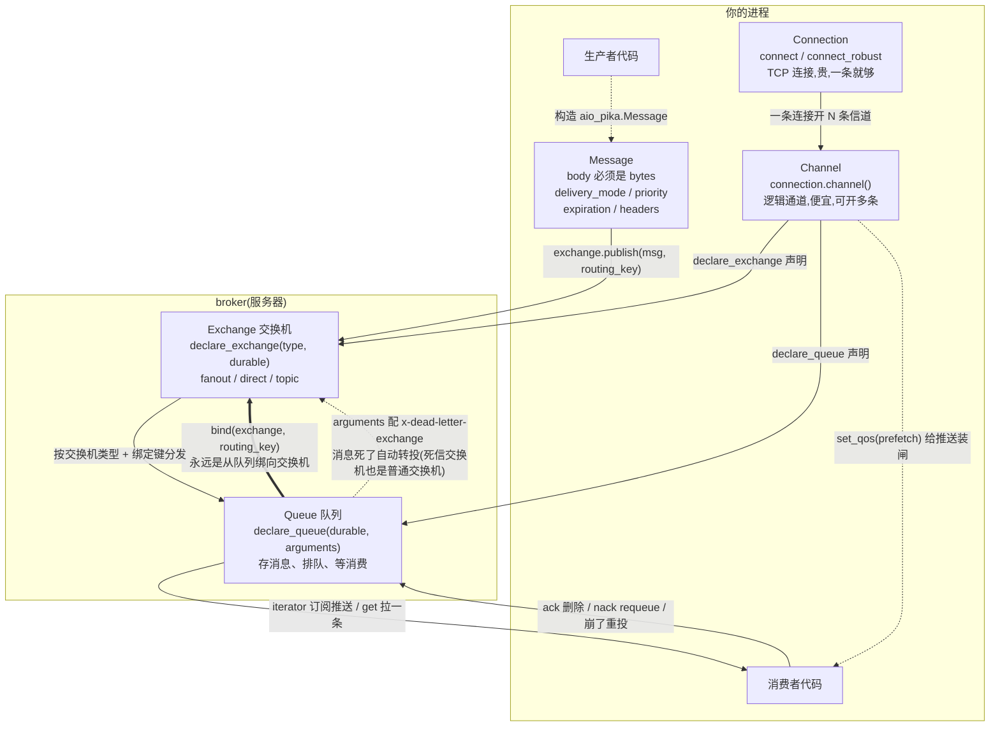
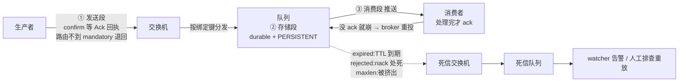
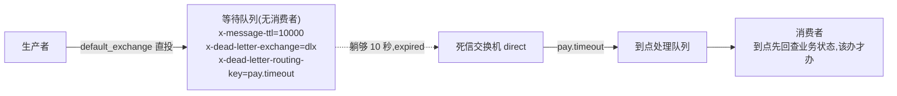
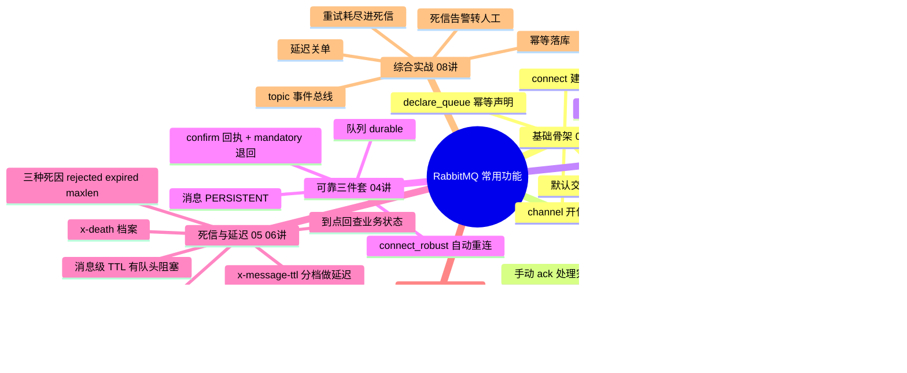

# RabbitMQ 概念地图

把八讲里的对象和配置收进几张图:**谁定义谁、谁绑定谁、哪个配置挂在哪个对象上**。图用 Mermaid 画,GitHub / Typora / Obsidian 里直接渲染;纯终端看不了图的话,每张图后面都配了同内容的表格,信息不缺。

> 配套关系:[aio-pika配置速查.md](aio-pika配置速查.md) 是字典(参数级),本文件是地图(关系级)。

---

## 1 对象关系图:谁定义谁、谁绑定谁

三句口诀:

- **生产者只认交换机,消费者只认队列**,中间靠绑定翻译——这就是解耦的落点(第 3 讲)
- **声明都在信道上做**(declare_exchange / declare_queue),连接只是管道(第 1 讲)
- **死信不是新概念**:队列 arguments 里指个 DLX,死的消息走"队列 → 交换机"再进死信队列(第 5 讲)

---

## 2 配置挂在哪:一表看全

问"死信配置在哪""TTL 配在哪",答案全在这张表——**先找对象,再找旋钮**:

| 对象 | 旋钮 | 管什么 | 讲 |
|---|---|---|---|
| Connection | `connect_robust(...)` | 断线自动重连 + 重放声明 | 04 |
| Channel | `channel(on_return_raises=True)` | 路由失败抛 DeliveryError | 04 |
| Channel | `publisher_confirms`(默认开) | publish 等 broker 回执 | 04 |
| Channel | `set_qos(prefetch_count=N)` | 消费者在途未 ack 消息上限 | 02 |
| publish() | `routing_key` | 路由的"地址" | 03 |
| publish() | `mandatory`(默认 True) | 路由不到退回而非丢弃 | 04 |
| Message | `delivery_mode=PERSISTENT` | 这条消息落盘 | 04 |
| Message | `priority=N` | 插队(需队列开 x-max-priority) | 07 |
| Message | `expiration=timedelta(...)` | 单条 TTL,有队头阻塞坑 | 06 |
| Message | `reply_to` + `correlation_id` | RPC 的回信地址与暗号 | 07 |
| Exchange | `type` / `durable` | 路由行为 / 定义落盘 | 03 / 04 |
| Queue | `durable=True` | 队列定义落盘 | 04 |
| Queue | `bind(exchange, routing_key=)` | 登记想要什么消息 | 03 |
| Queue arguments | `x-dead-letter-exchange` | 死了转投哪个交换机 | 05 |
| Queue arguments | `x-dead-letter-routing-key` | 转投时改写路由键(一个 DLX 多出口) | 06 |
| Queue arguments | `x-message-ttl` | 全队统一寿命,**做延迟用它** | 06 |
| Queue arguments | `x-expires` | 队列闲置多久自动删 | 06 |
| Queue arguments | `x-max-length` / `x-overflow` | 队列上限 / 满了挤老还是拒新 | 05 |
| Queue arguments | `x-max-priority` | 允许消息插队 | 07 |
| Queue arguments | `x-queue-type: quorum` | Raft 多副本队列 | 07 |
| 消费端 | `iterator()` / `get()` | 订阅推 / 主动拉 | 01 / 03 |
| 消费端 | `ack()` / `nack(requeue=?)` | 确认删除 / 拒绝(requeue=False 进死信) | 01 / 05 |

注意规律:**所有 x- 开头的都是队列 arguments**(挂在队列上,不是消息上、更不是交换机上);消息自身的属性(持久化、优先级、单条 TTL)才挂在 Message 上。

---

## 3 一条消息的一生(八讲全景)

- 三段路三种丢法,各配各的解法——第 4 讲开头那张三段图的放大版
- 虚线是"死"的出口:三种死因最后都汇到 DLX,差别只在 x-death 档案里的 reason(第 5 讲)
- 延迟队列就是故意走这条"死路":让消息在无消费者的队列里躺够 TTL,借 expired 到点投递(第 6 讲)

---

## 4 延迟队列链路(第 6 讲的套路单独放大)

三个要点全在等待队列的 arguments 里:**TTL 定时长、DLX 指出口、改写路由键分流**。多种延迟时长按档位建多条等待队列,别用消息级 TTL(队头阻塞)。

---

## 5 思维导图:常用功能总览

八讲走完,对着这张导图从上往下自问"这是什么、解决什么、代码怎么写"——答得顺,就出师了。
