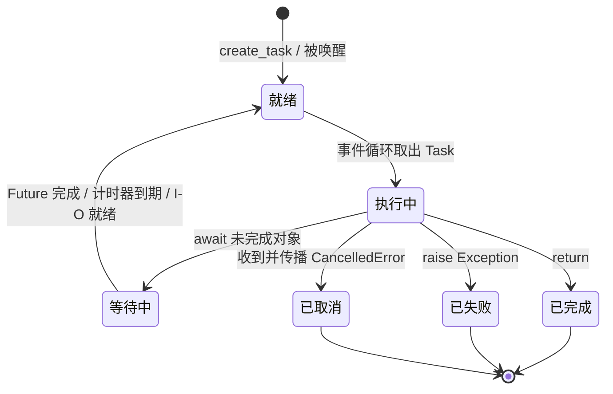

# 01 · 协程与事件循环

`async def` 定义协程函数；调用后得到协程对象；`await` 才会运行并等待它。普通脚本由 `asyncio.run(main())` 启动。

## 本章 API 的含义先说清

| 写法 / API | 输入 | 立即发生什么 | 最终结果 |
| --- | --- | --- | --- |
| `async def func()` | 函数定义 | 定义一个协程函数，不执行函数体 | 调用后得到协程对象 |
| `func()` | 参数 | 创建协程对象；不会自动调度 | 必须被 `await` 或交给 `create_task` |
| `await aw` | 一个 awaitable | 当前 Task 在 `aw` 未完成时挂起 | `aw` 的返回值，或它抛出的异常 |
| `asyncio.sleep(delay)` | 秒数 | 创建计时器型 awaitable | delay 到期后完成；不会阻塞线程 |
| `asyncio.run(coro)` | 顶层协程 | 创建并驱动一个事件循环 | coro 的 return 值，或其异常 |

## 事件循环到底怎样跑一段协程

把下面这句当作整个 asyncio 程序的起点：

```python
asyncio.run(main())
```

它大致完成三件事：创建一个事件循环；把 `main()` 作为顶层 Task 跑到结束；最后清理异步生成器、默认线程池等资源并关闭循环。因此一个普通脚本通常只在最外层调用一次 `asyncio.run()`。在已经运行的协程里再次调用它会报错：一个线程不能在同一时刻嵌套驱动两个事件循环。

事件循环不是“自动把所有 async 函数同时执行”。它维护一个概念上的**就绪队列**和一组**等待条件**。Task 被取出后会连续执行普通 Python 代码；只有遇到 `await` 才可能停下。若 await 的对象还没有完成，Task 会记录“等它完成后再继续”，然后把线程还给事件循环。计时器到期、socket 可读写或另一个 Future 完成时，事件循环才把 Task 放回就绪队列。

可以把一个 Task 的执行周期理解为下面这个状态机。这里的“等待 I/O / 计时器”只是常见来源；等待另一个 Task、Queue、Lock、Event 也是同一类状态转换。



“执行中”这一段不会被事件循环抢占；普通 Python 代码会一直运行到它主动 await、return 或抛异常。这个协作式特征正是协程与操作系统线程的核心区别。

以 `await asyncio.sleep(0.1)` 为例：`sleep` 注册一个 0.1 秒后的计时器并让当前 Task 挂起；这 0.1 秒里并没有线程睡在这里，事件循环可以处理别的任务。时间到了以后，计时器使 sleep 对应的 Future 完成，等待它的 Task 重新变为可运行。

在 CPython 默认事件循环的一轮实现中，循环会处理到期计时器和 I/O 就绪事件，把它们变成待执行回调，再执行当前轮就绪队列中的回调/Task 步进；下一轮再继续。你不需要依赖某个回调在“这一轮还是下一轮”精确运行——这是调度细节；代码只能依赖 await 所建立的因果关系。

## 代码 1：`await` 如何把返回值传回来

```python
import asyncio


async def demo_await_returns_value() -> None:
    async def get_value() -> str:
        await asyncio.sleep(0.1)
        return "结果到了"

    result = await get_value()
    print(result)


async def main() -> None:
    await demo_await_returns_value()


if __name__ == "__main__":
    asyncio.run(main())
```

`get_value()` 被调用时先得到协程对象。`await get_value()` 会驱动它执行：先运行到 `sleep`，此时 `demo_await_returns_value` 也随之挂起；计时器完成后，`get_value` 恢复执行并 `return "结果到了"`。这个返回值通过 await 表达式回到 `result`。

可以把 `await` 理解为“暂停当前协程，等另一个 awaitable 完成后，把它的结果或异常接回来”。可 await 的对象主要有：协程对象、Task、Future，以及实现了 `__await__` 协议的对象。

## 代码 2：两个协程如何在同一线程交错

```python
import asyncio
import threading


async def demo_await_yields_control() -> None:
    async def worker(name: str, delay: float) -> None:
        for index in range(2):
            print(f"{name}: {index}, thread={threading.get_ident()}")
            await asyncio.sleep(delay)

    await asyncio.gather(worker("A", 0.1), worker("B", 0.15))


async def main() -> None:
    await demo_await_yields_control()


if __name__ == "__main__":
    asyncio.run(main())
```

`gather` 会把两个协程登记为可并发推进的工作（第 02 章会把这个过程拆开）。A 先运行到它的 sleep，A 挂起；事件循环接着运行 B，B 也运行到 sleep 并挂起。之后哪个计时器先到期，哪个对应的 Task 先回到就绪队列。

两个 worker 的线程 ID 通常相同，因为它们都由同一个事件循环线程驱动。所谓“并发”是任务的等待时间重叠；同一时刻仍只有一个协程在执行 Python 指令。若某个协程在两次 await 之间做了 2 秒纯计算，它会独占该线程 2 秒，其他协程没有机会运行。

## 代码 3：`sleep(0)` 的位置

```python
import asyncio


async def demo_sleep_zero() -> None:
    async def worker(name: str) -> None:
        print(f"{name}: 第一步")
        await asyncio.sleep(0)
        print(f"{name}: 第二步")

    await asyncio.gather(worker("A"), worker("B"))


async def main() -> None:
    await demo_sleep_zero()


if __name__ == "__main__":
    asyncio.run(main())
```

`sleep(0)` 不创建真实时间等待；它让当前 Task 主动排到稍后的调度机会，事件循环可先推进其他就绪 Task。它只在你确实需要协作式让位时使用，不能解决 CPU 密集计算，也不是日常业务逻辑的“性能开关”。

## 两个边界

`await` 后的对象如果已经完成，当前 Task 可能几乎不发生可见切换；不要把“每个 await 必定换人”当作语义保证。相反，`time.sleep()` 不理解事件循环，会直接阻塞当前操作系统线程：计时器、网络事件和其他 Task 全部无法被处理。

所以一个 async 函数是否真的“异步”，取决于它内部是否使用可让位的 awaitable，而不是函数签名是否写了 `async`。

不要在协程中写 `time.sleep()`：它会占住事件循环所在的线程，使所有协程暂停。同步 I/O 的处理方式见第 04 章。
