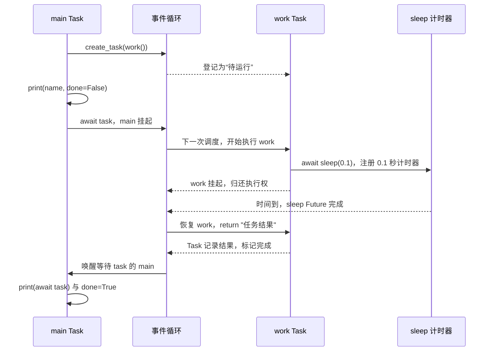
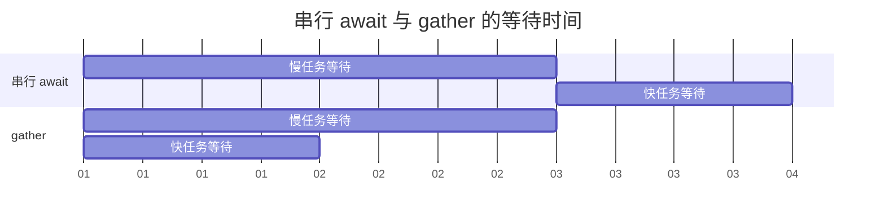
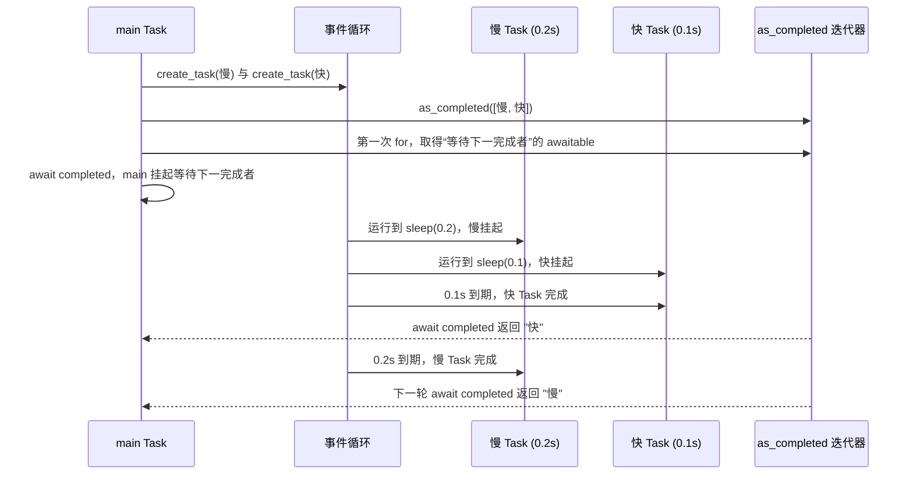

# 02 · 任务与结果收集

`create_task()` 返回 Task 句柄；`gather()` 同时等待多个任务；`as_completed()` 按完成先后逐个取得结果。

## 本章 API 的含义先说清

| API | 你传进去什么 | 它立即返回什么 | `await` 后得到什么 | 最核心的语义 |
| --- | --- | --- | --- | --- |
| `asyncio.create_task(coro, *, name=None)` | 一个协程对象 | `Task` | Task 的 return 值，或它抛出的异常 | 让协程由当前事件循环独立推进 |
| `asyncio.gather(*aws, return_exceptions=False)` | 多个协程 / Task / Future | 一个可 await 的聚合对象 | 与输入**同顺序**的结果列表 | 等待这一批都结束 |
| `asyncio.as_completed(aws, *, timeout=None)` | 一批 awaitable | “完成通知”的迭代器 | 每次 `await completed` 得到**下一个完成者**的结果 | 结果按完成先后交付，不按输入位置交付 |

这里“完成”只表示某个 awaitable 进入终态：可能 return，也可能 raise 或被取消。它不是“谁的 CPU 更快”，而是谁最先不再需要等待。

| API | 优先级 | 企业中常见的位置 |
| --- | --- | --- |
| `create_task` | **⭐⭐⭐ 企业常用** | 同一个请求/任务内部启动独立并发工作；应用启动后的受管后台任务 |
| `gather` | **⭐⭐⭐ 企业常用** | 同时等待多个独立 I/O；批量请求与聚合数据 |
| `gather(..., return_exceptions=True)` | **⭐⭐ 条件常用** | 允许部分失败的批处理或聚合；必须逐项处理异常 |
| `as_completed` | **⭐⭐ 条件常用** | 大批量任务先完成先处理、下载/搜索结果流式消费、竞速策略 |

## 协程对象、Task 与 Future 的关系

协程对象是调用 `async def` 函数的产物，它描述了“从函数开头开始如何继续”，但没有被事件循环调度前不会自行执行。Task 是事件循环对协程对象的包装：它负责在每次可运行时推进协程、在协程 await 未完成对象时挂起、并最终保存返回值或异常。

Future 更低一层，代表一个将来才会完成的结果容器。网络 I/O、计时器等底层操作通常用 Future 表示“尚未完成”；Task 自己也可以被 await，因为它会在内部协程结束时变为完成状态。写业务代码时，通常创建/等待 Task，不必手动创建 Future。

概念上的生命周期如下：

```text
coroutine object
    │ create_task
    ▼
Task 已登记 → 运行到 await → 等待某个 Future → 被唤醒 → 再继续
    │
    ├─ return → Task 保存结果，done() 为 True
    ├─ raise  → Task 保存异常，await task 时重新抛出
    └─ cancel → 协程收到 CancelledError，最终进入取消状态
```

## `create_task` 的调度时序

下面对应第一段代码。时间轴展示的是**概念顺序**：具体哪一个就绪回调先运行由事件循环决定，但 `create_task` 本身不会同步跑完 `work`。



这里最容易漏掉的是 `main` 自己也是 Task。`await task` 并不是 CPU 停住不动，而是 main 订阅 task 的完成通知后进入等待；work 的结果一写入 Task，事件循环就有理由把 main 放回就绪队列。

## 代码 1：`create_task` 的状态和结果

```python
import asyncio


async def demo_create_task() -> None:
    async def work() -> str:
        await asyncio.sleep(0.1)
        return "任务结果"

    task = asyncio.create_task(work(), name="my-task")
    print(task.get_name(), task.done())
    print(await task)
    print(task.done())


async def main() -> None:
    await demo_create_task()


if __name__ == "__main__":
    asyncio.run(main())
```

创建 Task 不会创建线程，也不会同步地把整个 `work` 跑完。它只是通知当前循环：“当前 Task 下一次让位后，请推进 `work`。”`await task` 则把当前 Task 变成“等待该 Task 完成”的状态；完成后，如果内部 return，得到结果；如果内部 raise，异常会在这里重新抛出。

Task 应始终有明确的所有者。短生命周期任务由当前 `main` / 请求 await；长期任务由应用的启动与关停逻辑保存、取消、收回。丢弃 Task 引用可能让异常只以日志警告形式出现，调用方却不知道操作失败。

## 代码 2：`gather` 的“并发”与“结果位置”是两回事

```python
import asyncio


async def demo_gather_order() -> None:
    async def work(name: str, delay: float) -> str:
        await asyncio.sleep(delay)
        print(f"完成：{name}")
        return name

    results = await asyncio.gather(work("慢", 0.2), work("快", 0.1))
    print(results)


async def main() -> None:
    await demo_gather_order()


if __name__ == "__main__":
    asyncio.run(main())
```

`gather` 对每个传入 awaitable 建立等待关系，并等待全部成功完成。两个 sleep 计时会重叠，所以整体耗时接近 0.2 秒而非 0.3 秒；但 gather 预先给每个输入确定了下标，第一项永远属于 `work("慢", ...)`，第二项永远属于 `work("快", ...)`。这让你可以安全写 `left, right = await gather(...)`。

默认 `gather` 的失败语义常被误解：第一个冒出的异常会立刻从 `await gather(...)` 传播到调用方；**但 gather 不会替你取消已经开始的其他 awaitable**。它们可能继续执行直到结束。若任务必须同生共死，使用第 03 章的 TaskGroup。

下面把“串行 await”和“gather”放到同一根时间轴上。方块代表 Task 正在等待 I/O 的时间；等待可以重叠，真正的 Python 执行片段仍然只有很短的一段。



图中的日期只是逻辑时间单位：串行要走 3 个单位，gather 只需最长的 2 个单位。这也是 async I/O 能提高吞吐的原因：它缩短的是“等候时间的总墙钟时间”，不是让单个 Task 的网络响应本身变快。

## 代码 3：为什么 `return_exceptions=True` 要谨慎

```python
import asyncio


async def demo_gather_exceptions() -> None:
    async def work(fail: bool) -> str:
        await asyncio.sleep(0.1)
        if fail:
            raise RuntimeError("失败了")
        return "成功了"

    results = await asyncio.gather(work(False), work(True), return_exceptions=True)
    for result in results:
        print(type(result).__name__, result)


async def main() -> None:
    await demo_gather_exceptions()


if __name__ == "__main__":
    asyncio.run(main())
```

这个参数改变的是“异常怎样交给调用者”：异常不再从 gather 抛出，而作为对应位置的值留在结果列表里。因此你必须做类型判断、记录错误并决定降级方式。它不是“忽略异常”的开关；如果直接把列表传给后续函数，异常对象会在离真正故障点很远的地方引发新问题。

## API 4：`as_completed` 到底返回什么

它的名字可以拆成 “as + completed”：**随着任务完成，不断给我下一个完成者。** 这和 `gather` 的“等全部完成，再给我一个固定顺序的列表”完全不同。

```python
for completed in asyncio.as_completed(tasks):
    result = await completed
```

- `tasks` 是你提交的一批 Task / 协程。
- `asyncio.as_completed(tasks)` 不是结果列表，而是一个迭代器。
- 在 Python 3.11+ 的普通 `for` 写法中，每次循环拿到的 `completed` 是“等待下一个完成者”的 awaitable；`await completed` 会等待并拿到下一个完成任务的结果或异常。
- 任务若抛异常，异常会在 `await completed` 这一行重新抛出；它不会自动变成普通返回值。
- 两个任务在几乎同一刻完成时，先交付谁不是你应该依赖的顺序保证。

## 代码 4：`as_completed` 为什么不保证输入顺序

```python
import asyncio


async def demo_as_completed() -> None:
    async def work(name: str, delay: float) -> str:
        await asyncio.sleep(delay)
        return name

    tasks = [asyncio.create_task(work("慢", 0.2)), asyncio.create_task(work("快", 0.1))]
    for completed in asyncio.as_completed(tasks):
        print("先收到：", await completed)


async def main() -> None:
    await demo_as_completed()


if __name__ == "__main__":
    asyncio.run(main())
```

时间关系正是下面这样：慢任务先被放进 `tasks[0]`，但快任务先结束，因此第一次循环获得的是快任务的完成入口。



所以你的理解可以改得更精确一些：**哪个任务最先完成，`as_completed` 就最先让你处理哪个任务的结果。** 如果“快”表示网络更早返回，这个网络结果先处理；如果“快”表示计算更早结束，也同样先处理。它只关心完成时间，不关心任务为什么先完成。

它适用于下载、批处理、竞速请求等“结果一到就能消费”的情况；若后续逻辑必须等所有结果齐全，选 `gather`。无论哪种方式，每个 Task 的结果或异常都必须最终被读取。

## 何时不该并发

下面是严格的依赖链，不能因为 API 都是 async 就提前创建第二个 Task：

```python
user = await authenticate(token)
permissions = await load_permissions(user.id)
```

第二步依赖第一步的 `user.id`。真正适合并发的是彼此独立的等待；共享可变状态、同一份资源或有顺序约束的操作，需要先设计同步和一致性边界。
