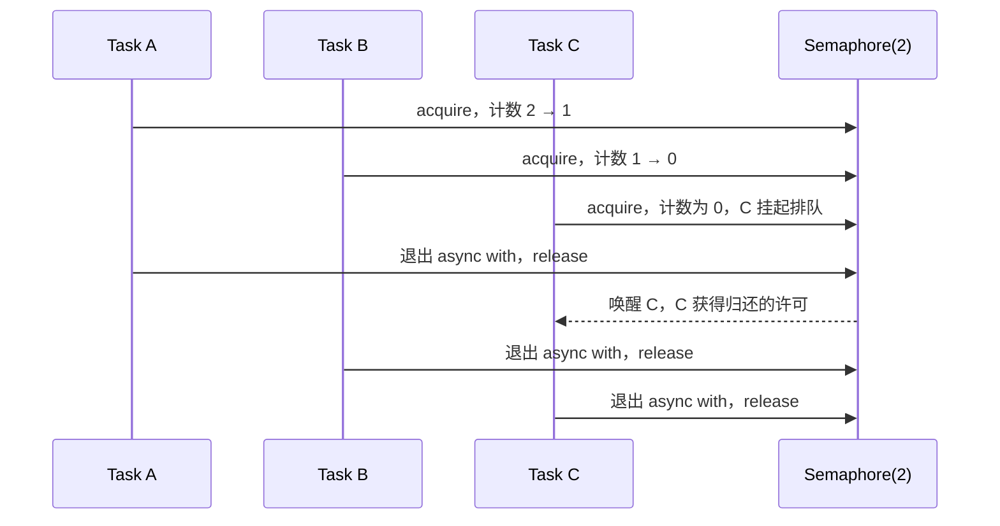
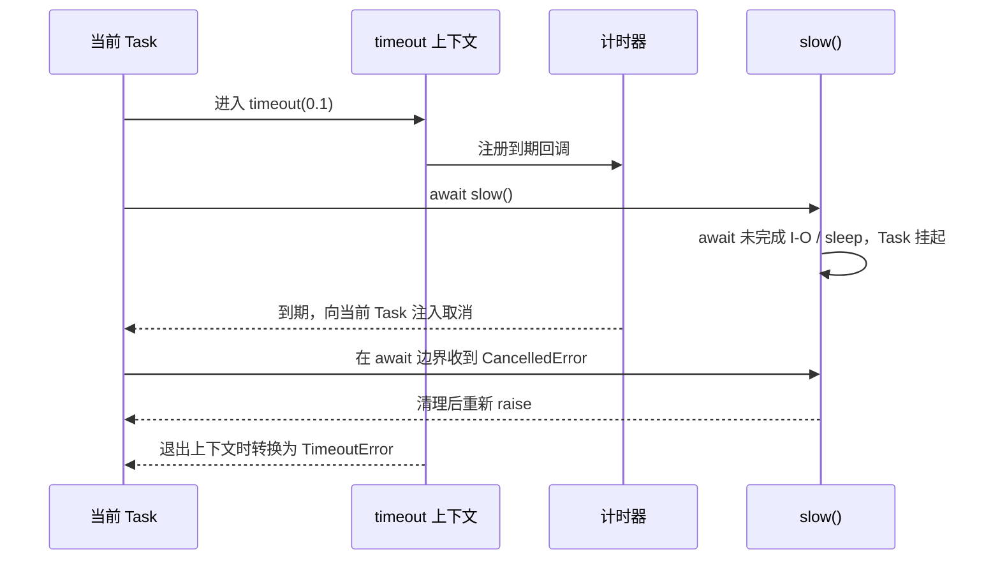
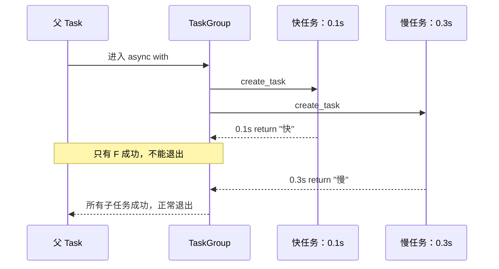
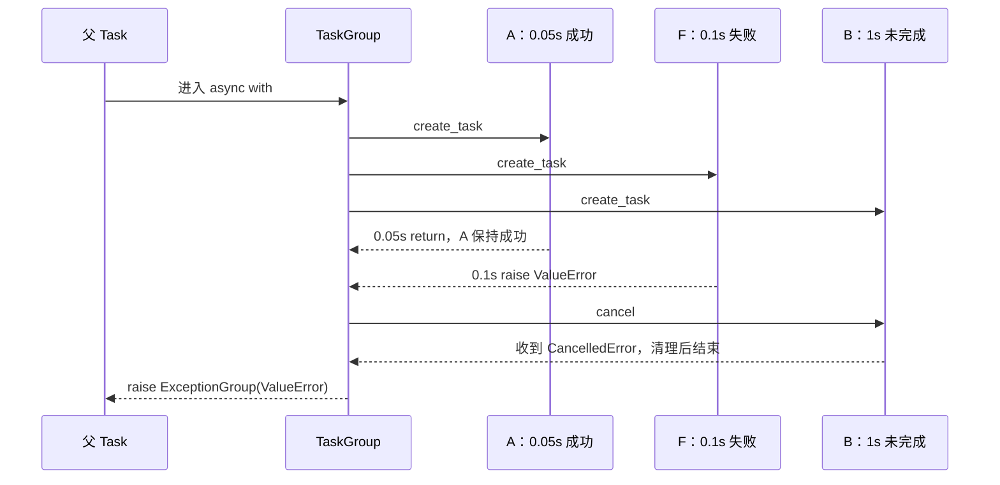

# 03 · 控制并发与取消

批量并发要明确三个边界：最多同时多少个、多久算失败、一个失败后其他任务怎么办。

## 本章 API 的含义先说清

| API | 解决什么问题 | 关键输入 | 当前 Task 会等待什么 | 结束 / 失败语义 |
| --- | --- | --- | --- | --- |
| `asyncio.Semaphore(n)` | 限制同时进入数量 | 初始许可 `n` | 无许可时等待许可归还 | `async with` 退出时归还许可 |
| `asyncio.timeout(seconds)` | 给一段代码设总时间预算 | 秒数 | 块内的 await | 到期取消当前 Task；块外得到 `TimeoutError` |
| `asyncio.wait_for(aw, timeout)` | 给一个 awaitable 设时限 | awaitable、秒数 | `aw` | 到期取消 `aw` 并抛 `TimeoutError` |
| `asyncio.TaskGroup()` | 管理一组同生共死的子任务 | `group.create_task(coro)` | 退出块时等待所有子任务 | 任一非取消异常会取消兄弟并抛 `ExceptionGroup` |
| `task.cancel()` | 请求 Task 停止 | Task | Task 在下一个可取消点处理请求 | 被取消的协程收到 `CancelledError` |

| API | 优先级 | 企业中常见的位置 |
| --- | --- | --- |
| `Semaphore` | **⭐⭐⭐ 企业常用** | 批量调用 HTTP / 数据库 / SDK 时限制并发，保护下游与连接池 |
| `asyncio.timeout` | **⭐⭐⭐ 企业常用** | 每次外部调用、整段请求编排的总时间预算；Python 3.11+ 推荐 |
| `TaskGroup` | **⭐⭐⭐ 企业常用** | 多个子任务必须整体成功或整体失败的新代码；Python 3.11+ |
| `task.cancel` / `CancelledError` | **⭐⭐⭐ 企业常用** | 超时、客户端断开、服务关停时的正确清理 |
| `wait_for` | **⭐ 补充了解** | 旧代码或只包单个 await 的场景；理解即可 |

## 完成、成功、失败与取消总表

| API | 何时继续 | 怎样算成功 | 失败 / 超时时怎样退出 | 会不会自动取消别的工作 |
| --- | --- | --- | --- | --- |
| `Semaphore` | 拿到许可后进入，离开块后归还许可 | 它只管许可，不定义整批任务成败 | 块内异常照常向外抛；许可仍会归还 | 不会 |
| `asyncio.timeout()` | 代码块正常退出，或超时取消清理结束 | 整个块在期限内正常结束 | 到期取消当前 Task，块外抛 `TimeoutError` | 当前 Task 正在等待的工作会收到取消 |
| `wait_for()` | awaitable 结束，或超时取消完成 | 该 awaitable 在期限内正常返回 | 内部异常原样传播；超时抛 `TimeoutError` | 只取消传入的 awaitable，不管理无关 Task |
| `TaskGroup` | 全部成功，或失败后的兄弟任务清理完成 | **所有子任务都成功** | 非取消异常最终组成 `ExceptionGroup` | **会取消所有未完成兄弟任务** |
| `task.cancel()` | 它只是发出取消请求；Task 稍后处理 | `True` 只表示请求已提交，不表示已停止 | 协程在可取消点收到 `CancelledError` | 不会自动取消无关 Task |

这张表里最重要的一行是 `TaskGroup`：**一个子任务成功，只代表那个子任务成功；只有全部子任务成功，整个 TaskGroup 才成功。**

## 并发量、速率和排队不是同一件事

`Semaphore(2)` 限制的是同一时刻持有许可的任务数量，也就是**并发量**。它不限制“一秒发起多少次操作”；如果每个任务很快结束，下一秒可以通过很多任务。按每秒配额限速需要令牌桶、漏桶或服务端限流策略，不能把 Semaphore 当作速率限制器。

信号量内部概念上维护一个许可计数。进入 `async with limit` 时：有许可就减一并继续；没有许可则当前 Task 挂起，直到别的 Task 离开代码块归还许可。`async with` 很重要：即使块内抛异常或被取消，也能在退出时归还许可。



注意：这张图表达的是许可归还与唤醒关系，不承诺具体排队公平性或日志打印顺序；这些属于实现和调度细节。

## 代码 1：`Semaphore` 限制同时运行数

```python
import asyncio


async def demo_semaphore() -> None:
    limit = asyncio.Semaphore(2)

    async def work(index: int) -> None:
        async with limit:
            print(f"开始 {index}")
            await asyncio.sleep(0.1)
            print(f"结束 {index}")

    await asyncio.gather(*(work(index) for index in range(5)))


async def main() -> None:
    await demo_semaphore()


if __name__ == "__main__":
    asyncio.run(main())
```

这里有 5 个 Task，但只有前两个拿到许可并进入块内。每个任务从 sleep 恢复、退出 `async with` 时归还许可，事件循环才会唤醒排队者中的后续任务。它不会创建额外线程，也不意味着后面三个任务不存在；它们只是停在“等待许可”这个 await 点。

## 超时的真实机制：先取消，后转换异常

`asyncio.timeout(0.1)` 在当前 Task 的作用域内安装一个到期计时器。时间到后，它取消**当前 Task**。Task 在下一次可恢复/可注入异常的位置收到 `CancelledError`；离开 timeout 上下文时，timeout 再把这次由自己触发的取消转换成外层看到的 `TimeoutError`。



因此，超时不能强行中断一段正在执行的普通 Python 计算。若协程连续算 10 秒都没有 await，事件循环没有机会投递取消。CPU 密集工作应该放到进程中。

## 代码 2：`asyncio.timeout` 取消超时工作

```python
import asyncio


async def demo_timeout() -> None:
    async def slow() -> None:
        try:
            await asyncio.sleep(1)
        except asyncio.CancelledError:
            print("slow 收到取消")
            raise

    try:
        async with asyncio.timeout(0.1):
            await slow()
    except TimeoutError:
        print("外层收到 TimeoutError")


async def main() -> None:
    await demo_timeout()


if __name__ == "__main__":
    asyncio.run(main())
```

`slow` 正在 await sleep，因此它很快接到 `CancelledError`。捕获它的正确目的只能是释放局部资源、记录必要状态；处理完必须 `raise`。若把它吞掉，外层 timeout 可能误以为工作正常完成，取消链会被破坏。

## 代码 3：`wait_for` 给单个 await 加时限

```python
import asyncio


async def demo_wait_for() -> None:
    try:
        await asyncio.wait_for(asyncio.sleep(1, result="完成"), timeout=0.1)
    except TimeoutError:
        print("wait_for 超时")


async def main() -> None:
    await demo_wait_for()


if __name__ == "__main__":
    asyncio.run(main())
```

`wait_for(aw, timeout)` 的边界是一个 awaitable；它超时后会取消该 awaitable 并等待取消完成。`asyncio.timeout()` 的边界是一个代码块：块内可有多个 await，整个块共享总时间预算。Python 3.11+ 的新代码一般优先用后者表达“这一段最多花多久”。

## 结构化并发：为什么 `TaskGroup` 比“记住所有 Task”更安全

TaskGroup 把子任务的生命周期绑定到 `async with` 块：块不会在子任务仍未结束时退出。一个子任务抛出非取消异常后，TaskGroup 取消兄弟任务、等待它们完成清理，然后把所有非取消异常组合成 `ExceptionGroup` 抛出。

先把判断规则写成一句不会误解的话：

> TaskGroup 的成功条件是“所有子任务正常完成”，失败策略是“一个子任务发生非取消异常，就取消尚未完成的兄弟任务，收尾后整体失败”。

因此它既不是“一个成功就成功”，也不是“第一个完成就结束”。快速子任务在 0.1 秒返回以后，TaskGroup 会保存它的结果，然后继续等慢任务；慢任务在 0.3 秒也成功，TaskGroup 才能正常退出。



## 代码 4：`TaskGroup` 的全部成功路径

```python
import asyncio


async def demo_task_group_all_success() -> None:
    async def work(name: str, delay: float) -> str:
        await asyncio.sleep(delay)
        return name

    async with asyncio.TaskGroup() as group:
        fast_task = group.create_task(work("快", 0.1))
        slow_task = group.create_task(work("慢", 0.3))

    print(fast_task.result(), slow_task.result())


async def main() -> None:
    await demo_task_group_all_success()


if __name__ == "__main__":
    asyncio.run(main())
```

`group.create_task()` 会返回 Task，所以可以保存句柄；但应当在 `async with` 成功退出后再读取结果。退出成功这一刻已经保证两项都正常完成，因此 `.result()` 不会阻塞，也不会在这里发现一个尚未结束的 Task。结果并不会像 `gather` 那样自动组成列表，TaskGroup 负责的是生命周期和失败边界，结果要从各自 Task 取。

失败时间线要分清三种身份：已经成功的任务保持成功；首先失败的任务保留原异常；仍未完成的任务被取消。最后 TaskGroup 整体失败。



这避免了两类常见泄漏：函数已经返回但子任务仍在跑；一个子任务失败后其他任务继续悄悄执行。`except*` 不是普通 `except` 的花哨版本，它用于从异常组中按成员类型匹配异常。

## 代码 5：`TaskGroup` 的失败路径

```python
import asyncio


async def demo_task_group_failure() -> None:
    async def fast_success() -> str:
        await asyncio.sleep(0.05)
        return "我已经成功，不会倒退成失败"

    async def long_running() -> None:
        try:
            await asyncio.sleep(1)
        except asyncio.CancelledError:
            print("慢任务被取消")
            raise

    async def failing() -> None:
        await asyncio.sleep(0.1)
        raise ValueError("故意失败")

    try:
        async with asyncio.TaskGroup() as group:
            successful_task = group.create_task(fast_success())
            group.create_task(failing())
            group.create_task(long_running())
    except* ValueError as errors:
        print(successful_task.result())
        print(errors.exceptions[0])


async def main() -> None:
    await demo_task_group_failure()


if __name__ == "__main__":
    asyncio.run(main())
```

`fast_success` 在 0.05 秒正常完成，它的 Task 保持成功，因此异常处理处仍能读取结果。`failing` 在 0.1 秒抛出 `ValueError`，此时 `long_running` 尚未结束，所以收到取消。TaskGroup 不会在 0.1 秒那一刻直接跳到外层；它先等待慢任务完成取消清理，之后才以异常组形式退出。

这正是“子任务状态”和“TaskGroup 整体状态”不能混为一谈的地方：A 可以成功，F 可以失败，B 可以取消，而 TaskGroup 的最终结论仍是失败。一个成功项不会抵消另一个失败项。

把常见组合压缩成一张判断表：

| 子任务首先发生什么 | TaskGroup 接下来做什么 | TaskGroup 最终表现 |
| --- | --- | --- |
| 一个成功，其余仍运行 | 保存该 Task 的结果，继续等待 | 尚无整体结论 |
| 全部正常返回 | 正常退出 `async with` | 整体成功 |
| 一个抛普通异常，其余仍运行 | 取消未完成兄弟，并等待清理 | 抛 `ExceptionGroup`，整体失败 |
| 多个任务在取消完成前又抛异常 | 收集这些非取消异常 | 一起放入 `ExceptionGroup` |
| 父 Task 被外部取消 | TaskGroup 取消并收回子任务 | 父 Task 继续传播 `CancelledError` |

还有一个底层特例：`CancelledError` 是取消控制信号，不按普通业务异常处理。某个子任务仅以 `CancelledError` 结束时，不会像 `ValueError` 那样触发“取消全部兄弟并组成异常组”。因此严格地说，TaskGroup 正常退出代表“没有未处理的非取消异常”；业务上是否接受某个子任务被取消，还要查看相应 Task 的 `cancelled()`。日常学习时先记住主规则：**预期工作全部返回才叫业务整体成功，任一普通异常则整组失败。**

选择规则很简单：结果允许部分成功、每项错误要分别处理时，用 `gather(return_exceptions=True)`；它们必须作为一个整体成功或失败时，用 `TaskGroup`。
