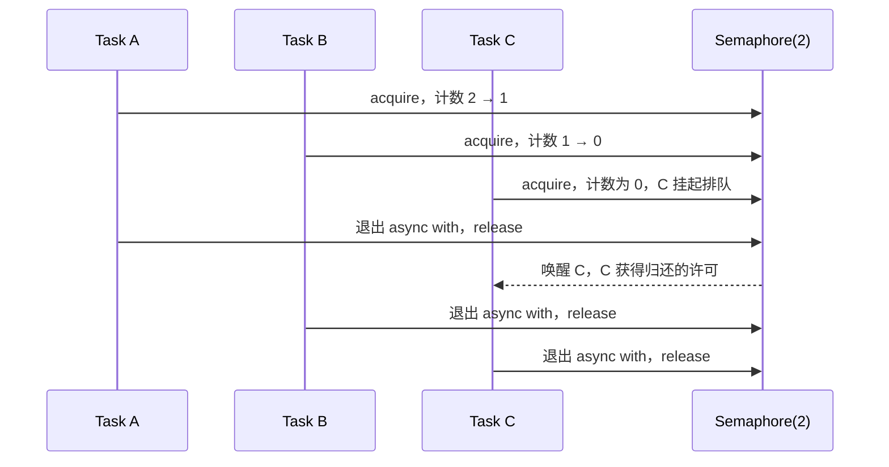
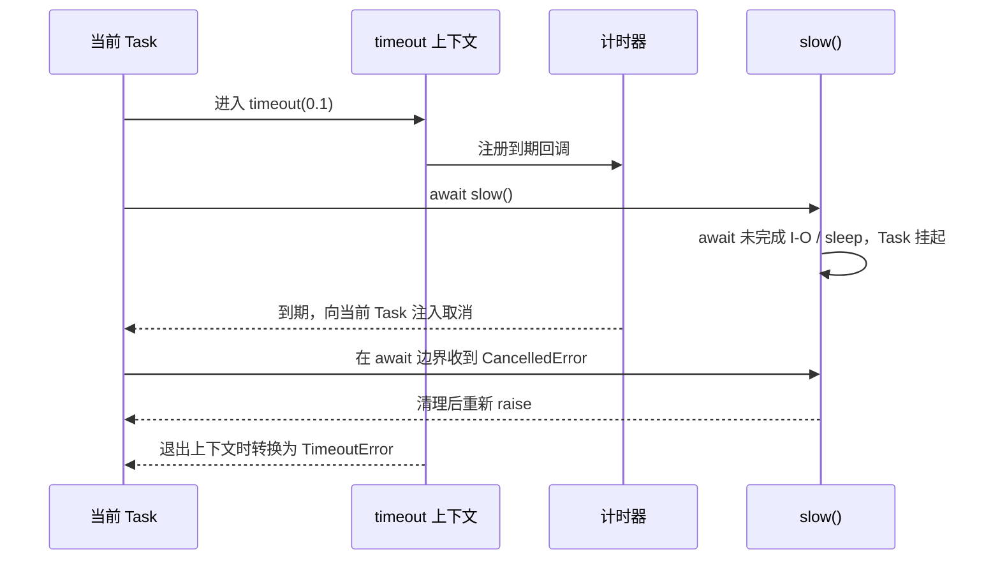
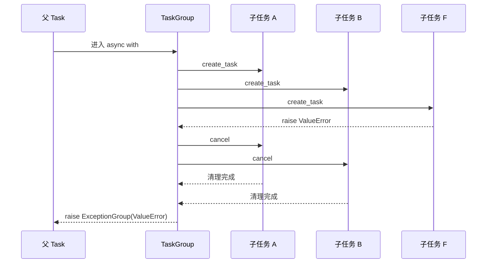

# 03 · 控制并发与取消

批量并发要明确三个边界：最多同时多少个、多久算失败、一个失败后其他任务怎么办。

## 本章 API 的含义先说清

| API | 解决什么问题 | 关键输入 | 当前 Task 会等待什么 | 结束 / 失败语义 |
| --- | --- | --- | --- | --- |
| `asyncio.Semaphore(n)` | 限制同时进入数量 | 初始许可 `n` | 无许可时等待许可归还 | `async with` 退出时归还许可 |
| `asyncio.timeout(seconds)` | 给一段代码设总时间预算 | 秒数 | 块内的 await | 到期取消当前 Task；块外得到 `TimeoutError` |
| `asyncio.wait_for(aw, timeout)` | 给一个 awaitable 设时限 | awaitable、秒数 | `aw` | 到期取消 `aw` 并抛 `TimeoutError` |
| `asyncio.TaskGroup()` | 管理一组同生共死的子任务 | `group.create_task(coro)` | 退出块时等待所有子任务 | 任一非取消异常会取消兄弟并抛 `ExceptionGroup` |
| `task.cancel()` | 请求 Task 停止 | Task | Task 在下一个可取消点处理请求 | 被取消的协程收到 `CancelledError` |

## 并发量、速率和排队不是同一件事

`Semaphore(2)` 限制的是同一时刻持有许可的任务数量，也就是**并发量**。它不限制“一秒发起多少次操作”；如果每个任务很快结束，下一秒可以通过很多任务。按每秒配额限速需要令牌桶、漏桶或服务端限流策略，不能把 Semaphore 当作速率限制器。

信号量内部概念上维护一个许可计数。进入 `async with limit` 时：有许可就减一并继续；没有许可则当前 Task 挂起，直到别的 Task 离开代码块归还许可。`async with` 很重要：即使块内抛异常或被取消，也能在退出时归还许可。



注意：这张图表达的是许可归还与唤醒关系，不承诺具体排队公平性或日志打印顺序；这些属于实现和调度细节。

## 代码 1：`Semaphore` 限制同时运行数

```python
import asyncio


async def demo_semaphore() -> None:
    limit = asyncio.Semaphore(2)

    async def work(index: int) -> None:
        async with limit:
            print(f"开始 {index}")
            await asyncio.sleep(0.1)
            print(f"结束 {index}")

    await asyncio.gather(*(work(index) for index in range(5)))


async def main() -> None:
    await demo_semaphore()


if __name__ == "__main__":
    asyncio.run(main())
```

这里有 5 个 Task，但只有前两个拿到许可并进入块内。每个任务从 sleep 恢复、退出 `async with` 时归还许可，事件循环才会唤醒排队者中的后续任务。它不会创建额外线程，也不意味着后面三个任务不存在；它们只是停在“等待许可”这个 await 点。

## 超时的真实机制：先取消，后转换异常

`asyncio.timeout(0.1)` 在当前 Task 的作用域内安装一个到期计时器。时间到后，它取消**当前 Task**。Task 在下一次可恢复/可注入异常的位置收到 `CancelledError`；离开 timeout 上下文时，timeout 再把这次由自己触发的取消转换成外层看到的 `TimeoutError`。



因此，超时不能强行中断一段正在执行的普通 Python 计算。若协程连续算 10 秒都没有 await，事件循环没有机会投递取消。CPU 密集工作应该放到进程中。

## 代码 2：`asyncio.timeout` 取消超时工作

```python
import asyncio


async def demo_timeout() -> None:
    async def slow() -> None:
        try:
            await asyncio.sleep(1)
        except asyncio.CancelledError:
            print("slow 收到取消")
            raise

    try:
        async with asyncio.timeout(0.1):
            await slow()
    except TimeoutError:
        print("外层收到 TimeoutError")


async def main() -> None:
    await demo_timeout()


if __name__ == "__main__":
    asyncio.run(main())
```

`slow` 正在 await sleep，因此它很快接到 `CancelledError`。捕获它的正确目的只能是释放局部资源、记录必要状态；处理完必须 `raise`。若把它吞掉，外层 timeout 可能误以为工作正常完成，取消链会被破坏。

## 代码 3：`wait_for` 给单个 await 加时限

```python
import asyncio


async def demo_wait_for() -> None:
    try:
        await asyncio.wait_for(asyncio.sleep(1, result="完成"), timeout=0.1)
    except TimeoutError:
        print("wait_for 超时")


async def main() -> None:
    await demo_wait_for()


if __name__ == "__main__":
    asyncio.run(main())
```

`wait_for(aw, timeout)` 的边界是一个 awaitable；它超时后会取消该 awaitable 并等待取消完成。`asyncio.timeout()` 的边界是一个代码块：块内可有多个 await，整个块共享总时间预算。Python 3.11+ 的新代码一般优先用后者表达“这一段最多花多久”。

## 结构化并发：为什么 `TaskGroup` 比“记住所有 Task”更安全

TaskGroup 把子任务的生命周期绑定到 `async with` 块：块不会在子任务仍未结束时退出。一个子任务抛出非取消异常后，TaskGroup 取消兄弟任务、等待它们完成清理，然后把所有非取消异常组合成 `ExceptionGroup` 抛出。



这避免了两类常见泄漏：函数已经返回但子任务仍在跑；一个子任务失败后其他任务继续悄悄执行。`except*` 不是普通 `except` 的花哨版本，它用于从异常组中按成员类型匹配异常。

## 代码 4：`TaskGroup` 同生共死

```python
import asyncio


async def demo_task_group() -> None:
    async def long_running(name: str) -> None:
        try:
            await asyncio.sleep(1)
        except asyncio.CancelledError:
            print(f"{name} 被取消")
            raise

    async def failing() -> None:
        await asyncio.sleep(0.1)
        raise ValueError("故意失败")

    try:
        async with asyncio.TaskGroup() as group:
            group.create_task(long_running("A"))
            group.create_task(long_running("B"))
            group.create_task(failing())
    except* ValueError as errors:
        print(errors.exceptions[0])


async def main() -> None:
    await demo_task_group()


if __name__ == "__main__":
    asyncio.run(main())
```

`failing` 在 0.1 秒后抛出 `ValueError`。A 和 B 此时停在 sleep，所以会收到取消并执行各自的 `except CancelledError`。TaskGroup 不会立刻把 ValueError 扔给外层；它先等待兄弟任务完成取消清理，之后才以异常组形式退出。

选择规则很简单：结果允许部分成功、每项错误要分别处理时，用 `gather(return_exceptions=True)`；它们必须作为一个整体成功或失败时，用 `TaskGroup`。
