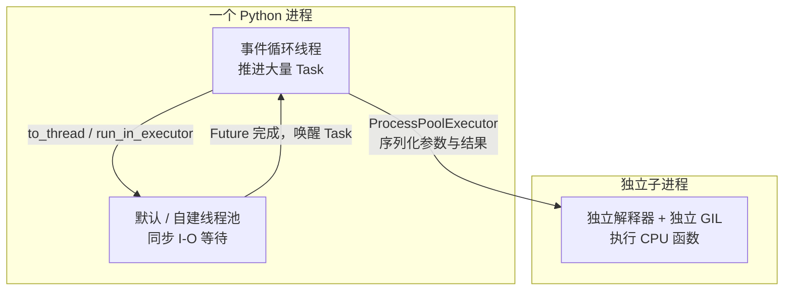
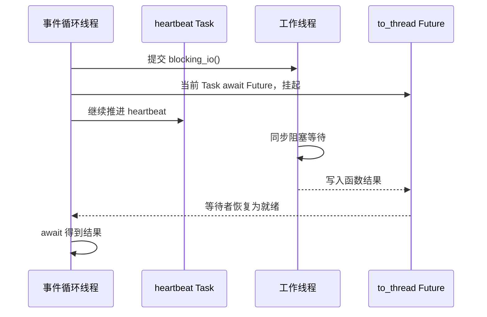

# 04 · 线程、进程与阻塞代码

协程只会在 `await` 处让位。普通同步函数不会因为从 `async def` 里调用就变成异步。

## 本章 API 的含义先说清

| API | 你提交什么 | 实际在哪运行 | `await` 后得到什么 | 适用边界 |
| --- | --- | --- | --- | --- |
| `asyncio.to_thread(func, *args)` | 同步函数及其参数 | asyncio 默认线程池 | `func(*args)` 的结果或异常 | 阻塞 I/O；不用于纯 Python CPU 加速 |
| `loop.run_in_executor(executor, func, *args)` | 指定 Executor、同步函数及参数 | 你传入的线程池或进程池 | `func(*args)` 的结果或异常 | 需要自建/指定执行器 |
| `ThreadPoolExecutor(n)` | 同步函数任务 | 同一进程的最多 n 个线程 | Future 的结果或异常 | 有界同步 I/O 并发 |
| `ProcessPoolExecutor(n)` | 可序列化的函数和参数 | 最多 n 个独立 Python 进程 | 反序列化后的返回值或异常 | CPU 密集计算 |

| API | 优先级 | 企业中常见的位置 |
| --- | --- | --- |
| `asyncio.to_thread` | **⭐⭐⭐ 企业常用** | 异步服务必须接入同步 SDK、同步文件 I/O、旧客户端库 |
| `ThreadPoolExecutor` | **⭐⭐ 条件常用** | 同步脚本的 I/O 并发，或必须隔离/限制某类阻塞调用的线程数 |
| `run_in_executor` | **⭐ 补充了解** | 已有 Executor、需指定线程池或进程池时；新代码默认线程池优先 `to_thread` |
| `ProcessPoolExecutor` | **⭐⭐ 条件常用** | 图像/视频处理、压缩、纯 Python 重计算；长期重活往往交给任务队列/独立服务 |

## 三层执行单位：Task、线程、进程

Task 是事件循环中的调度单位；一个线程可以驱动大量 Task，但它在任意时刻只能运行一个 Task 的一段 Python 代码。线程是操作系统调度单位；不同线程可以同时等待 I/O，也可以分别运行原生扩展代码。进程则拥有独立的 Python 解释器、地址空间和 GIL。

CPython 中的 GIL 使得多个线程通常不能同时执行纯 Python 字节码。所以“线程”不是 CPU 密集计算的默认加速器；但网络、磁盘等 I/O 等待期间线程不占用 Python 执行权，线程仍很适合承接阻塞 I/O。



关键不是“async 的代码一定在主线程，同步代码一定在工作线程”，而是**你把哪一个函数提交给哪个执行单元**。`asyncio.to_thread` 移动的是同步函数；`ProcessPoolExecutor` 移动的是一个可序列化的函数调用。

## 代码 1：`to_thread` 隔离同步 I/O

```python
import asyncio
import time


async def demo_to_thread() -> None:
    def blocking_io() -> str:
        time.sleep(0.25)
        return "同步工作结束"

    async def heartbeat() -> None:
        for index in range(3):
            print(f"心跳 {index}")
            await asyncio.sleep(0.1)

    _, result = await asyncio.gather(heartbeat(), asyncio.to_thread(blocking_io))
    print(result)


async def main() -> None:
    await demo_to_thread()


if __name__ == "__main__":
    asyncio.run(main())
```

调用 `asyncio.to_thread(blocking_io)` 时，asyncio 会准备一个“在线程池执行该同步函数”的 awaitable；当前代码通过 gather 等待它和 heartbeat。线程池中的工作线程执行 `time.sleep(0.25)`，而事件循环线程可以继续唤醒 heartbeat。因此两者的等待时间重叠。



`to_thread(...)` 本身返回可 await 的协程：只创建它、不 `await`、也不交给 `create_task`，同步函数不会启动。它使用 asyncio 的默认线程池；需要控制线程数或隔离不同类别的工作时，用下一节的自建 Executor。

反面写法是下面这样：

```python
async def wrong() -> None:
    result = blocking_io()  # 当前事件循环线程会被阻塞到函数返回
    print(result)
```

不要把普通同步函数前面强加 `await`；它不是 awaitable。要么使用真正的异步客户端，要么使用 `to_thread`。

## 代码 2：自建 `ThreadPoolExecutor`

```python
import asyncio
import time
from concurrent.futures import ThreadPoolExecutor


async def demo_custom_thread_pool() -> None:
    def blocking_io(index: int) -> str:
        time.sleep(0.1)
        return f"完成 {index}"

    loop = asyncio.get_running_loop()
    with ThreadPoolExecutor(max_workers=2) as pool:
        results = await asyncio.gather(
            *(loop.run_in_executor(pool, blocking_io, index) for index in range(3))
        )
    print(results)


async def main() -> None:
    await demo_custom_thread_pool()


if __name__ == "__main__":
    asyncio.run(main())
```

`run_in_executor(pool, func, *args)` 把 `func(*args)` 提交给指定 Executor，并返回可 await 的 Future。这里线程池最多有两个工作线程，因此三个 `blocking_io` 调用不可能同时执行；第三个要等其中一个线程空闲。

`with ThreadPoolExecutor(...)` 退出时会执行 shutdown 并等待已提交工作结束，所以本例在离开 with 后结果已经完整。实际服务中，线程池通常是进程级资源：启动时创建、关闭时 shutdown，而不是每个请求都新建一个。

## 代码 3：`ProcessPoolExecutor` 跑 CPU 密集计算

```python
import asyncio
import os
from concurrent.futures import ProcessPoolExecutor


def cpu_work(limit: int) -> tuple[int, int]:
    """进程池调用的函数必须放在模块顶层。"""
    return os.getpid(), sum(number * number for number in range(limit))


async def demo_process_pool() -> None:
    loop = asyncio.get_running_loop()
    with ProcessPoolExecutor(max_workers=2) as pool:
        pid, result = await loop.run_in_executor(pool, cpu_work, 200_000)
    print(f"工作进程 pid={pid}，校验值={result % 97}")


async def main() -> None:
    await demo_process_pool()


if __name__ == "__main__":
    asyncio.run(main())
```

进程池的子进程无法直接访问主进程的普通内存对象。函数、参数和返回值需要经过序列化传输，所以 `cpu_work` 必须定义在模块顶层，让子进程能够导入它；lambda、局部函数、打开的文件句柄常常无法传给进程池。

每个进程都有自己的解释器与 GIL，因此多项 CPU 计算可以使用多个核。代价也明显：进程启动、pickle 序列化、数据拷贝以及结果回传。很小的计算反而可能比直接执行更慢。`to_thread` 用于同步 I/O，不会让纯 Python CPU 计算变快；某些 NumPy 等原生库会主动释放 GIL，是需要单独测量的例外。

## 选择的判断顺序

先问“主要时间花在哪”：

```text
正在等网络、磁盘、数据库？
  ├─ 有异步客户端 → 直接 await
  └─ 只有同步接口 → to_thread / 有界 ThreadPoolExecutor

正在进行 Python 层的大量计算？
  └─ ProcessPoolExecutor 或独立后台 worker
```

不要因为函数名字里有 `async` 就默认它不阻塞；也不要因为代码慢就默认上线程。先判断等待 I/O 还是消耗 CPU，选型才会稳定。
