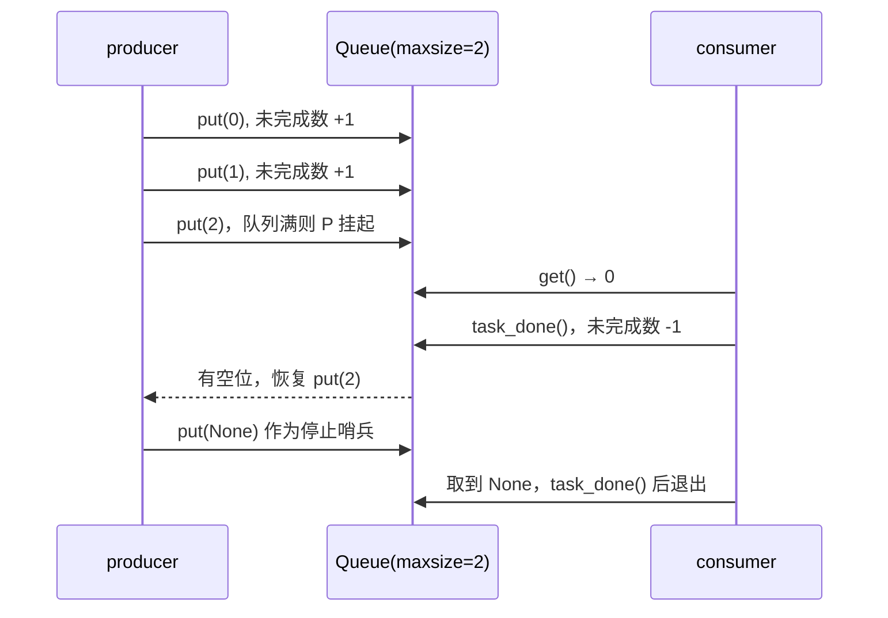
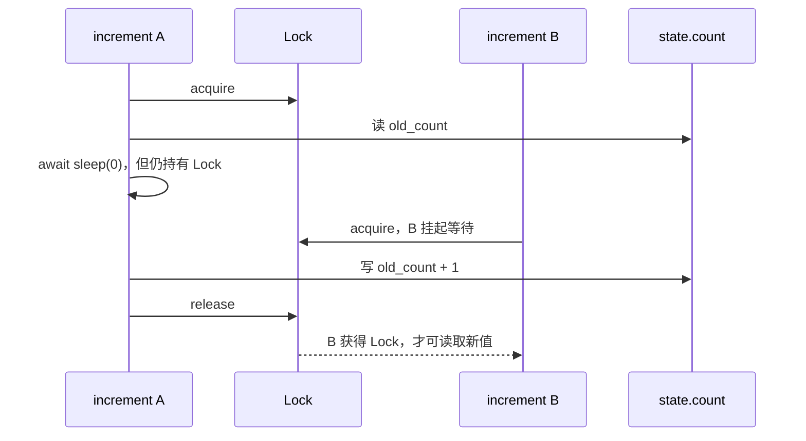
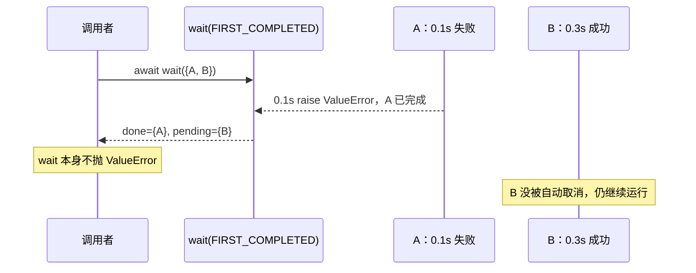

# 05 · 常用 API 组合：`Queue`、`Event`、`Lock`、`wait`

这些 API 用于协程之间传递数据、广播状态、保护临界区，以及只等待部分任务。

## 本章 API 的含义先说清

| API | 管理的东西 | 调用方何时挂起 | 完成后得到什么 / 发生什么 |
| --- | --- | --- | --- |
| `Queue.put(item)` | 一条数据和队列容量 | 队列达到 `maxsize` 时 | item 被放入队列，等待者可被唤醒 |
| `Queue.get()` | 下一条数据 | 队列为空时 | 返回一个 item；之后必须一次 `task_done()` |
| `Queue.join()` | 未完成项目计数 | 计数不为 0 时 | 所有已 put 的 item 都已 task_done |
| `Event.wait()` | 一个布尔状态 | Event 未 set 时 | set 后恢复；不返回数据 |
| `Event.set()` | 一个布尔状态 | 从不挂起 | 变为 set 并唤醒所有 wait 者 |
| `Lock.acquire()` / `async with lock` | 临界区的所有权 | 锁已被持有时 | 获取互斥进入权；退出块自动释放 |
| `asyncio.wait(tasks, return_when=...)` | 一组 Task 的完成集合 | 条件尚未满足时 | `(done, pending)` 两个集合 |

| API | 优先级 | 企业中常见的位置 |
| --- | --- | --- |
| `Queue` | **⭐⭐ 条件常用** | 同进程 producer / consumer、连接内工作流、后台协程管道；跨进程应用消息队列 |
| `Lock` | **⭐⭐ 条件常用** | 跨 `await` 的共享内存临界区；通常优先通过设计减少共享状态 |
| `Event` | **⭐ 补充了解** | 进程内启动屏障、停止信号、少数广播型协调 |
| `asyncio.wait` | **⭐ 补充了解** | 竞速、只等首个完成者、需要自行管理 done / pending 的底层编排 |

## 完成、成功、失败与取消总表

这些同步原语大多只回答“什么时候可以继续”，并不替一批业务任务判定整体成功。

| API | 等待何时结束 | “成功”的准确含义 | 某个使用者失败时 | 其他等待者 / 任务 |
| --- | --- | --- | --- | --- |
| `Queue.put()` | 项目成功进入队列 | 本次放入成功，不代表项目已处理 | 当前异常照常传播 | 队列不会自动取消其他任务 |
| `Queue.join()` | 未完成计数降为 0 | 每个已放入项目都调用了 `task_done()`，**不等于业务处理一定成功** | consumer 崩溃不会自动让 `join()` 结束 | producer / consumer 不会自动互相取消 |
| `Event.wait()` | Event 已被 `set()` | 状态条件成立，不代表某批工作完成 | 当前 Task 的异常照常传播 | `set()` 唤醒全部等待者，但不管理其结果 |
| `async with lock` | 获得锁后进入，块退出后释放 | 成功取得临界区所有权 | 块内异常向外抛，锁仍释放 | 不会取消其他等待者 |
| `asyncio.wait()` | `return_when` 条件满足 | 只完成“集合划分”，不判定业务整体成功 | 子任务异常留在 Task 中，不由 `wait` 抛出 | pending 默认继续运行 |

## 先区分四种协调方式

`Queue` 解决“把一条条数据交给另一个协程”；`Event` 解决“某个状态已经发生”；`Lock` 解决“同一时刻只有一个协程能进入临界区”；`wait` 解决“我只等到指定完成条件，不一定等全部任务”。它们并不互相替代。

```mermaid
flowchart LR
    P[Producer Task] -->|put(item)| Q[asyncio.Queue]
    Q -->|get()| C[Consumer Task]
    E[Event.set] -->|唤醒全部 wait 者| R[等待状态的 Tasks]
    L[Lock] -->|互斥进入临界区| S[共享内存状态]
    W[asyncio.wait] -->|划分 done / pending| T[一组 Tasks]
```

## 代码 1：`Queue` 传递工作

```python
import asyncio


async def demo_queue() -> None:
    queue: asyncio.Queue[int | None] = asyncio.Queue(maxsize=2)

    async def producer() -> None:
        for item in range(3):
            await queue.put(item)
            print(f"放入 {item}")
        await queue.put(None)  # 本 demo 用 None 表示停止

    async def consumer() -> None:
        while True:
            item = await queue.get()
            try:
                if item is None:
                    return
                print(f"取出 {item}")
            finally:
                queue.task_done()

    producer_task = asyncio.create_task(producer())
    consumer_task = asyncio.create_task(consumer())
    await producer_task
    await queue.join()
    await consumer_task


async def main() -> None:
    await demo_queue()


if __name__ == "__main__":
    asyncio.run(main())
```

Queue 内部维护项目列表和等待者。当队列空时，`await get()` 使 consumer 挂起，直到 producer 放入项目；当队列达到 `maxsize` 时，`await put()` 使 producer 挂起，直到 consumer 取走项目。这种“生产速度不能无限超过消费速度”的约束叫背压。

`put()` 每成功一次，Queue 的未完成任务计数加一；每个从 `get()` 取出的项目都必须刚好调用一次 `task_done()`，无论它是正常数据还是停止哨兵。`join()` 等待的正是该计数归零，不是“队列这一刻看起来为空”。少调会让 join 永远等待，多调会抛 `ValueError`。

这里尤其不能把 `task_done()` 理解成“业务成功”。它只是在维护 Queue 的计数。consumer 即使处理失败，也必须先决定失败项怎样记录、重试或转移，随后再正确维护计数；否则 consumer 已经异常退出，`join()` 却可能永远等不到归零。Queue 本身不会替 producer 和 consumer 建立“一个失败就全体取消”的关系，需要由外层 `TaskGroup` 等生命周期工具负责。

`None` 不是 Queue 的内置停止语义，只是这个例子约定的哨兵值。若有两个 consumer，通常需要放两个哨兵，让每个 consumer 都能收到一个退出信号。



## 代码 2：`Event` 广播状态改变

```python
import asyncio


async def demo_event() -> None:
    ready = asyncio.Event()

    async def waiter(name: str) -> None:
        await ready.wait()
        print(f"{name} 被唤醒")

    tasks = [asyncio.create_task(waiter("A")), asyncio.create_task(waiter("B"))]
    await asyncio.sleep(0)
    ready.set()
    await asyncio.gather(*tasks)


async def main() -> None:
    await demo_event()


if __name__ == "__main__":
    asyncio.run(main())
```

Event 只有一个布尔状态：初始为 false；`set()` 变为 true 并唤醒所有正在 `wait()` 的 Task；之后新的 `wait()` 也会立刻通过，直到有人调用 `clear()`。所以它适合“初始化完成”“可以开始”“收到停止信号”等广播式状态。

它不像 Queue 一样积累事件：连续调用两次 `set()` 仍只是 true，两个“发生过”的事实不会被计数。因此 Event 适合状态，不适合消息。

它不保存多次发生的事件，也不携带不同项目的内容。需要按顺序传递 N 个值，选择 Queue；只需唤醒一个等待者时，通常应考虑 Queue 或更具体的同步设计。

## 为什么协程也会有竞态：关键不是“有没有多线程”

单个事件循环线程不会在一段普通 Python 指令中间切换 Task；但它会在 `await` 处切换。如果一个协程读出旧状态，在 await 时让位，另一个协程也可能读到同一个旧状态，两个协程随后写回不同版本，就出现了竞态。

Lock 是互斥的，不是事务：它只保证遵守同一把 Lock 的协程不会同时进入块内；它不会保护数据库、不会自动在不同进程间生效，也不能拯救不使用这把锁的代码。



## 代码 3：`Lock` 保护跨 `await` 的读改写

```python
import asyncio


async def demo_lock() -> None:
    lock = asyncio.Lock()
    state = {"count": 0}

    async def increment() -> None:
        async with lock:
            old_count = state["count"]
            await asyncio.sleep(0)
            state["count"] = old_count + 1

    await asyncio.gather(*(increment() for _ in range(3)))
    print(state["count"])


async def main() -> None:
    await demo_lock()


if __name__ == "__main__":
    asyncio.run(main())
```

三次 `increment()` 虽然并发创建，但同一时刻只有一个能获取 lock。它读取 count 后，即使 `sleep(0)` 让位，也仍持有 lock；其他 increment 只能等待锁，所以最后结果是 3。

协程只在 `await` 处切换，所以没有跨 await 的普通 Python 代码段通常不需要 `asyncio.Lock`。锁内不要做慢 I/O：等待网络时持锁会让所有等待者排队。能用 Queue 传递所有权、避免共享状态时，设计通常更清晰。

## 代码 4：`wait` 只采用第一个完成者

```python
import asyncio


async def demo_wait_first_completed() -> None:
    async def work(name: str, delay: float) -> str:
        await asyncio.sleep(delay)
        return name

    tasks = {asyncio.create_task(work("慢", 0.2)), asyncio.create_task(work("快", 0.1))}
    done, pending = await asyncio.wait(tasks, return_when=asyncio.FIRST_COMPLETED)
    for task in pending:
        task.cancel()
    await asyncio.gather(*pending, return_exceptions=True)
    print(next(iter(done)).result())


async def main() -> None:
    await demo_wait_first_completed()


if __name__ == "__main__":
    asyncio.run(main())
```

`asyncio.wait` 只做“等到条件满足后，把 Task 分成 done 与 pending 两组”。`FIRST_COMPLETED` 指任意一个完成；还有 `FIRST_EXCEPTION` 与 `ALL_COMPLETED`。它不会调用 `result()`，因此不会替你把异常抛出来；也不会取消 pending，因为“第一个完成后其他是否还需要继续”是业务语义，库不能替你猜。

三个条件的精确含义如下：

| `return_when` | 返回时机 | 第一个成功会返回吗 | 第一个失败会返回吗 | 没有任何失败时 |
| --- | --- | --- | --- | --- |
| `FIRST_COMPLETED` | 任一 Task 成功、失败或取消 | 会 | 会 | 第一个进入终态就返回 |
| `FIRST_EXCEPTION` | 任一 Task 因异常结束 | 不一定；普通成功不会触发 | 会 | 退化为等待全部完成 |
| `ALL_COMPLETED` | 全部 Task 都进入终态 | 不会提前返回 | 不会提前返回 | 全部结束后返回 |

注意这里的“返回”只表示 `asyncio.wait(...)` 返回 `(done, pending)`，不表示 done 里的任务成功。你必须对每个 done Task 调用 `result()`、`exception()` 或 `await`，才能分别得知它是返回、失败还是取消。



本例选择“最快者胜出”，所以显式取消 pending，再用 `gather(..., return_exceptions=True)` 等它们真正结束，避免留下未回收 Task。若 `done` 中的任务可能失败，直接 `next(iter(done)).result()` 会重新抛出那个异常；实际代码应明确决定如何处理。

`wait` 的语义可以概括为：**它只告诉你完成集合的边界，不替你制定完成后的资源策略。** 所以才需要你明确选择 pending 是继续、取消还是转交给其他管理者。

## 一张选择表

| 你的关系 | 优先工具 | 不应拿来替代它的工具 |
| --- | --- | --- |
| 数据逐条交接、要背压 | `Queue` | `Event` |
| 广播某个状态已经成立 | `Event` | `Queue` |
| 保护跨 await 的内存临界区 | `Lock` | `Semaphore` |
| 只等到一部分 Task 完成 | `wait` | `gather` |
| 限制进入某段工作的数量 | `Semaphore` | `Lock` |
