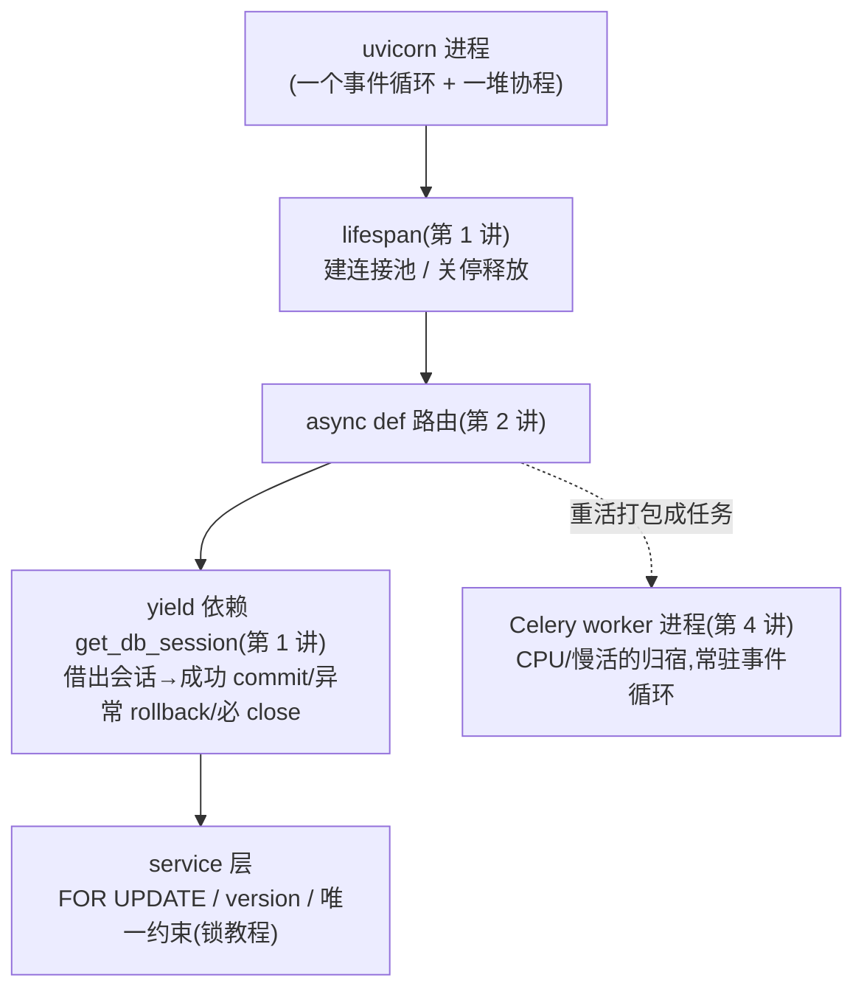
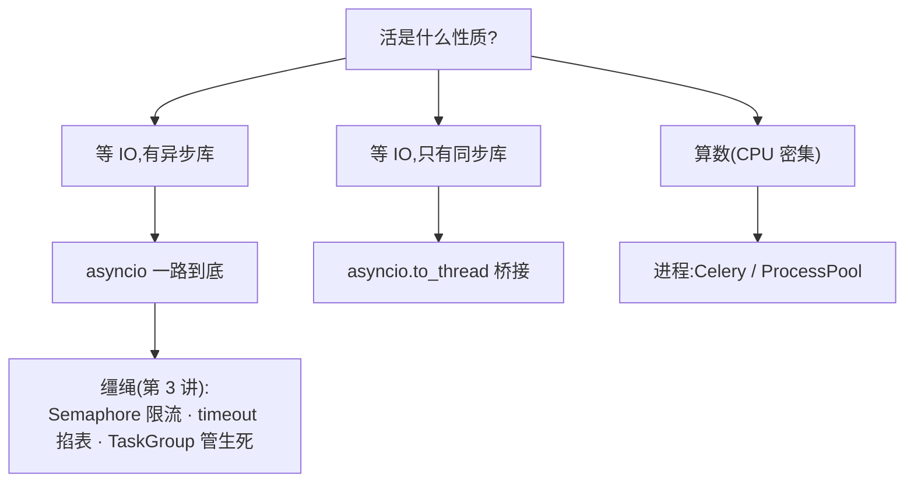

# 异步概念地图

五讲的对象和选型收进几张图。Mermaid 渲染同[锁教程](../锁教程/概念地图.md)。

## 1 一张请求的生命周期(FastAPI 异步栈)

## 2 并发模型选型(第 4 讲的结论)

三句口诀:

- **切换点决定加锁义务**:协程只在 await 切换(await 之间天然原子),线程随时被切(共享状态必 Lock)——两个世界的分界线
- **事件循环只有一根线程**:谁阻塞它,谁冻结整个服务;`time.sleep` 和同步 SDK 是毒药,`to_thread` 是解药
- **资源生命周期交给 with/yield,不交给记性**:commit/rollback/close 写在管家手里,业务代码里一个都不许手写

## 3 编排 API 速查

| 问题 | API | 失败语义 |
|---|---|---|
| 怎么开 | `create_task` + `gather` | 默认一炸全炸;`return_exceptions=True` 各记各的 |
| 要同生共死 | `async with TaskGroup()` | 一炸全取消,`except*` 接异常组 |
| 限多少 | `asyncio.Semaphore(n)` | 排队,不失败 |
| 多久算失败 | `async with asyncio.timeout(s)` | 到点取消,抛 TimeoutError |
| 谁先处理 | `as_completed(tasks)` | 先回先收,流式 |

## 4 易混点对照

| 对比项 | 协程 asyncio | 线程 threading | 进程 multiprocessing |
|---|---|---|---|
| 切换者 | 代码里的 await(你说了算) | 操作系统(随时) | 不切换,各自独立 |
| 并行算数 | ❌ 单线程 | ❌ GIL | ✅ |
| 等 IO 加速 | ✅ | ✅(等 IO 释放 GIL) | ✅ 但杀鸡用牛刀 |
| 共享内存要锁 | await 之间不用 | **必 Lock** | 不共享(靠队列/管道) |
| 企业定位 | 服务端主线 | 桥接阻塞 / 脚本糖 | CPU 重活(Celery) |
