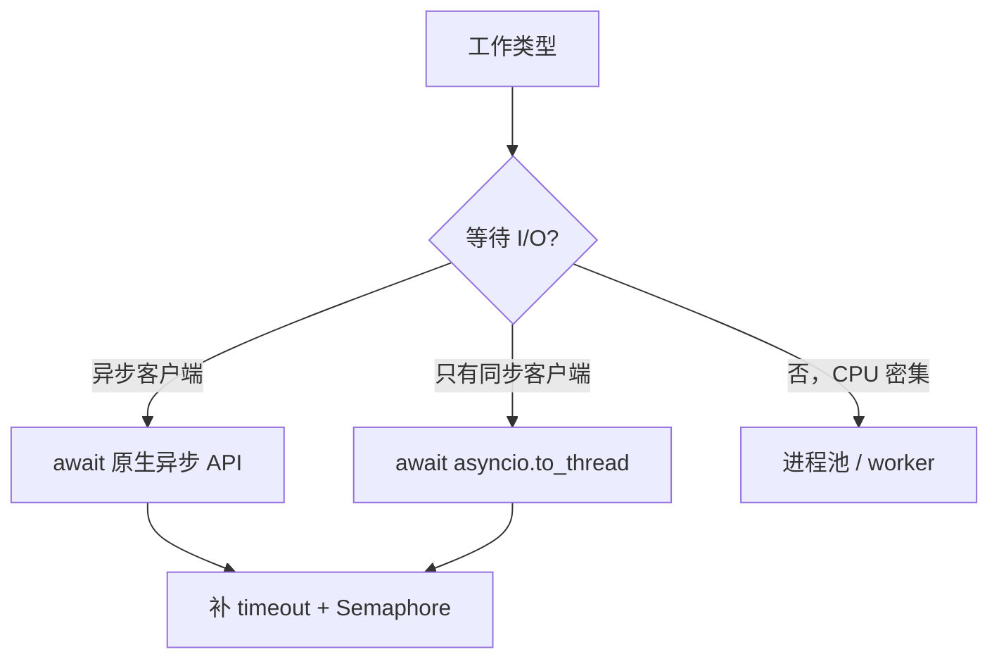

# 异步 API 一页地图

```text
async def f()       定义协程函数
f()                 得到协程对象（还没真正执行）
await f()           执行并在此处等它完成
create_task(f())    登记为 Task，让事件循环在下一个让位点推进它
await task          收结果 / 抛出任务异常
```

| 目标 | API | 关键行为 |
| --- | --- | --- |
| 等一个异步结果 | `await` | 当前协程让位，不代表新线程 |
| 同时启动一批 | `create_task` / `gather` | `gather` 按传入顺序返回 |
| 先处理先完成的 | `as_completed` | 每次拿下一个完成者 |
| 同生共死 | `TaskGroup` | 一个失败，取消兄弟任务 |
| 限制同时运行数量 | `Semaphore` | 多余任务排队 |
| 限定等待时间 | `timeout` / `wait_for` | 超时时取消被等待的工作 |
| 搬走同步 I/O | `to_thread` | 线程池，不会让 CPU 计算变快 |
| CPU 并行 | `ProcessPoolExecutor` | 进程间要序列化数据 |
| 协程间传工作 | `Queue` | 不手写轮询 |


