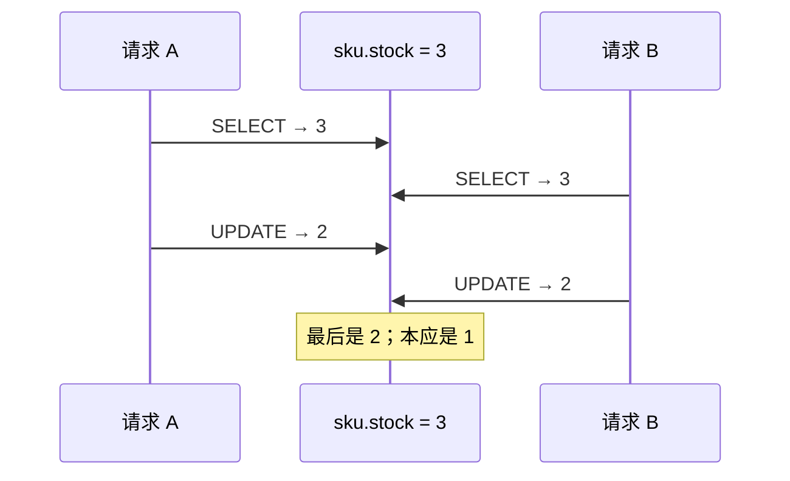

# 第 1 讲 · 并发事故与原子写

本讲先学最重要的结论：**能写成一条 SQL 的，不要先读到 Python 再写回。**

## 这讲要保护什么

`lock_lab_product_sku(id=1)`（early-bird 票档）初始 `stock=3`。两个请求都要扣 1 张，期望最后剩 1。



这叫**丢失更新**：两个请求都基于同一个旧值计算，后写入者覆盖先写入者。

## 错误写法：读、改、写拆成三步

```python
async def unsafe_reserve() -> None:
    async with Session() as session:
        sku = await session.get(ProductSku, 1)
        await asyncio.sleep(0.1)  # 模拟校验、远程调用或业务计算
        sku.stock -= 1
        await session.commit()
```

两次独立 Session 都可能读到 `3`，最后都写 `2`。`sleep` 不是问题本身；真实系统的网络请求、序列化、CPU 计算都会形成同样的窗口。

```python
await asyncio.gather(unsafe_reserve(), unsafe_reserve())
```

## 正确写法：条件 UPDATE

```python
from sqlalchemy import update


async def reserve() -> bool:
    async with Session() as session:
        result = await session.execute(
            update(ProductSku)
            .where(ProductSku.id == 1, ProductSku.stock > 0)
            .values(stock=ProductSku.stock - 1)
        )
        await session.commit()
        return result.rowcount == 1
```

```python
results = await asyncio.gather(*(reserve() for _ in range(5)))
print(results)  # 只有 3 个 True、2 个 False
```

| 表达式 | 含义 |
| --- | --- |
| `stock = stock - 1` | 在数据库里基于最新值计算，不拿旧值覆盖 |
| `WHERE stock > 0` | 库存已经为 0 时，本次更新根本不发生 |
| `rowcount == 1` | 成功占到一张票；`0` 是售罄，不是系统异常 |

这条语句已经会在更新过程中协调并发写入，所以这里**不需要**再额外套 Redis 锁或 `FOR UPDATE`。

## 原子写与锁的边界

| 场景 | 首选 |
| --- | --- |
| 加减计数、扣库存、状态从 A 变 B | 单条 `UPDATE ... WHERE ...` |
| 需要先读多项数据，再做复杂决定 | 第 2、3 讲的悲观锁或乐观锁 |
| 同一个请求只能落一次订单 | 第 4 讲的唯一约束 |

## 练习

先用一条 `UPDATE` 把 SKU 1 的 `stock` 改成 2，再同时发 5 个 `reserve()`。验收不是日志顺序，而是：成功数为 2、最终 `stock` 为 0，并且不会出现负数。
