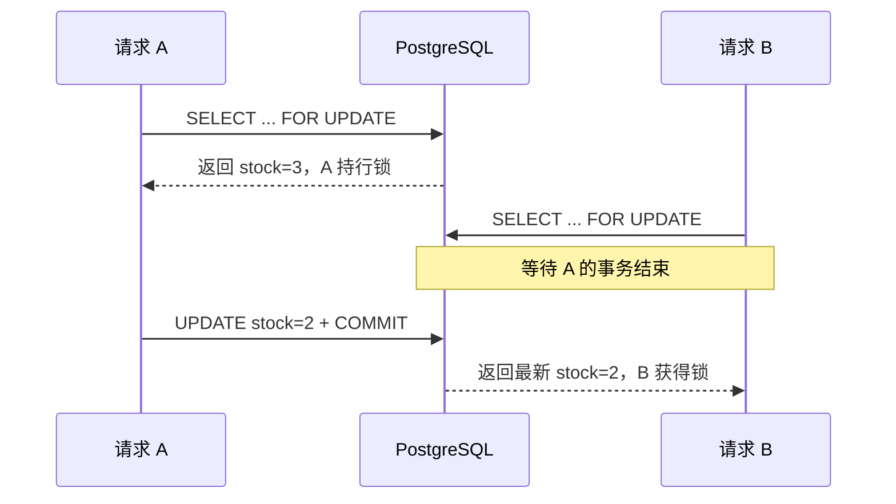

# 第 2 讲 · 悲观锁：`FOR UPDATE`

悲观锁的前提：**预计别人会改同一行，先锁住，再做读-改-写。** PostgreSQL 对应 `SELECT ... FOR UPDATE`。

## 先说清 API 的含义

| 写法 | 竞争者的结果 | 适用场景 |
| --- | --- | --- |
| `FOR UPDATE` | 等当前事务提交或回滚 | 必须串行的短事务 |
| `FOR UPDATE NOWAIT` | 抢不到立即报错 | 接口不允许排队等待 |
| `FOR UPDATE SKIP LOCKED` | 跳过被占行 | 多 worker 领待办 |

行锁从取得行到**事务结束**才释放；普通 `SELECT` 仍可读取该行，但其他写入者和锁定读会被阻塞。

五个实验同一套跑法：`reset_lab()` 回初始状态 → `asyncio.gather` 并发 → 入口 `asyncio.run`（骨架见 README《怎么跑一个实验》），每个实验只替换函数和 `main()`。

## 实验一：事故现场——不加锁，库存丢一张

`product_sku(id=1)`（early-bird 票档）`stock=3`，两个请求各扣 1，应剩 1。完整文件：

```python
import asyncio
import time

from 锁教程.model import Order, OrderItem, Product, ProductSku, Session, reset_lab


async def unsafe_reserve(name: str) -> str:
    async with Session() as session:
        sku = await session.get(ProductSku, 1)
        await asyncio.sleep(0.2)  # 模拟读和写之间的业务计算
        sku.stock -= 1
        await session.commit()
        return f"{name}: 读到 {sku.stock + 1}, 写成 {sku.stock}"


async def main():
    await reset_lab()
    prev = time.perf_counter()
    results = await asyncio.gather(unsafe_reserve("请求A"), unsafe_reserve("请求B"))
    print(f"耗时 {time.perf_counter() - prev:.2f}s")
    print(results)
    async with Session() as session:
        print(f"终态: stock={(await session.get(ProductSku, 1)).stock}")


if __name__ == "__main__":
    asyncio.run(main())
```

真实输出：

```text
耗时 0.33s
['请求A: 读到 3, 写成 2', '请求B: 读到 3, 写成 2']
终态: stock=2
```

两个请求都基于旧值 3 计算，后写覆盖先写，库存凭空多出一张。能用一条条件 `UPDATE` 解决的直接回第 1 讲；规则必须先把行读出来再算（会员价、限购、组合额度）时，才用本讲的锁。



## 实验二：只加一个子句——`FOR UPDATE`

```python
from sqlalchemy import select


async def reserve_with_row_lock(name: str) -> str:
    async with Session.begin() as session:
        sku = (
            await session.execute(
                select(ProductSku).where(ProductSku.id == 1).with_for_update()
            )
        ).scalar_one()
        await asyncio.sleep(0.2)  # 持锁期间做业务计算
        if sku.stock < 1:
            return f"{name}: 售罄"
        sku.stock -= 1
        return f"{name}: 扣减后 stock={sku.stock}"
```

把 `main()` 里的协程换成 `reserve_with_row_lock` 再跑：

```text
耗时 0.48s
['请求A: 扣减后 stock=2', '请求B: 扣减后 stock=1']
终态: stock=1
```

结果对了（3 → 2 → 1），代价是等待：B 的锁定读被 A 挡住，A 提交后 B 才读到最新值 2 再扣。**悲观锁的正确性是用等待换来的。**

`Session.begin()` 是锁的生命周期：没有事务边界就没有锁。持锁期间不要调 HTTP、发消息、做长计算，这些放到提交之后。

## 实验三：不愿意排队——`NOWAIT`

把实验二的子句换成 `nowait=True`，抢不到锁立即报错而不是等：

```python
from sqlalchemy.exc import DBAPIError


async def reserve_nowait(name: str) -> str:
    try:
        async with Session.begin() as session:
            sku = (
                await session.execute(
                    select(ProductSku)
                    .where(ProductSku.id == 1)
                    .with_for_update(nowait=True)
                )
            ).scalar_one()
            await asyncio.sleep(0.2)
            sku.stock -= 1
            return f"{name}: 扣减后 stock={sku.stock}"
    except DBAPIError:
        return f"{name}: 锁被占用，立即失败"
```

```text
耗时 0.25s
['请求A: 扣减后 stock=2', '请求B: 锁被占用，立即失败']
终态: stock=2
```

两个细节，都是实测踩出来的：

- asyncpg 的 `LockNotAvailableError` 被 SQLAlchemy 包成 `DBAPIError`，不是 `OperationalError`，异常要接对类型。
- 并发实验里异常要么在协程内接住，要么给 `gather` 传 `return_exceptions=True`；否则一个协程报错，整个 `gather` 中断。

接口层把它翻译成“系统繁忙，请重试”；不要无限重试，也不要拿 `NOWAIT` 当库存是否充足的判断。

## 实验四：领任务，三种写法连跑

`reset_lab()` 每次重造 5 笔 `PENDING`（待处理）订单，它们就是 worker 的队列。不加锁的领取：

```python
async def claim_unsafe(worker: str) -> str | None:
    async with Session.begin() as session:
        order = (
            await session.execute(
                select(Order)
                .where(Order.status == "PENDING")
                .order_by(Order.id)
                .limit(1)
            )
        ).scalar_one_or_none()
        await asyncio.sleep(0.2)  # 读到单和改状态之间的处理窗口
        if order is None:
            return None
        order.status = "PROCESSING"
        return f"{worker} 领取 {order.id}"
```

加锁的版本是同一份代码，只换子句：

```python
                .with_for_update()                  # ② FOR UPDATE：等
                .with_for_update(skip_locked=True)  # ③ SKIP LOCKED：跳
```

两个 worker 并发，三种写法的真实输出（订单 id 每轮变化，验收看“是否同一单”和耗时）：

```text
① 不加锁      耗时 0.27s   ['workerA 领取 46', 'workerB 领取 46']   ← 同一单被领两次
② FOR UPDATE  耗时 0.47s   ['workerA 领取 51', 'workerB 领取 52']   ← 不重复，B 排队等 A
③ SKIP LOCKED 耗时 0.26s   ['workerA 领取 57', 'workerB 领取 56']   ← 不重复，互不等待
```

| 写法 | 会不会重复领 | 第二个 worker 在干嘛 | 总耗时 |
| --- | --- | --- | --- |
| 不加锁 | 会（都读到同一行） | 也在读同一单 | 最快，但结果是错的 |
| `FOR UPDATE` | 不会 | 等第一个提交，再领下一单 | ≈ 2 × 单次处理 |
| `SKIP LOCKED` | 不会 | 跳过被锁行，立即领下一单 | ≈ 1 × 单次处理 |

再用 ③ 让 5 个 worker 并发领 5 笔：

```text
['worker0 领取 62', 'worker1 领取 61', 'worker2 领取 65', 'worker3 领取 64', 'worker4 领取 63']
第 6 次调用: None（队列已领空）
```

事务一提交，订单已从 `PENDING` 改成 `PROCESSING`；真正耗时的处理放在事务外。`SKIP LOCKED` 允许 worker 暂时看不到别人处理中的行，适合队列领取，也因此不适合要求完整一致的普通列表查询。

## 实验五：一个业务要改多张表

下单要同时动四张表：订单表和明细表各 `INSERT` 一行、SKU 扣库存、商品 `sold_count` 加一。给第一个查询加 `with_for_update` 只锁得住它 SELECT 到的行——行锁逐行生效，管不到其他表。每张表按“要不要先读再写”分类处理：

| 表的角色 | 处理方式 |
| --- | --- |
| 竞争焦点，要读-改-写（SKU 库存行） | `SELECT ... FOR UPDATE`，最先锁 |
| 也要读-改-写，冲突少（商品行） | 同样 `FOR UPDATE`，按同一固定顺序排在后面 |
| 只写、不依赖读到的旧值（销量 +1） | 直接 `UPDATE`，语句本身拿行锁 |
| 纯 `INSERT`（订单头、明细行） | 不锁，身份靠唯一约束（第 4 讲） |

```python
async def place_order(request_id: str) -> str:
    async with Session.begin() as session:  # 所有锁活到 commit 才一起释放
        # 1) 按固定顺序锁完所有要"读-改-写"的行：商品 → SKU
        product = await session.scalar(
            select(Product).where(Product.id == 1).with_for_update()
        )
        sku = await session.scalar(
            select(ProductSku).where(ProductSku.id == 1).with_for_update()
        )
        # 2) 锁全部到手后再判断，此时读到的值不会被别的事务改
        if sku.stock < 1:
            return "SOLD_OUT"
        # 3) 统一写入；订单和明细是 INSERT，不锁
        sku.stock -= 1
        product.sold_count += 1
        order = Order(user_id="u-1", request_id=request_id, total_amount=sku.price)
        session.add(order)
        await session.flush()  # 拿 order.id 给明细行用
        session.add(OrderItem(order_id=order.id, sku_id=sku.id, quantity=1, unit_price=sku.price))
    return "SUCCESS"
```

实测一次：`SUCCESS`，`stock` 3→2，`sold_count` 0→1，订单 1 笔、明细 1 行——四张表在一个事务里一起变。

“先锁完、再判断、再写”的顺序不是风格偏好，反着来会死锁。两个事务都要锁商品行和 SKU 行，一个先商品、一个先 SKU：

```python
async def biz(name: str, sku_first: bool) -> str:
    try:
        async with Session.begin() as session:
            lock_sku = select(ProductSku).where(ProductSku.id == 1).with_for_update()
            lock_product = select(Product).where(Product.id == 1).with_for_update()
            if sku_first:
                await session.execute(lock_sku)
                await asyncio.sleep(0.3)  # 持着第一把锁继续准备
                await session.execute(lock_product)
            else:
                await session.execute(lock_product)
                await asyncio.sleep(0.3)
                await session.execute(lock_sku)
            return f"{name}: 两行都锁到手"
    except DBAPIError as e:
        return f"{name}: 数据库杀掉了我({type(e.orig.__cause__).__name__})"
```

```python
async def main():
    await reset_lab()
    prev = time.perf_counter()
    results = await asyncio.gather(
        biz("事务1(先锁商品)", False),
        biz("事务2(先锁SKU)", True),
    )
    print(f"相反顺序 耗时 {time.perf_counter() - prev:.2f}s")
    print(results)

    await reset_lab()
    prev = time.perf_counter()
    results = await asyncio.gather(
        biz("事务1(先锁商品)", False),
        biz("事务2(先锁商品)", False),
    )
    print(f"相同顺序 耗时 {time.perf_counter() - prev:.2f}s")
    print(results)
```

真实输出：

```text
相反顺序 耗时 1.38s
['事务1(先锁商品): 两行都锁到手', '事务2(先锁SKU): 数据库杀掉了我(DeadlockDetectedError)']
相同顺序 耗时 0.66s
['事务1(先锁商品): 两行都锁到手', '事务2(先锁商品): 两行都锁到手']
```

相反顺序时：一个持商品锁等 SKU，另一个持 SKU 锁等商品，环路形成。PostgreSQL 等 `deadlock_timeout`（默认 1s）后检测到死锁，杀掉其中一个让另一个活下来——1.38s 里大半是在等数据库做决定，谁被杀不确定。相同顺序时：第二个在第一把锁上排队 0.3s，之后一路畅通，永不死锁。

规则：**锁多行、多表时，所有代码按同一稳定顺序加锁**（统一“商品 → SKU”，或主键升序）。

## 死锁和超时

顺序之外，再给接口设较短的等待预算，例如事务内执行 `SET LOCAL lock_timeout = '300ms'`。死锁受害者和锁等待超时都应记录指标；只有确定操作可安全重放时才重试。

SQLAlchemy 的 `.with_for_update(nowait=True, skip_locked=True)` 会生成相应的 PostgreSQL 锁定子句。[SQLAlchemy 文档](https://docs.sqlalchemy.org/en/20/core/selectable.html)

## 练习

实验二的 `sleep(0.2)` 改成 `sleep(1)` 再跑：总耗时约 2s。回答：持锁时间就是别人的什么？持锁事务里哪些操作必须挪出去？

用 `SKIP LOCKED` 版领取让 5 个协程并发领单。验收：领到的订单 id 互不相同；第 6 次返回 `None`。

把 `place_order` 用同一个 `request_id` 并发跑两次，观察第二次的结果——带着现象去第 4 讲。
