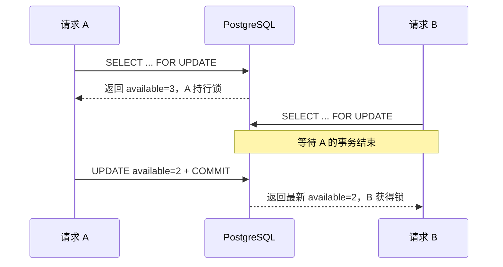

# 第 2 讲 · 悲观锁：`FOR UPDATE`

悲观锁的前提是：**我预计别人会改同一行，所以先把它锁住，再做读-改-写。** PostgreSQL 中对应 `SELECT ... FOR UPDATE`。

## 先说清 API 的含义

| 写法 | 竞争者的结果 | 适用场景 |
| --- | --- | --- |
| `FOR UPDATE` | 等当前事务提交或回滚 | 必须串行的短事务 |
| `FOR UPDATE NOWAIT` | 抢不到立即报错 | 接口不允许排队等待 |
| `FOR UPDATE SKIP LOCKED` | 跳过被占行 | 多 worker 领待办 |

行锁从取得行到**事务结束**才释放；普通 `SELECT` 通常仍可读取该行，但其他写入者和锁定读会被阻塞。

## 基础写法：锁住课程行再报名

```python
from sqlalchemy import select


async def reserve_with_row_lock() -> bool:
    async with Session.begin() as session:
        product = (
            await session.execute(
                select(Product)
                .where(Product.id == 1)
                .with_for_update()
            )
        ).scalar_one()

        if product.available < 1:
            return False

        product.available -= 1
        return True
```



`async with Session.begin()` 是重点：没有事务边界，锁就没有可依附的生命周期。持锁期间不要调用 HTTP、发消息或做长计算；这些工作应该放在提交之后。

## 不愿意等：`NOWAIT`

```python
stmt = (
    select(Product)
    .where(Product.id == 1)
    .with_for_update(nowait=True)
)
```

拿不到锁会立即得到数据库错误。接口层可把它转成“系统繁忙，请重试”；不要无限重试，也不要把 `NOWAIT` 当作库存是否充足的判断。

## 多 worker 领任务：`SKIP LOCKED`

这里改用统一的 `lock_lab_order` 表。多个 worker 只领取 `PENDING` 订单，每条订单只能被一个 worker 领到。

```python
async def claim_one(worker_id: str) -> int | None:
    async with Session.begin() as session:
        order = (
            await session.execute(
                select(Order)
                .where(Order.status == "PENDING")
                .order_by(Order.id)
                .limit(1)
                .with_for_update(skip_locked=True)
            )
        ).scalar_one_or_none()

        if order is None:
            return None

        order.status = "PROCESSING"
        print(worker_id, "领取", order.id)
        return order.id
```

事务一提交，订单已从 `PENDING` 改成 `PROCESSING`；真正耗时的处理放在这个事务外。`SKIP LOCKED` 适合队列领取，因为它允许 worker 暂时看不到被别人处理中的行；因此不适合需要“查询结果完整一致”的普通列表。

## 死锁和超时

两个事务分别按不同顺序锁两行，就可能互相等死。规则只有一条：**需要锁多行时，所有代码按同一稳定顺序（通常主键升序）加锁。**

```python
stmt = (
    select(Product)
    .where(Product.id.in_([1, 2]))
    .order_by(Product.id)
    .with_for_update()
)
```

还应为接口设置较短的等待预算，例如事务内执行 `SET LOCAL lock_timeout = '300ms'`。死锁受害者和锁等待超时都应记录指标；只有确定操作可安全重放时才重试。

SQLAlchemy 的 `.with_for_update(nowait=True, skip_locked=True)` 会生成相应的 PostgreSQL 锁定子句。[SQLAlchemy 文档](https://docs.sqlalchemy.org/en/20/core/selectable.html)

## 练习

让两个协程同时执行 `reserve_with_row_lock()`，在 A 取得锁后人为 `await asyncio.sleep(0.2)`。观察 B 不是失败，而是等 A 提交后读取最新库存。
