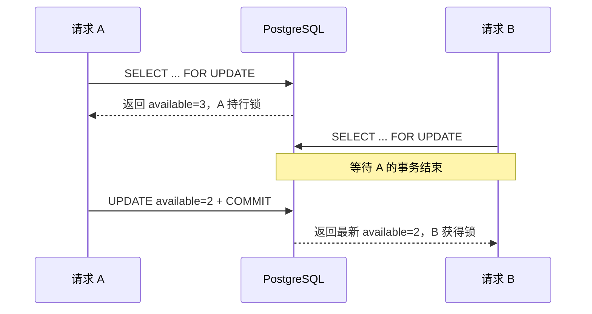

# 第 2 讲 · 悲观锁：`FOR UPDATE`

悲观锁的前提是：**我预计别人会改同一行，所以先把它锁住，再做读-改-写。** PostgreSQL 中对应 `SELECT ... FOR UPDATE`。

## 先说清 API 的含义

| 写法 | 竞争者的结果 | 适用场景 |
| --- | --- | --- |
| `FOR UPDATE` | 等当前事务提交或回滚 | 必须串行的短事务 |
| `FOR UPDATE NOWAIT` | 抢不到立即报错 | 接口不允许排队等待 |
| `FOR UPDATE SKIP LOCKED` | 跳过被占行 | 多 worker 领待办 |

行锁从取得行到**事务结束**才释放；普通 `SELECT` 通常仍可读取该行，但其他写入者和锁定读会被阻塞。

本讲四个实验是同一套跑法：`reset_lab()` 回到初始状态 → `asyncio.gather` 把多个协程同时放进事件循环模拟并发 → 入口处 `asyncio.run` 启动整个程序。骨架说明统一放在 README《怎么跑一个实验》；下面每个实验只替换函数和 `main()` 的内容。

## 实验一：不加锁，亲眼看名额丢一个

`lock_lab_product(id=1)` 初始 `available=3`，两个请求同时各扣 1 个，正确答案显然是剩 1。完整文件如下：

```python
import asyncio
import time

from 锁教程.model import Product, Session, reset_lab


async def unsafe_reserve(name: str) -> str:
    async with Session() as session:
        product = await session.get(Product, 1)
        await asyncio.sleep(0.2)  # 模拟读和写之间的业务计算
        product.available -= 1
        await session.commit()
        return f"{name}: 读到 {product.available + 1}, 写成 {product.available}"


async def main():
    await reset_lab()
    prev = time.perf_counter()
    results = await asyncio.gather(unsafe_reserve("请求A"), unsafe_reserve("请求B"))
    print(f"耗时 {time.perf_counter() - prev:.2f}s")
    print(results)


if __name__ == "__main__":
    asyncio.run(main())
```

真实输出：

```text
耗时 0.33s
['请求A: 读到 3, 写成 2', '请求B: 读到 3, 写成 2']
```

两个请求都基于同一个旧值 3 计算，后写者覆盖先写者——这就是第 1 讲的丢失更新。第 1 讲的答案是压成一条条件 `UPDATE`；但如果规则复杂到必须先把行读出来再算（会员等级、黑名单、组合额度……），就得回到读-改-写，这时才轮到悲观锁出场。



## 实验二：只加一个子句——`FOR UPDATE`

同一份代码：查询加 `.with_for_update()`，事务改用 `Session.begin()`——没有事务边界，锁就没有可依附的生命周期。

```python
from sqlalchemy import select


async def reserve_with_row_lock(name: str) -> str:
    async with Session.begin() as session:
        product = (
            await session.execute(
                select(Product).where(Product.id == 1).with_for_update()
            )
        ).scalar_one()
        await asyncio.sleep(0.2)  # 持锁期间做业务计算
        if product.available < 1:
            return f"{name}: 售罄"
        product.available -= 1
        return f"{name}: 扣减后 available={product.available}"
```

`main()` 里把两个协程换成 `reserve_with_row_lock` 再跑：

```text
耗时 0.47s
['请求A: 扣减后 available=2', '请求B: 扣减后 available=1']
```

结果对了（3 → 2 → 1），但要付代价：B 的锁定读被 A 的行锁挡住，等 A 提交后才拿到最新值 2 再扣。对比实验一的 0.33s，多出的时间就是排队。**悲观锁的正确性是用等待换来的**；持锁期间不要调用 HTTP、发消息或做长计算，这些工作应该放在提交之后。

## 实验三：不愿意排队——`NOWAIT`

把实验二的子句换成 `nowait=True`，抢不到锁立即报错而不是等：

```python
from sqlalchemy.exc import DBAPIError


async def reserve_nowait(name: str) -> str:
    try:
        async with Session.begin() as session:
            product = (
                await session.execute(
                    select(Product).where(Product.id == 1).with_for_update(nowait=True)
                )
            ).scalar_one()
            await asyncio.sleep(0.2)
            product.available -= 1
            return f"{name}: 扣减后 available={product.available}"
    except DBAPIError:
        return f"{name}: 锁被占用，立即失败"
```

```text
耗时 0.25s
['请求A: 扣减后 available=2', '请求B: 锁被占用，立即失败']
```

两个细节，都是实测踩出来的：

- asyncpg 抛的 `LockNotAvailableError` 会被 SQLAlchemy 包成 `DBAPIError`（不是 `OperationalError`），接异常要接对类型。
- 并发实验里异常必须在协程内接住（或给 `gather` 传 `return_exceptions=True`），否则一个协程报错会让整个 `gather` 直接中断。

接口层应把它翻译成“系统繁忙，请重试”；不要无限重试，也不要把 `NOWAIT` 当作库存是否充足的判断。

## 实验四：领任务，三种写法连跑

`reset_lab()` 每次重置时都会重造 5 条 `PENDING` 待办，它们就是 worker 要领的队列。先用不加锁的版本领：

```python
async def claim_unsafe(worker: str) -> str | None:
    async with Session.begin() as session:
        order = (
            await session.execute(
                select(Order)
                .where(Order.status == "PENDING")
                .order_by(Order.id)
                .limit(1)
            )
        ).scalar_one_or_none()
        await asyncio.sleep(0.2)  # 读到单和改状态之间的处理窗口
        if order is None:
            return None
        order.status = "PROCESSING"
        return f"{worker} 领取 {order.id}"
```

再加锁的两个版本是同一份代码，只换一个子句：

```python
                .with_for_update()                  # ② FOR UPDATE：等
                .with_for_update(skip_locked=True)  # ③ SKIP LOCKED：跳
```

`main()` 每轮 `reset_lab()` 后 `gather` 两个协程，三种写法的真实输出：

```text
① 不加锁     耗时 0.27s   ['请求A 领取 76', '请求B 领取 76']   ← 同一单被领了两次
② FOR UPDATE 耗时 0.48s   ['请求A 领取 82', '请求B 领取 81']   ← 不重复，但 B 排队等 A
③ SKIP LOCKED 耗时 0.25s  ['请求A 领取 87', '请求B 领取 86']   ← 不重复，互不等待
```

订单 id 每轮会变（自增序列不回退），验收看两点：**是否领到同一单**、**耗时倍数**。

| 写法 | 会不会重复领 | 第二个 worker 在干嘛 | 总耗时 |
| --- | --- | --- | --- |
| 不加锁 | 会（都读到同一行） | 也在读同一单 | 最快，但结果是错的 |
| `FOR UPDATE` | 不会 | 等第一个提交，再领下一单 | ≈ 2 × 单次处理 |
| `SKIP LOCKED` | 不会 | 跳过被锁行，立即领下一单 | ≈ 1 × 单次处理 |

事务一提交，订单已从 `PENDING` 改成 `PROCESSING`；真正耗时的处理放在这个事务外。`SKIP LOCKED` 适合队列领取，因为它允许 worker 暂时看不到被别人处理中的行；也因此不适合需要“查询结果完整一致”的普通列表。

## 死锁和超时

两个事务分别按不同顺序锁两行，就可能互相等死。规则只有一条：**需要锁多行时，所有代码按同一稳定顺序（通常主键升序）加锁。**

```python
stmt = (
    select(Product)
    .where(Product.id.in_([1, 2]))
    .order_by(Product.id)
    .with_for_update()
)
```

还应为接口设置较短的等待预算，例如事务内执行 `SET LOCAL lock_timeout = '300ms'`。死锁受害者和锁等待超时都应记录指标；只有确定操作可安全重放时才重试。

SQLAlchemy 的 `.with_for_update(nowait=True, skip_locked=True)` 会生成相应的 PostgreSQL 锁定子句。[SQLAlchemy 文档](https://docs.sqlalchemy.org/en/20/core/selectable.html)

## 练习

把实验二里的 `sleep(0.2)` 改成 `sleep(1)` 再跑。验收：总耗时约 2s——第二个请求整整等了 1s，体会“持锁时间就是别人的最长等待时间”，然后回答：持锁事务里哪些操作必须挪出去？

`await reset_lab()` 后表里已有 5 条 `PENDING` 待办，让 5 个协程并发执行 `SKIP LOCKED` 版本的领取函数。验收：5 个协程领到的订单 id 互不相同；第 6 次调用返回 `None`，说明队列已被领空。
