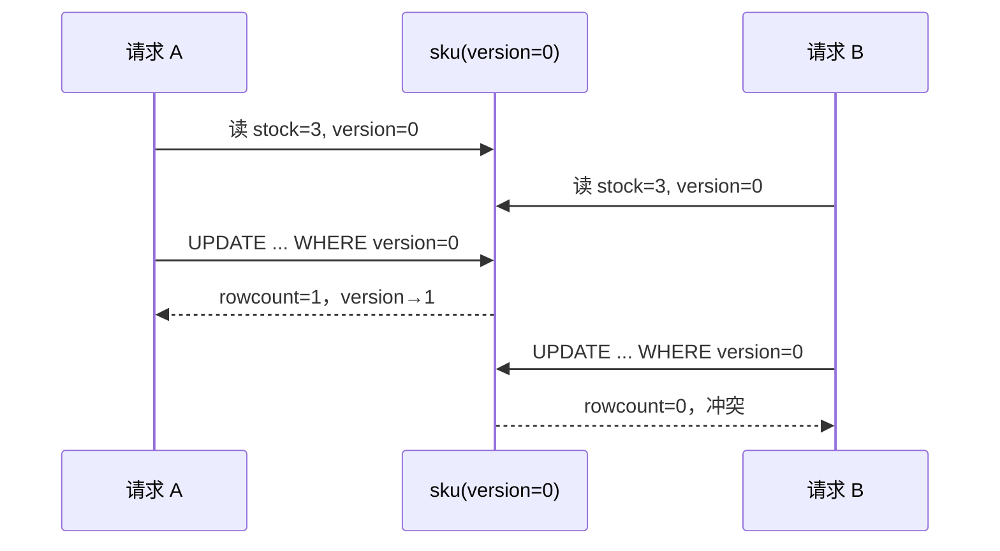

# 第 3 讲 · 乐观锁：version CAS 与重试

乐观锁不先占住数据库行。它假设冲突相对少：先读数据，提交时再问数据库“我读到的还是这个版本吗？”

## 核心 SQL

```sql
UPDATE lock_lab_product_sku
SET stock = :new_stock,
    version = version + 1
WHERE id = 1
  AND version = :old_version;
```

| `rowcount` | 含义 |
| --- | --- |
| `1` | 本次更新成功，旧版本仍有效 |
| `0` | 别人已经抢先修改，当前快照过期 |

`rowcount == 0` 是**并发冲突**，不是 SQL 执行失败。

## 实验一：CAS 单挑，输的立刻知道自己输了

和第 2 讲实验二同一场景：两个并发请求各扣一张早鸟票。悲观锁的第二个在排队（0.48s），乐观锁的第二个立刻拿到 `CONFLICT`。完整文件：

```python
import asyncio
import time

from sqlalchemy import select, update

from 锁教程.model import ProductSku, Session, reset_lab


async def reserve_once(name: str) -> str:
    async with Session() as session:
        sku = (await session.execute(select(ProductSku).where(ProductSku.id == 1))).scalar_one()
        await asyncio.sleep(0.2)  # 基于读到的值做复杂计算
        if sku.stock < 1:
            return f"{name}: SOLD_OUT"
        result = await session.execute(
            update(ProductSku)
            .where(ProductSku.id == 1, ProductSku.version == sku.version)
            .values(stock=sku.stock - 1, version=sku.version + 1)
        )
        await session.commit()
        return f"{name}: SUCCESS" if result.rowcount == 1 else f"{name}: CONFLICT"


async def main():
    await reset_lab()
    prev = time.perf_counter()
    results = await asyncio.gather(reserve_once("请求A"), reserve_once("请求B"))
    print(f"耗时 {time.perf_counter() - prev:.2f}s")
    print(results)
    async with Session() as session:
        sku = await session.get(ProductSku, 1)
        print(f"终态: stock={sku.stock}, version={sku.version}")


if __name__ == "__main__":
    asyncio.run(main())
```

真实输出：

```text
耗时 0.27s
['请求A: SUCCESS', '请求B: CONFLICT']
终态: stock=2, version=1
```

关键在 `WHERE` 里多出的 `Sku.version == sku.version`：A 先提交，把 version 从 0 改到 1；B 拿着旧版本 0 去 `UPDATE`，一行都匹配不上。**B 没有等任何人**——同样的两个请求，第 2 讲排队 0.48s，这里 0.34s。



## 实验二：五个请求抢三张票，冲突靠重试消化

`main()` 里的 `gather` 换成 5 个 `reserve_once`，不加重试：

```text
耗时 0.27s
['请求1: SUCCESS', '请求2: CONFLICT', '请求3: CONFLICT', '请求4: CONFLICT', '请求5: CONFLICT']
终态: stock=2, version=1
```

五个请求都在 0.2s 的计算窗口里读到 version=0，最终只有一个 `UPDATE` 命中。冲突不是异常，是“我的快照过期了”的信号。给它一个**有边界的重试**：

```python
import random


async def reserve_with_retry(name: str) -> str:
    for attempt in range(3):
        outcome = await reserve_once(name)
        if not outcome.endswith("CONFLICT"):
            return outcome + f"(第{attempt + 1}次尝试)"
        await asyncio.sleep(random.uniform(0.01, 0.05) * (attempt + 1))
    return f"{name}: BUSY(冲突3次后放弃)"
```

`gather` 换成 5 个 `reserve_with_retry`：

```text
耗时 0.97s
['请求1: SUCCESS(第1次尝试)', '请求2: SUCCESS(第2次尝试)', '请求3: BUSY(冲突3次后放弃)',
 '请求4: BUSY(冲突3次后放弃)', '请求5: SUCCESS(第3次尝试)']
终态: stock=0, version=3
```

重试把冲突消化成最终结果：3 个 `SUCCESS` 把票扣完（stock=0），另外 2 个在 3 次上限内没抢到，返回 `BUSY`。每次运行的具体组合会变（随机退避加交错），验收看统计和终态。

代价对比：无重试 0.27s，重试 0.97s——退避和重跑就是乐观锁在高冲突下要付的成本。

## 重试必须有边界

只对 `CONFLICT` 重试；网络错误、约束错误、编程错误不要吞掉重试。高热点行上大量 CAS 重试会形成重试风暴，此时换第 1 讲的条件 UPDATE 或第 2 讲的短事务悲观锁。

## 乐观锁、条件 UPDATE、悲观锁怎么选

| 情况 | 选什么 |
| --- | --- |
| 只需扣库存 / 改状态 | 条件 UPDATE，最简单 |
| 先读后做复杂计算，冲突少 | version CAS |
| 先读后做复杂计算，冲突很高且必须串行 | `FOR UPDATE` |

第 2 讲的多表场景同样适用：`place_order` 里如果把“商品 → SKU”两把锁换成 CAS，每个读-改-写行各带 version，失败的重读整条链再试——锁少了对别人友好，但高冲突时整链重试的成本会超过直接排队。

## 练习

把 `reserve_with_retry` 的重试上限从 3 改成 10，重跑实验二。验收：`BUSY` 消失，终态 `stock=0`；对比总耗时，回答：上限放大后谁受益、谁被拖慢。
