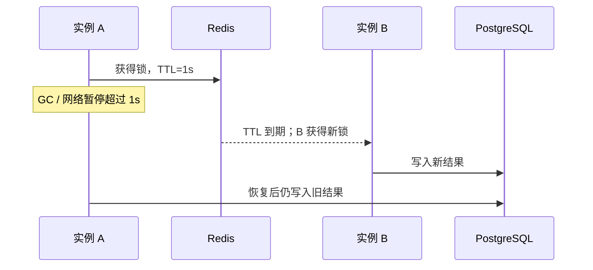

# 第 5 讲 · 跨实例协调：advisory lock 与 Redis 锁

前四讲保护的是 PostgreSQL 中的事实，所以数据库语句、约束和事务已经是最强的工具。本讲只处理数据库行锁不方便表达的“跨实例临界区”，例如多台服务同时刷新同一个缓存、定时任务只能有一个执行者。

## 先选协调范围

| 范围 | 首选 | 典型场景 |
| --- | --- | --- |
| 同一 PostgreSQL 数据库内 | transaction advisory lock | 每日汇总、迁移保护、数据库内定时任务 |
| 多服务实例，但允许租约语义 | Redis 锁 | 缓存重建、尽力防重的定时任务 |
| 库存、订单、资金等数据库事实 | 不用 Redis 锁 | 用条件 UPDATE、约束、事务 |

## PostgreSQL advisory lock：数据库里的命名锁

它不锁某一行，而是锁一个整数或两个整数组成的“名字”。事务结束自动释放，适合协调同一个 PostgreSQL 内的逻辑。

```python
from sqlalchemy import text


async def run_daily_summary() -> str:
    async with Session.begin() as session:
        acquired = await session.scalar(
            text("SELECT pg_try_advisory_xact_lock(:key)"),
            {"key": 20260928},
        )
        if not acquired:
            return "SKIPPED"

        # 只放短、只依赖数据库的临界区
        await session.execute(text("UPDATE lock_lab_product SET version = version"))
        return "DONE"
```

`pg_try_advisory_xact_lock` 抢不到立即返回 `False`；事务提交或回滚即释放。不要拿它包住长时间 HTTP 调用。

## Redis 锁：带 TTL 的租约，不是永久所有权

加锁至少要同时完成：

```text
SET key token NX PX ttl
```

- `NX`：只有 key 不存在才成功。
- `PX`：即使进程崩溃，TTL 到期后 key 会消失。
- `token`：释放时必须确认“锁仍是我的”。

用异步服务时使用 `redis.asyncio`，避免把同步 Redis 客户端直接塞进协程。

```python
from redis import asyncio as redis_async


async def rebuild_cache() -> str:
    client = redis_async.from_url(REDIS_URL, decode_responses=True)
    lock = client.lock("lock-lab:product:1:cache-rebuild", timeout=10, blocking=False)

    if not await lock.acquire():
        await client.aclose()
        return "SKIPPED"

    try:
        # 双重检查缓存；真正的库存修改仍必须走 PostgreSQL 条件 UPDATE
        await asyncio.sleep(0.1)
        return "DONE"
    finally:
        if await lock.owned():
            await lock.release()
        await client.aclose()
```

## TTL 到期是最危险的边界



token 安全释放只能防止 A 删除 B 的锁，**不能**阻止过期的 A 继续写业务结果。需要绝对顺序时，写入方还要验证单调递增的 fencing token；更常见、更稳妥的选择是让 PostgreSQL 的条件 UPDATE、版本号和唯一约束继续做最终裁判。

redis-py 的 `Lock` 会维护所有权 token，并提供 `extend` / `reacquire` 等 TTL 操作；续期只是延长租约，不会把 Redis 锁变成绝对排他锁。[redis-py Lock 文档](https://redis.readthedocs.io/en/stable/lock.html)

## 练习

让两个协程同时执行 `rebuild_cache()`，验收：一个 `DONE`、一个 `SKIPPED`。再把临界区时间设得比 TTL 长，画出 A、B 可能重叠的时间线，并解释为什么 token 释放仍不能完全解决问题。
