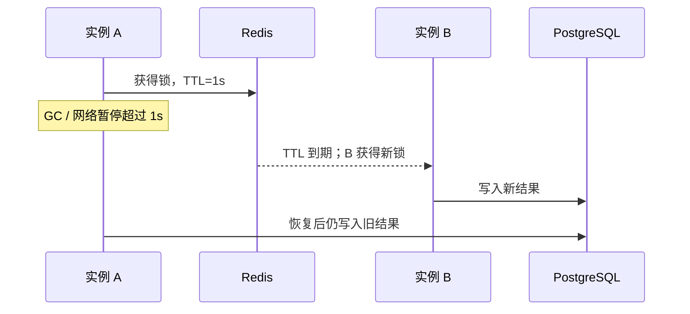

# 第 5 讲 · 跨实例协调：advisory lock 与 Redis 锁

前四讲保护的是 PostgreSQL 中的事实，数据库语句、约束和事务已经是最强的工具。本讲只处理数据库行锁不方便表达的“跨实例临界区”：多台服务同时刷新同一个缓存、定时任务只能有一个执行者。

## 先选协调范围

| 范围 | 首选 | 典型场景 |
| --- | --- | --- |
| 同一 PostgreSQL 数据库内 | transaction advisory lock | 每日汇总、迁移保护、数据库内定时任务 |
| 多服务实例，但允许租约语义 | Redis 锁 | 缓存重建、尽力防重的定时任务 |
| 库存、订单、资金等数据库事实 | 不用 Redis 锁 | 用条件 UPDATE、约束、事务 |

## 实验一：每日汇总只能执行一次

两个服务实例同时到期触发“每日汇总”，业务规则是**只能执行一次**，重复执行等于把账算两遍。`product.summary_done` 是“汇总已执行”标记。不加协调的版本，完整文件：

```python
import asyncio

from 锁教程.model import Product, Session, reset_lab


async def run_summary_naive(name: str) -> str:
    async with Session.begin() as session:
        product = await session.get(Product, 1)
        already = product.summary_done  # 读"今天是否已执行"
        await asyncio.sleep(0.2)  # 汇总耗时
        if already:
            return f"{name}: SKIPPED(已执行过)"
        product.summary_done = True
        return f"{name}: DONE(执行汇总)"


async def main():
    await reset_lab()
    results = await asyncio.gather(run_summary_naive("实例A"), run_summary_naive("实例B"))
    print(results)


if __name__ == "__main__":
    asyncio.run(main())
```

真实输出：

```text
['实例A: DONE(执行汇总)', '实例B: DONE(执行汇总)']
```

两个实例都在对方提交前读到 `summary_done=False`，各执行了一次。要保护的不是某一行库存，而是“这段工作只能一个人做”——没有对应的行可以 `FOR UPDATE` 竞争。

## 实验二：PostgreSQL advisory lock：数据库里的命名锁

advisory lock 不锁行，锁一个整数“名字”。在函数开头抢锁：

```python
from sqlalchemy import text

ADV_KEY = 20260930


async def run_summary_locked(name: str) -> str:
    async with Session.begin() as session:
        acquired = await session.scalar(
            text("SELECT pg_try_advisory_xact_lock(:key)"), {"key": ADV_KEY}
        )
        if not acquired:
            return f"{name}: SKIPPED(另一个实例在做)"
        product = await session.get(Product, 1)
        already = product.summary_done
        await asyncio.sleep(0.2)
        if already:
            return f"{name}: SKIPPED(已执行过)"
        product.summary_done = True
        return f"{name}: DONE(执行汇总)"
```

`main()` 里换成 `run_summary_locked`：

```text
['实例A: DONE(执行汇总)', '实例B: SKIPPED(另一个实例在做)']
```

`pg_try_advisory_xact_lock` 抢不到立即返回 `False`，不排队；事务提交或回滚自动释放，没有忘删锁的风险。只放短、只依赖数据库的临界区，不要拿它包住长时间 HTTP 调用。

## 实验三：Redis 锁：带 TTL 的租约

跨实例（多个服务共用一个 Redis）时，加锁至少要同时完成：

```text
SET key token NX PX ttl
```

- `NX`：只有 key 不存在才成功。
- `PX`：即使进程崩溃，TTL 到期后 key 消失——锁是租约，不是永久所有权。
- `token`：释放时确认“锁仍是我的”。

用异步服务时使用 `redis.asyncio`，不要把同步客户端直接塞进协程：

```python
import os

from redis import asyncio as redis_async

REDIS_URL = os.environ["REDIS_URL"]


async def rebuild_cache(name: str) -> str:
    client = redis_async.from_url(REDIS_URL, decode_responses=True)
    try:
        lock = client.lock("lock-lab:cache-rebuild", timeout=10, blocking=False)
        if not await lock.acquire():
            return f"{name}: SKIPPED(锁被占)"
        await asyncio.sleep(0.2)  # 重建缓存的耗时
        return f"{name}: DONE"
    finally:
        if await lock.owned():
            await lock.release()
        await client.aclose()
```

两个实例并发：

```text
['实例A: DONE', '实例B: SKIPPED(锁被占)']
```

`redis-py` 的 `lock()` 一次完成 `SET NX PX` 并生成随机 token；`owned()` 确认锁还属于自己才释放，防止删掉别人的锁。

## 实验四：TTL 到期是最危险的边界

租约保证“持锁人崩溃后锁自动消失”，代价是持锁人**没崩、只是慢**时锁也会消失。TTL 设 1s、临界区干 1.5s 的活：

```python
import time

T0 = time.perf_counter()


def now() -> str:
    return f"{time.perf_counter() - T0:.2f}s"


async def overlap_demo() -> None:
    client = redis_async.from_url(REDIS_URL, decode_responses=True)
    key = "lock-lab:overlap"

    async def instance_a() -> None:
        lock = client.lock(key, timeout=1, blocking=False)
        assert await lock.acquire()
        print(f"[{now()}] A: 拿到锁(TTL=1s), 进入临界区")
        await asyncio.sleep(1.5)  # 模拟 GC / 网络暂停 / 数据量超预期
        print(f"[{now()}] A: 临界区做完, 但锁在 1.0s 时就过期了")
        if await lock.owned():
            await lock.release()
        else:
            print(f"[{now()}] A: 锁已不属于我(owned=False), 不能释放")

    async def instance_b() -> None:
        await asyncio.sleep(0.4)
        ok = await client.lock(key, timeout=1, blocking=False).acquire()
        print(f"[{now()}] B: 第一次尝试 -> {'拿到锁' if ok else 'SKIPPED(租约还在)'}")
        if ok:
            return
        await asyncio.sleep(0.8)  # 到 1.2s 再试
        ok = await client.lock(key, timeout=1, blocking=False).acquire()
        print(f"[{now()}] B: 第二次尝试 -> {'拿到锁!A 还没做完, 双双进入临界区' if ok else '仍失败'}")

    await asyncio.gather(instance_a(), instance_b())
    await client.aclose()
```

真实输出（绝对时间戳每次不同，看四个事件的**间隔**）：

```text
[0.07s] A: 拿到锁(TTL=1s), 进入临界区
[0.42s] B: 第一次尝试 -> SKIPPED(租约还在)
[1.23s] B: 第二次尝试 -> 拿到锁!A 还没做完, 双双进入临界区
[1.57s] A: 临界区做完, 但锁在 1.0s 时就过期了
[1.58s] A: 锁已不属于我(owned=False), 不能释放
```

1.23s 到 1.57s 之间，**两个实例同时待在临界区里**。token 安全释放只防止 A 误删 B 的锁，不能阻止过期的 A 继续写业务结果。



需要绝对顺序时，写入方还要验证单调递增的 fencing token；更稳妥的做法是让 PostgreSQL 的条件 UPDATE、版本号和唯一约束做最终裁判——Redis 锁只负责“尽量少撞车”，不负责“绝对不撞车”。

redis-py 的 `Lock` 维护所有权 token，提供 `extend` / `reacquire` 等 TTL 操作；续期只是延长租约，不会把 Redis 锁变成绝对排他锁。[redis-py Lock 文档](https://redis.readthedocs.io/en/stable/lock.html)

## 练习

把实验四的临界区从 1.5s 缩到 0.3s（远小于 TTL=1s），重跑并确认重叠消失。然后回答：TTL、临界区耗时、GC 最大暂停，这三者要维持什么不等式，Redis 锁才可靠？拿不准时，最终裁判放在哪一层？
