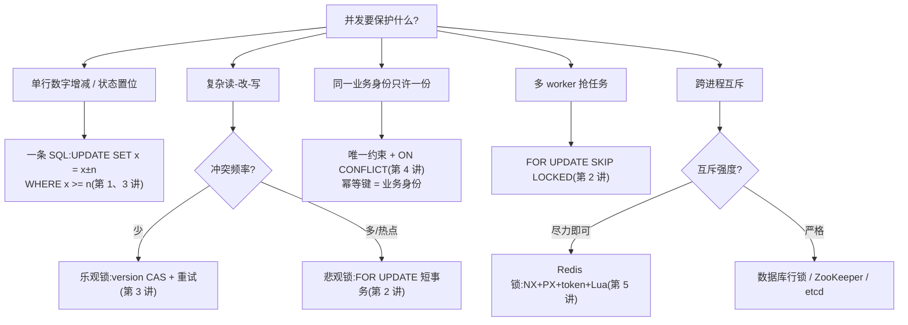
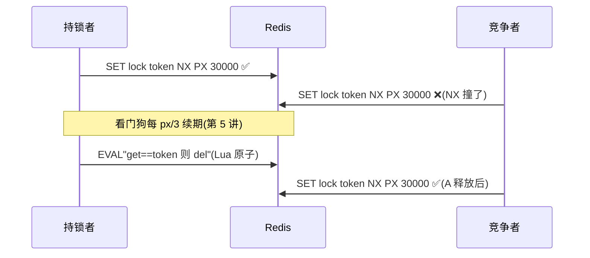

# 锁概念地图

六讲的武器收进一张图:**遇到什么威胁,拔哪把刀**。图用 Mermaid 画,GitHub / Typora / Obsidian 里直接渲染;看不了图就看下面的表,信息不缺。

## 1 选型决策树

## 2 Redis 锁的完整生命周期

三句口诀:

- **一条 SQL 能解决的,不上锁**;数据库锁能解决的,不上分布式锁;单机锁能解决的,不上 Redis
- **悲观锁的命门是持锁时长**(事务要短),乐观锁的命门是冲突率(高了重试风暴),Redis 锁的命门是过期时间(短了互斥失效,长了崩溃死锁)
- **唯一约束永远在场**——它是唯一不依赖应用代码正确性的防线

## 3 易混点对照表

| 对比项 | 悲观锁 | 乐观锁 | 唯一约束 | Redis 锁 |
|---|---|---|---|---|
| 保护对象 | 改同一行 | 改同一行 | 插同一身份 | 进程外任意临界区 |
| 真的加锁了吗 | 是(数据库行锁) | 否(条件 UPDATE) | 是(唯一索引) | 是(key 互斥) |
| 冲突方感受 | 排队/NOWAIT 报错 | rowcount=0 重试 | 23505/1062 报错 | SET 失败/等待 |
| 死锁可能 | 有(固定顺序防) | 无 | 无 | 无(但有"过期重叠") |
| 崩溃后果 | 事务回滚自动放锁 | 无状态,无影响 | 无影响 | 靠过期时间自愈 |
| 一句话 | 先锁后用 | 先干再验 | 一山不容二虎 | 进程外的门闩 |
