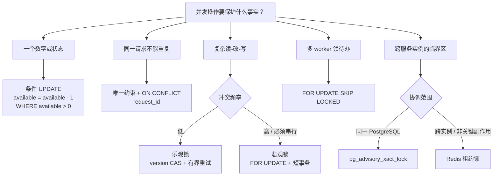
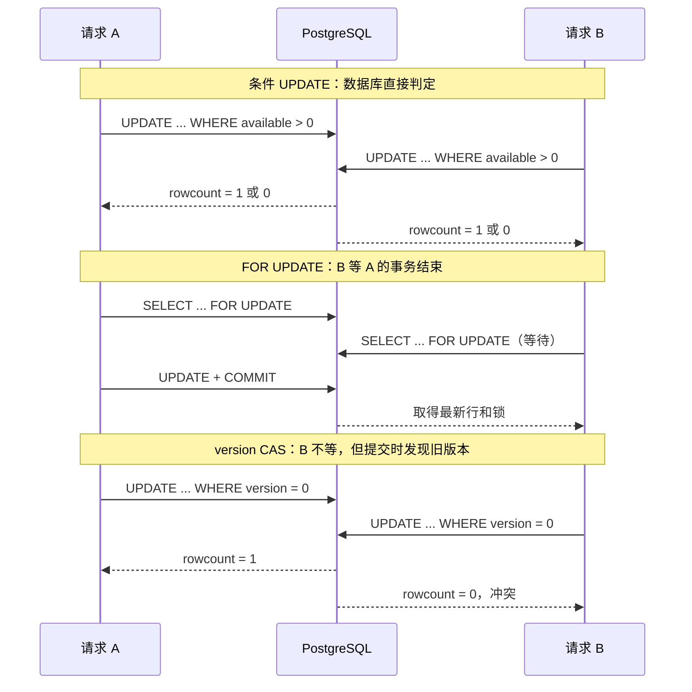

# 锁与并发控制概念地图

```mermaid
flowchart TD
    Q[并发操作要保护什么事实？]
    Q --> A[一个数字或状态]
    Q --> B[同一请求不能重复]
    Q --> C[复杂读-改-写]
    Q --> D[多 worker 领待办]
    Q --> E[跨服务实例的临界区]

    A --> A1[条件 UPDATE<br/>available = available - 1<br/>WHERE available > 0]
    B --> B1[唯一约束 + ON CONFLICT<br/>request_id]
    C --> C1{冲突频率}
    C1 -->|低| C2[乐观锁<br/>version CAS + 有界重试]
    C1 -->|高 / 必须串行| C3[悲观锁<br/>FOR UPDATE + 短事务]
    D --> D1[FOR UPDATE SKIP LOCKED]
    E --> E1{协调范围}
    E1 -->|同一 PostgreSQL| E2[pg_advisory_xact_lock]
    E1 -->|跨实例 / 非关键副作用| E3[Redis 租约锁]
```

## 三个最容易混淆的概念

| 名称 | 本质 | 失败方怎样处理 |
| --- | --- | --- |
| 悲观锁 | 先占住数据库行，再做读-改-写 | 等待、`NOWAIT` 失败或 `SKIP LOCKED` 跳过 |
| 乐观锁 | 不占锁，提交时检查版本是否仍有效 | `rowcount == 0`，按业务决定是否重试 |
| Redis 锁 | 带 TTL 的跨实例租约 | 抢不到就退出 / 等待；过期可能带来旧新持有者重叠 |

## 时间线：三种修改同一库存的方式

```mermaid
sequenceDiagram
    participant A as 请求 A
    participant DB as PostgreSQL
    participant B as 请求 B

    Note over A,B: 条件 UPDATE：数据库直接判定
    A->>DB: UPDATE ... WHERE available > 0
    B->>DB: UPDATE ... WHERE available > 0
    DB-->>A: rowcount = 1 或 0
    DB-->>B: rowcount = 1 或 0

    Note over A,B: FOR UPDATE：B 等 A 的事务结束
    A->>DB: SELECT ... FOR UPDATE
    B->>DB: SELECT ... FOR UPDATE（等待）
    A->>DB: UPDATE + COMMIT
    DB-->>B: 取得最新行和锁

    Note over A,B: version CAS：B 不等，但提交时发现旧版本
    A->>DB: UPDATE ... WHERE version = 0
    B->>DB: UPDATE ... WHERE version = 0
    DB-->>A: rowcount = 1
    DB-->>B: rowcount = 0，冲突
```

一句口诀：**先让数据库用一条语句或约束保证事实；需要多步串行时再锁；Redis 只用来协调数据库以外的跨实例临界区。**
